# AI Design Patterns

A comprehensive collection of AI design patterns implemented in Python, featuring production-grade examples using local-first, open-source models.

**Repository**: [github.com/bhatti/agentic-patterns](https://github.com/bhatti/agentic-patterns)

## 📚 Overview

This repository contains implementations of design patterns from four authoritative books:

1. **Generative AI Design Patterns** (*Valliappa Lakshmanan* et al.) — *Solutions to Common Challenges When Building GenAI Agents and Applications*
2. **Machine Learning Design Patterns** — *Solutions to Common Challenges in Data Preparation, Model Building, and MLOps*
3. **Agentic Design Patterns** (*Antonio Gulli*) — *A Hands-On Guide to Building Intelligent Systems*
4. **AI Engineering** — *Building Applications with Foundation Models*

## 🎯 Goals

- **Simple but Production-Grade**: Easy to understand examples with real-world best practices
- **Local-First**: All examples work with local models via Ollama
- **Open Source**: Uses open-source models (Qwen, DeepSeek, Llama, Mistral, etc.)
- **Comprehensive**: Each pattern includes README, code examples, use cases, and best practices

## 📖 Pattern Categories

### 🎨 Content & Style Control Patterns

The first five patterns focus on controlling and optimizing content generation, style, and format. These patterns solve the fundamental challenge of ensuring AI-generated content meets specific requirements, constraints, and optimization goals.

---

### 📚 Adding Knowledge Patterns

The next patterns focus on augmenting LLMs with external knowledge sources. These patterns solve the challenge of accessing up-to-date information, private data, and knowledge beyond the model's training cutoff.

---

## Pattern 1: Logits Masking

**Category**: Content & Style Control  
**Complexity**: Medium  
**Use When**: You need to enforce constraints during generation (e.g., valid JSON, banned words)

### Real-World Problem

**SQL Query Results API**: Your API needs to convert SQL query results to JSON responses. LLMs often generate invalid JSON with syntax errors (missing quotes, unmatched braces, missing commas), which breaks your API and requires post-processing.

### Problem (General)

When generating structured outputs (like JSON, code, or formatted text), language models can produce invalid sequences that don't conform to required style rules, schemas, or constraints.

### Solution

**Logits Masking** intercepts the model's token generation process to enforce constraints during sampling. The pattern involves three key steps:

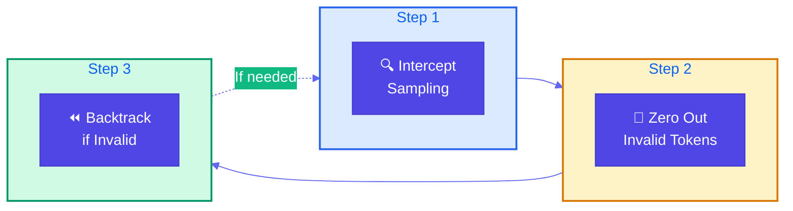

1. **Intercept Sampling**: Modify logits before token selection
2. **Zero Out Invalid Sequences**: Mask invalid tokens (set logits to -inf)
3. **Backtracking**: Revert to checkpoint if invalid sequence detected

### Use Cases

- API response generation (ensure valid JSON)
- Code generation (enforce style guidelines)
- Content moderation (prevent banned words)
- Structured data extraction (match specific formats)

### Constraints & Tradeoffs

**Constraints:**
- Requires access to model logits (not available in all APIs)
- State tracking can be complex for nested structures
- Performance overhead from logits processing

**Tradeoffs:**
- ✅ Prevents invalid generation at source
- ✅ More efficient than post-processing
- ⚠️ More complex than simple validation
- ⚠️ May limit model creativity

### Code Snippet

```python
class JSONLogitsProcessor(LogitsProcessor):
    """Intercept logits and mask invalid JSON tokens."""
    
    def __call__(self, input_ids, scores):
        # STEP 1: Intercept sampling
        current_text = self.tokenizer.decode(input_ids[0])
        
        # STEP 2: Zero out invalid sequences
        for token_id in range(scores.shape[-1]):
            if not self._is_valid_json_token(token_id, current_text):
                scores[0, token_id] = float('-inf')  # Mask invalid
        
        return scores
```

**Full Example**: [View on GitHub](https://github.com/bhatti/agentic-patterns/blob/main/patterns/logits-masking/example.py)

---

## Pattern 2: Grammar Constrained Generation

**Category**: Content & Style Control  
**Complexity**: High  
**Use When**: You need outputs that conform to formal grammar specifications

### Problem

Language models often produce text that doesn't conform to required formats, schemas, or grammars. Unlike simple masking, grammar-constrained generation ensures outputs follow formal grammar specifications.

### Solution

**Grammar Constrained Generation** uses formal grammar specifications to guide token generation. Three implementation approaches:

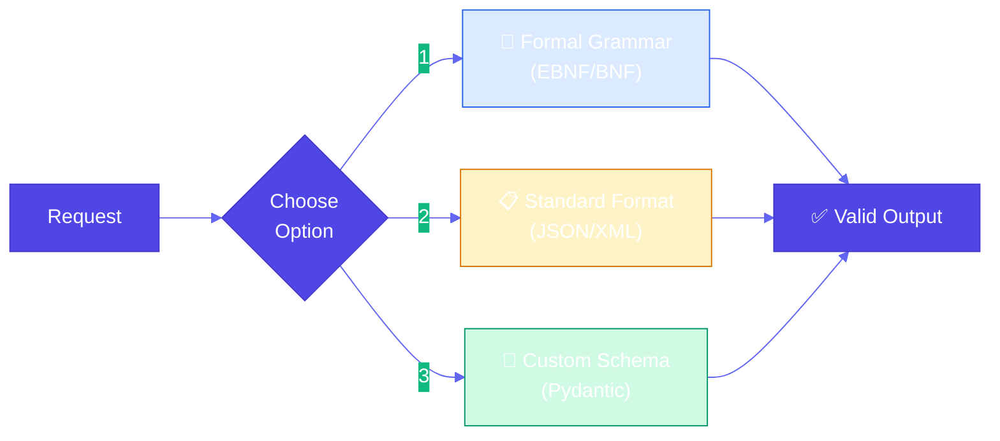

1. **Grammar-Constrained Logits Processor**: Use EBNF grammar to create processor
2. **Standard Data Format**: Leverage JSON/XML with existing validators
3. **User-Defined Schema**: Use custom schemas (JSON Schema, Pydantic)

### Use Cases

- API configuration generation (OpenAPI specs)
- Configuration files (YAML, TOML that must parse)
- Database queries (SQL with guaranteed syntax)
- Code generation (must compile/parse)

### Constraints & Tradeoffs

**Constraints:**
- Requires grammar definition or schema
- Grammar parsing can be computationally expensive
- Complex grammars may limit generation speed

**Tradeoffs:**
- ✅ Guarantees grammatical correctness
- ✅ Works with existing schema languages
- ⚠️ More complex than simple masking
- ⚠️ May require grammar expertise

### Code Snippet

```python
# Option 1: Formal Grammar
grammar = """
root        ::= endpoint_config
endpoint_config ::= "{" ws endpoint_def ws "}"
endpoint_def    ::= '"endpoint"' ws ":" ws endpoint_obj
"""

# Option 2: JSON Schema
schema = {
    "type": "object",
    "required": ["endpoint"],
    "properties": {
        "endpoint": {
            "type": "object",
            "required": ["name", "method", "path"]
        }
    }
}

# Apply grammar constraints during generation
processor = GrammarConstrainedProcessor(grammar, tokenizer)
logits = processor(input_ids, logits)
```

**Full Example**: [View on GitHub](https://github.com/bhatti/agentic-patterns/blob/main/patterns/grammar/example.py)

---

## Pattern 3: Style Transfer

**Category**: Content & Style Control  
**Complexity**: Low to Medium  
**Use When**: You need to transform content from one style to another

### Real-World Problem

**Notes to Professional Email Converter**: You need to convert informal meeting notes or quick jottings into professional, well-structured emails ready to send. Manual rewriting is time-consuming and inconsistent.

### Problem (General)

Content often needs to be transformed from one style to another while preserving core information. Manual rewriting is time-consuming and inconsistent.

### Solution

**Style Transfer** uses AI to transform content between styles. Two approaches:

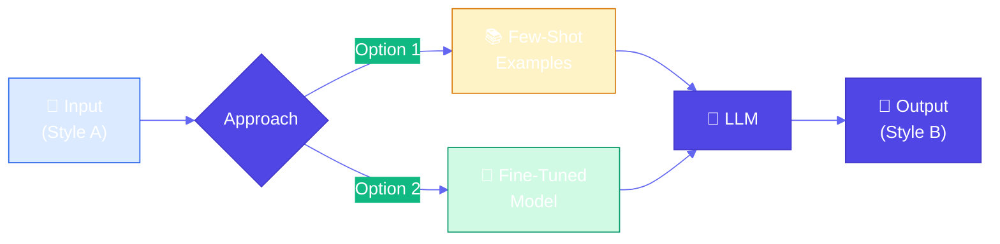

1. **Few-Shot Learning**: Use example pairs in prompt (no training)
2. **Model Fine-Tuning**: Fine-tune model on style pairs

### Use Cases

- Professional communication (notes to emails)
- Content adaptation (academic to blog posts)
- Brand voice (maintain consistent tone)
- Platform adaptation (different social media styles)

### Constraints & Tradeoffs

**Constraints:**
- Few-shot limited by context window
- Fine-tuning requires training data
- Style consistency can vary

**Tradeoffs:**
- ✅ Few-shot: Quick, no training needed
- ✅ Fine-tuning: Better consistency
- ⚠️ Few-shot: May not capture nuances
- ⚠️ Fine-tuning: Requires data collection

### Code Snippet

```python
# Option 1: Few-Shot Learning
examples = [
    StyleExample(
        input_text="urgent: need meeting minutes by friday",
        output_text="Subject: Urgent: Meeting Minutes Needed\n\nDear [Recipient],\n\n..."
    )
]

transfer = FewShotStyleTransfer(examples)
result = transfer.transfer_style("quick update: deadline moved")

# Option 2: Fine-Tuning
training_data = [
    {"prompt": "Convert notes to email", "completion": "Professional email..."}
]
fine_tuned_model = fine_tune_model(base_model, training_data)
```

**Full Example**: [View on GitHub](https://github.com/bhatti/agentic-patterns/blob/main/patterns/style-transfer/example.py)

---

## Pattern 4: Reverse Neutralization

**Category**: Content & Style Control  
**Complexity**: High  
**Use When**: You need to generate content in a specific personal style that zero-shot can't capture

### Real-World Problem

**Technical Documentation to Personal Blog Style**: You want to convert technical documentation into your personal blog writing style. Zero-shot prompting fails because the model doesn't know your unique writing style, tone, and preferences.

### Problem (General)

When you need content in a specific, personalized style (e.g., "write it as you wrote it"), zero-shot prompting fails because the model doesn't know your unique writing style.

### Solution

**Reverse Neutralization** uses a two-stage fine-tuning approach:

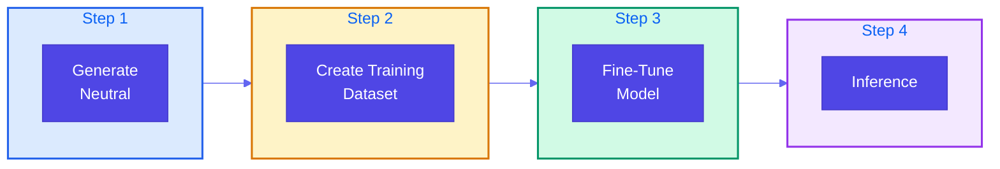

1. **Generate Neutral Form**: Create content in neutral, standardized format
2. **Fine-Tune Style Converter**: Train model to convert neutral → your style
3. **Inference**: Use fine-tuned model for style conversion

### Use Cases

- Personal blog writing (technical content to your style)
- Brand voice (consistent voice across content)
- Documentation style (match organization's style guide)
- Communication templates (your personal email style)

### Constraints & Tradeoffs

**Constraints:**
- Requires fine-tuning (more complex setup)
- Needs training data (neutral → style pairs)
- Two-stage process (slower than direct generation)

**Tradeoffs:**
- ✅ Learns your specific style
- ✅ Consistent results
- ✅ Captures personal nuances
- ⚠️ Requires data collection and training
- ⚠️ Less flexible (need retraining to change style)

### Code Snippet

```python
# Step 1: Generate neutral form
neutral_generator = NeutralGenerator()
neutral = neutral_generator.generate_neutral("API Authentication")

# Step 2-3: Create training dataset and fine-tune
pairs = [
    StylePair(neutral="Technical doc...", styled="Your blog style...")
]
fine_tuned_model = fine_tune_on_preferences(pairs)

# Step 4: Use fine-tuned model
converter = StyleConverter(fine_tuned_model)
styled = converter.convert_to_style(neutral)
```

**Full Example**: [View on GitHub](https://github.com/bhatti/agentic-patterns/blob/main/patterns/reverse-neutralization/example.py)

---

## Pattern 5: Content Optimization

**Category**: Content & Style Control  
**Complexity**: High  
**Use When**: You need to optimize content for specific performance goals (e.g., open rates, conversions)

### Real-World Problem

**Email Subject Line Optimizer**: You need to optimize email subject lines to maximize open rates for marketing campaigns. Traditional A/B testing is manual and doesn't learn what makes content effective. You need a system that learns from comparisons and generates optimized content.

### Problem (General)

When creating content for specific purposes, you need to optimize for outcomes. Traditional A/B testing is limited - it's manual, time-consuming, and doesn't learn patterns.

### Solution

**Content Optimization** uses preference-based fine-tuning (DPO) to train a model to generate content that wins in comparisons:

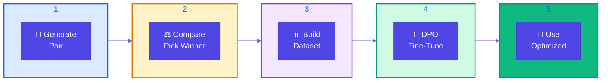

1. **Generate Pair**: Create two variations from same prompt
2. **Compare**: Test and pick winner based on metrics
3. **Create Dataset**: Collect preference pairs (prompt, chosen, rejected)
4. **Fine-Tune with DPO**: Train model on preferences
5. **Use Optimized Model**: Generate better-performing content

### Use Cases

- Email marketing (optimize subject lines for open rates)
- E-commerce (optimize product descriptions for conversions)
- Social media (optimize posts for engagement)
- Landing pages (optimize copy for sign-ups)

### Constraints & Tradeoffs

**Constraints:**
- Requires preference data collection
- DPO fine-tuning is computationally intensive
- Need clear optimization metrics

**Tradeoffs:**
- ✅ Learns from all comparisons
- ✅ Scales to many variations
- ✅ Model internalizes winning patterns
- ⚠️ Requires training data (100+ pairs)
- ⚠️ More complex than A/B testing

### Code Snippet

```python
# Step 1: Generate pair
generator = ContentGenerator()
var_a, var_b = generator.generate_pair("New product launch")

# Step 2: Compare and pick winner
comparator = ContentComparator(optimization_goal="open_rate")
pair = comparator.compare(ContentPair(prompt, var_a, var_b))
# Winner selected based on metrics

# Step 3-4: Create dataset and fine-tune
preferences = [PreferenceExample(prompt, chosen, rejected)]
dpo_trainer = PreferenceTuner()
optimized_model = dpo_trainer.fine_tune(preferences)

# Step 5: Use optimized model
optimized_generator = OptimizedContentGenerator(optimized_model)
result = optimized_generator.generate_optimized("Newsletter")
```

**Full Example**: [View on GitHub](https://github.com/bhatti/agentic-patterns/blob/main/patterns/content-optimization/example.py)

---

## Pattern 6: Basic RAG (Retrieval-Augmented Generation)

**Category**: Adding Knowledge  
**Complexity**: Medium  
**Use When**: You need to augment LLM responses with external knowledge sources

### Real-World Problem

**Product Documentation Q&A System**: You need to build a Q&A system that answers questions about your product documentation. The documentation is large, constantly updated, and contains specific technical details that base LLMs don't know. Users need accurate, up-to-date answers with source citations.

### Problem (General)

LLMs have three key knowledge limitations:
- **Static Knowledge Cutoff**: Trained on data up to a specific date
- **Model Capacity Limits**: Can't store all knowledge in parameters
- **Lack of Private Data Access**: No access to internal documents or databases

### Solution

**Basic RAG** uses trusted knowledge sources when generating LLM responses. It consists of two pipelines:

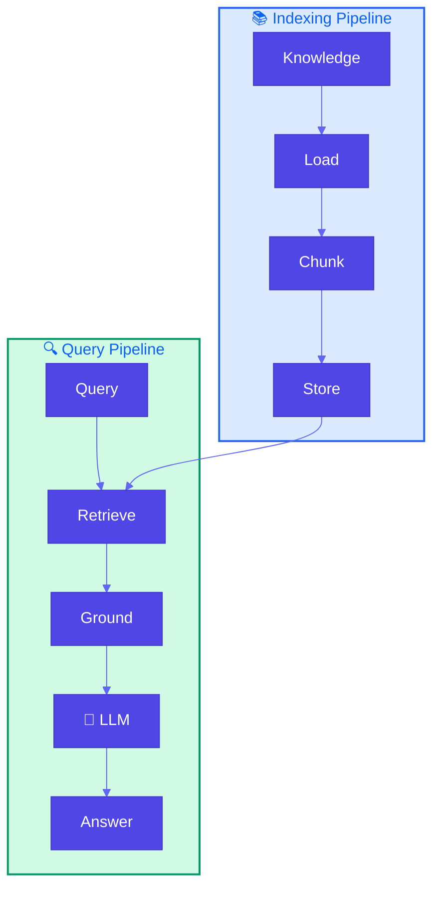

1. **Indexing Pipeline** (preparatory): Build efficient data store from knowledge sources
   - Load documents
   - Chunk into manageable pieces
   - Store in searchable index

2. **Retrieval-Generation Pipeline** (runtime): Use relevant knowledge to augment responses
   - Retrieve relevant chunks for query
   - Ground prompt with retrieved context
   - Generate response using LLM

### Use Cases

- Product documentation (answer questions about features/APIs)
- Company knowledge base (query internal wikis/policies)
- Customer support (accurate answers from support docs)
- Research assistance (search through papers/documents)
- Legal/compliance (query regulations/guides)

### Constraints & Tradeoffs

**Constraints:**
- Requires knowledge base preparation (indexing)
- Retrieval quality depends on chunking strategy
- May retrieve irrelevant chunks
- Limited by retrieval method effectiveness

**Tradeoffs:**
- ✅ Access to up-to-date and private knowledge
- ✅ Can handle large knowledge bases
- ✅ Transparent (can cite sources)
- ⚠️ Requires indexing infrastructure
- ⚠️ Retrieval quality affects response quality
- ⚠️ May include irrelevant context

### Code Snippet

```python
# INDEXING PIPELINE
loader = DocumentLoader()
documents = loader.load_documents("product_docs")

splitter = TextSplitter(chunk_size=500, chunk_overlap=50)
chunks = []
for doc in documents:
    chunks.extend(splitter.split_document(doc))

index = Index()
index.add_chunks(chunks)

# RETRIEVAL-GENERATION PIPELINE
retriever = Retriever(index, top_k=3)
generator = RAGGenerator(retriever)

# Query
result = generator.generate("How do I authenticate with the API?")
# Returns answer with source citations
```

**Full Example**: [View on GitHub](https://github.com/bhatti/agentic-patterns/blob/main/patterns/basic-rag/example.py)

---

## Pattern 7: Semantic Indexing

**Category**: Adding Knowledge  
**Complexity**: High  
**Use When**: You need semantic understanding beyond keywords, or have complex content (images, tables, code)

### Problem

Traditional keyword-based indexing has limitations:
- **Semantic Understanding**: Misses meaning - "car" and "automobile" are different keywords
- **Complex Content**: Struggles with images, tables, code blocks, structured data
- **Context Loss**: Fixed-size chunking breaks up related content
- **Multimedia**: Can't effectively index images, videos, or other media

### Solution

**Semantic Indexing** uses embeddings (vector representations) to capture meaning:

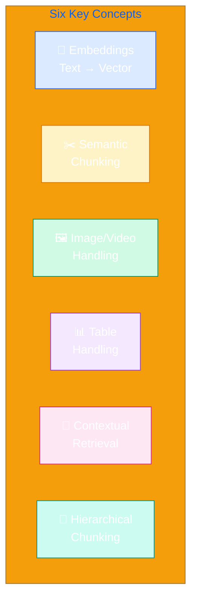

1. **Embeddings**: Encode text/images into fixed vector representations for semantic meaning
2. **Semantic Chunking**: Divide text into meaningful segments based on semantic content
3. **Image/Video Handling**: Use OCR or vision models for embedding generation
4. **Table Handling**: Organize and extract key information from structured data
5. **Contextual Retrieval**: Preserve context with hierarchical chunking
6. **Hierarchical Chunking**: Multi-level chunking (document → section → paragraph)

### Use Cases

- Technical documentation (code examples, API docs, tutorials)
- Research papers (find by concept, not keywords)
- Product catalogs (search by features, not names)
- Multimedia content (images, videos with descriptions)
- Structured data (databases, tables, structured documents)

### Constraints & Tradeoffs

**Constraints:**
- Requires embedding models (computational cost)
- Vector storage needs more space than keyword indexes
- Embedding quality depends on model choice
- More complex than keyword-based indexing

**Tradeoffs:**
- ✅ Better semantic understanding
- ✅ Handles complex content (images, tables, code)
- ✅ Preserves context with hierarchical chunking
- ✅ Supports multimedia content
- ⚠️ More complex implementation
- ⚠️ Higher computational cost
- ⚠️ Requires embedding model selection

### Code Snippet

```python
# CONCEPT 1: EMBEDDINGS - Vector representations for semantic meaning
from sentence_transformers import SentenceTransformer
import math

class EmbeddingGenerator:
    """Generate embeddings that capture semantic meaning."""
    
    def __init__(self, model_name: str = "all-MiniLM-L6-v2"):
        # Load sentence transformer model
        # Returns 384-dim vectors for all-MiniLM-L6-v2
        self.model = SentenceTransformer(model_name)
    
    def generate_embedding(self, text: str) -> List[float]:
        """Convert text to fixed-size vector representation."""
        # Embeddings capture semantic meaning, not just keywords
        # Similar concepts have similar vectors
        return self.model.encode(text).tolist()
    
    def cosine_similarity(self, vec1: List[float], vec2: List[float]) -> float:
        """Calculate semantic similarity between two vectors."""
        # Dot product measures alignment
        dot_product = sum(a * b for a, b in zip(vec1, vec2))
        # Normalize by magnitudes
        magnitude1 = math.sqrt(sum(a * a for a in vec1))
        magnitude2 = math.sqrt(sum(a * a for a in vec2))
        return dot_product / (magnitude1 * magnitude2) if magnitude1 * magnitude2 > 0 else 0.0

# CONCEPT 2: SEMANTIC CHUNKING - Divide by meaning, not size
import re
from dataclasses import dataclass

@dataclass
class SemanticChunk:
    """Represents a semantically meaningful chunk."""
    id: str
    text: str
    embedding: Optional[List[float]] = None
    chunk_type: str = "text"  # text, code, table, image
    parent_id: Optional[str] = None
    children_ids: List[str] = None

class SemanticChunker:
    """Chunk text by semantic structure, not fixed size."""
    
    def chunk_by_structure(self, content: str) -> List[SemanticChunk]:
        """Chunk respecting document structure (headers, sections, paragraphs)."""
        chunks = []
        
        # Split by markdown headers (## or ###)
        # This preserves semantic boundaries
        sections = re.split(r'\n(#{2,3}\s+.+?)\n', content)
        
        current_section = None
        chunk_index = 0
        
        for i, part in enumerate(sections):
            if part.strip().startswith('#'):
                # Header - start new semantic chunk
                if current_section:
                    chunks.append(SemanticChunk(
                        id=f"chunk-{chunk_index}",
                        text=current_section,
                        chunk_type="text"
                    ))
                    chunk_index += 1
                current_section = part + "\n"
            else:
                # Content - append to current section
                if current_section:
                    current_section += part
                else:
                    current_section = part
        
        # Add final chunk
        if current_section:
            chunks.append(SemanticChunk(
                id=f"chunk-{chunk_index}",
                text=current_section,
                chunk_type="text"
            ))
        
        return chunks

# CONCEPT 3: IMAGE HANDLING - OCR or vision models
from PIL import Image
import pytesseract  # For OCR

class ImageProcessor:
    """Process images for semantic indexing."""
    
    def __init__(self, embedding_generator: EmbeddingGenerator):
        self.embedding_generator = embedding_generator
    
    def process_image(self, image_path: str) -> Dict[str, Any]:
        """Process image: extract text via OCR and generate embeddings."""
        # Option 1: OCR to extract text, then embed
        image = Image.open(image_path)
        ocr_text = pytesseract.image_to_string(image)
        text_embedding = self.embedding_generator.generate_embedding(ocr_text)
        
        # Option 2: Vision model for visual embeddings (alternative approach)
        # vision_embedding = vision_model.encode(image_path)
        
        return {
            "text": ocr_text,
            "embedding": text_embedding,
            "type": "image",
            "path": image_path
        }

# CONCEPT 4: TABLE HANDLING - Extract structured data
class TableProcessor:
    """Process tables for semantic indexing."""
    
    def __init__(self, embedding_generator: EmbeddingGenerator):
        self.embedding_generator = embedding_generator
    
    def process_table(self, table_data: List[Dict[str, Any]]) -> Dict[str, Any]:
        """Extract structured data and create embeddings."""
        # Create text representation preserving structure
        text_parts = []
        for row in table_data:
            # Format: "column1: value1, column2: value2, ..."
            row_text = ", ".join([f"{k}: {v}" for k, v in row.items()])
            text_parts.append(row_text)
        
        table_text = "\n".join(text_parts)
        
        # Generate embedding for table content
        embedding = self.embedding_generator.generate_embedding(table_text)
        
        return {
            "text": table_text,
            "embedding": embedding,
            "type": "table",
            "row_count": len(table_data),
            "columns": list(table_data[0].keys()) if table_data else [],
            "structure": table_data  # Preserve original structure
        }

# CONCEPTS 5 & 6: HIERARCHICAL CHUNKING & CONTEXTUAL RETRIEVAL
class HierarchicalChunker:
    """Create hierarchical chunks with parent-child relationships."""
    
    def create_hierarchy(self, document: Dict[str, Any]) -> List[SemanticChunk]:
        """Create multi-level chunks: Document → Section → Paragraph."""
        chunks = []
        
        # Level 0: Document chunk
        doc_chunk = SemanticChunk(
            id="doc-root",
            text=document.get("title", "") + "\n" + document.get("content", "")[:200],
            chunk_type="document",
            children_ids=[]
        )
        chunks.append(doc_chunk)
        
        # Level 1: Section chunks
        content = document.get("content", "")
        sections = re.split(r'\n(#{2}\s+.+?)\n', content)
        
        section_index = 0
        for i, part in enumerate(sections):
            if part.strip().startswith('##'):
                # Section header - create section chunk
                section_chunk = SemanticChunk(
                    id=f"section-{section_index}",
                    text=part,
                    chunk_type="section",
                    parent_id="doc-root",
                    children_ids=[]
                )
                chunks.append(section_chunk)
                doc_chunk.children_ids.append(section_chunk.id)
                section_index += 1
            elif i > 0:
                # Level 2: Paragraph chunks (content after header)
                para_chunk = SemanticChunk(
                    id=f"para-{section_index-1}-{i}",
                    text=part[:300],
                    chunk_type="paragraph",
                    parent_id=f"section-{section_index-1}" if section_index > 0 else "doc-root"
                )
                chunks.append(para_chunk)
                # Link to parent
                if chunks[-2].id.startswith("section"):
                    chunks[-2].children_ids.append(para_chunk.id)
        
        return chunks

class ContextualRetriever:
    """Retrieve chunks with context preservation."""
    
    def __init__(self, chunks: List[SemanticChunk], embedding_generator: EmbeddingGenerator):
        self.chunks = {chunk.id: chunk for chunk in chunks}
        self.embedding_generator = embedding_generator
        
        # Generate embeddings for all chunks
        for chunk in chunks:
            if chunk.embedding is None:
                chunk.embedding = embedding_generator.generate_embedding(chunk.text)
    
    def retrieve_with_context(self, query: str, top_k: int = 3, 
                              include_context: bool = True) -> List[SemanticChunk]:
        """Retrieve relevant chunks with parent/child context."""
        # Step 1: Generate query embedding
        query_embedding = self.embedding_generator.generate_embedding(query)
        
        # Step 2: Calculate similarities and find top-k
        scored_chunks = []
        for chunk in self.chunks.values():
            if chunk.embedding:
                similarity = self.embedding_generator.cosine_similarity(
                    query_embedding, chunk.embedding
                )
                scored_chunks.append((similarity, chunk))
        
        # Sort by similarity
        scored_chunks.sort(key=lambda x: x[0], reverse=True)
        top_chunks = [chunk for _, chunk in scored_chunks[:top_k]]
        
        # Step 3: Add context (parent and children chunks)
        if include_context:
            contextual_chunks = []
            for chunk in top_chunks:
                contextual_chunks.append(chunk)
                
                # Add parent for context
                if chunk.parent_id and chunk.parent_id in self.chunks:
                    parent = self.chunks[chunk.parent_id]
                    if parent not in contextual_chunks:
                        contextual_chunks.append(parent)
                
                # Add children for detail
                for child_id in chunk.children_ids:
                    if child_id in self.chunks:
                        child = self.chunks[child_id]
                        if child not in contextual_chunks:
                            contextual_chunks.append(child)
            
            return contextual_chunks
        
        return top_chunks
```

**Full Example**: [View on GitHub](https://github.com/bhatti/agentic-patterns/blob/main/patterns/semantic-indexing/example.py)

---

## Pattern 8: Indexing at Scale

**Category**: Adding Knowledge  
**Complexity**: High  
**Use When**: Your RAG system needs to handle large-scale knowledge bases with evolving, time-sensitive information

### Real-World Problem

**Healthcare Guidelines Knowledge Base**: Your RAG system indexes healthcare guidelines (CDC, WHO) that change over time. As the knowledge base grows, performance degrades, old guidelines contradict new ones (e.g., mask recommendations changed multiple times), and users get confused by contradictory or outdated answers.

### Problem (General)

RAG systems in production face critical challenges as knowledge bases grow:
- **Performance Degradation**: Search and retrieval slow down as index size increases
- **Data Freshness**: Recent findings obsolete old guidelines (e.g., CDC updates contradict previous recommendations)
- **Contradictory Content**: Multiple versions of information exist, causing confusion
- **Outdated Content**: Old information remains in index, leading to incorrect answers

### Solution

**Indexing at Scale** uses metadata and temporal awareness to handle large, evolving knowledge bases:

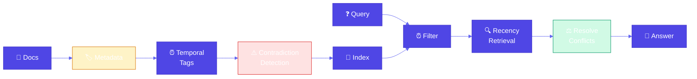

1. **Document Metadata**: Use timestamps, version numbers, source information for context
2. **Temporal Tagging**: Tag chunks with creation/update dates, expiration dates
3. **Contradiction Detection**: Identify and prioritize newer information over older contradictory content
4. **Outdated Content Management**: Automatically deprecate or flag outdated information
5. **Efficient Indexing**: Use incremental updates, versioning, and metadata filtering
6. **Model Lifecycle Management**: Choose models/APIs with long support lifecycles

### Use Cases

- Healthcare guidelines (CDC, WHO guidelines that change over time)
- Technical documentation (API docs with versioning and deprecations)
- Policy documents (company policies that get updated regularly)
- Research knowledge bases (scientific papers with publication dates)
- Regulatory compliance (regulations that change with new laws)

### Constraints & Tradeoffs

**Constraints:**
- Requires metadata management infrastructure
- Contradiction detection can be computationally expensive
- Temporal tagging adds complexity to indexing
- Version management needs careful design

**Tradeoffs:**
- ✅ Handles large-scale knowledge bases efficiently
- ✅ Ensures data freshness and accuracy
- ✅ Prevents contradictory information
- ✅ Manages outdated content automatically
- ⚠️ More complex than basic RAG
- ⚠️ Requires metadata discipline
- ⚠️ Additional storage for metadata

### Code Snippet

```python
# TEMPORAL METADATA - Track creation, update, expiration dates
@dataclass
class TemporalMetadata:
    created_at: datetime
    updated_at: datetime
    expires_at: Optional[datetime] = None
    version: str = "1.0"
    source: str = ""
    authority: str = "medium"  # high, medium, low

# CONTRADICTION DETECTION - Identify conflicting information
class ContradictionDetector:
    def detect_contradictions(self, topic: str) -> List[Contradiction]:
        # Compare chunks on same topic
        # Check for opposite keywords (required vs optional)
        # Resolve by preferring newer, more authoritative sources
        return contradictions
    
    def _resolve_contradiction(self, chunk_a, chunk_b):
        # Prefer newer date
        if chunk_a.metadata.updated_at > chunk_b.metadata.updated_at:
            return "chunk_a"
        # If same date, prefer higher authority
        if chunk_a.metadata.authority > chunk_b.metadata.authority:
            return "chunk_a"
        return "chunk_b"

# TEMPORAL RETRIEVER - Prioritize recent information
class TemporalRetriever:
    def retrieve(self, query: str, top_k: int = 5,
                max_age_days: Optional[int] = None,
                exclude_outdated: bool = True):
        # Filter by expiration date
        # Filter by max_age_days
        # Exclude outdated chunks
        # Sort by recency (newer first) and relevance
        return results

# KNOWLEDGE BASE WITH TEMPORAL AWARENESS
kb = HealthcareGuidelinesKB()
kb.add_guideline(
    content="CDC recommends masks required in public",
    source="CDC",
    date=datetime(2021, 7, 15),
    authority="high"
)

result = kb.query("Should I wear a mask?", prefer_recent=True)
# Returns most recent guidelines, flags contradictions
```

**Full Example**: [View on GitHub](https://github.com/bhatti/agentic-patterns/blob/main/patterns/indexing-at-scale/example.py)

---

## Pattern 9: Index-Aware Retrieval

**Category**: Adding Knowledge  
**Complexity**: High  
**Use When**: Basic RAG fails due to vocabulary mismatches, fine details, or holistic answers requiring multiple concepts

### Real-World Problem

**Technical API Documentation Q&A System**: Users ask questions in natural language ("How do I log in?"), but your API documentation uses technical terminology ("OAuth 2.0 authentication", "access token"). Basic RAG fails because "log in" ≠ "authentication" ≠ "OAuth 2.0". Answers might be fine details hidden in chunks or require connecting multiple concepts.

### Problem (General)

Basic RAG assumes you can search the knowledge base for chunks similar to questions, but this isn't always the case:
- **Question Not in Knowledge Base**: User asks "How do I log in?" but chunks say "authentication" or "OAuth 2.0"
- **Technical Knowledge Mismatch**: User uses natural language, docs use technical terminology
- **Fine Detail Hidden**: Answer is a small detail buried in a large chunk
- **Holistic Interpretation**: Answer requires connecting multiple concepts across chunks

### Solution

**Index-Aware Retrieval** uses advanced retrieval techniques to bridge the gap:

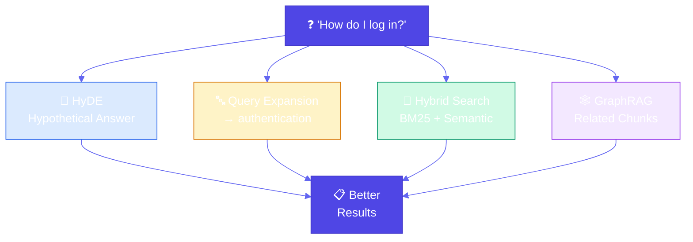

1. **Hypothetical Document Embedding (HyDE)**: Generate hypothetical answer first, then match chunks to that answer
2. **Query Expansion**: Add context and translate user terms to technical terms used in chunks
3. **Hybrid Search**: Combine keyword (BM25) and semantic (embedding) search with weighted average
4. **GraphRAG**: Store documents in graph database, retrieve related chunks after finding initial match

### Use Cases

- Technical documentation (users ask in natural language, docs use technical terms)
- Research papers (answers require connecting multiple concepts)
- API documentation (fine details hidden in large chunks)
- Product documentation (holistic answers need multiple related sections)
- Knowledge bases (complex questions requiring multi-hop reasoning)

### Constraints & Tradeoffs

**Constraints:**
- HyDE requires LLM call (latency and cost)
- Query expansion needs domain knowledge
- Hybrid search requires both keyword and semantic indexes
- GraphRAG needs graph database infrastructure

**Tradeoffs:**
- ✅ Handles vocabulary mismatches
- ✅ Finds fine details in chunks
- ✅ Connects related concepts
- ✅ More accurate retrieval
- ⚠️ More complex than basic RAG
- ⚠️ Higher computational cost
- ⚠️ Requires more infrastructure

### Code Snippet

```python
# TECHNIQUE 1: HYPOTHETICAL DOCUMENT EMBEDDING (HyDE)
class HyDEGenerator:
    def retrieve_with_hyde(self, query: str, chunks: List[DocumentChunk], top_k: int = 3):
        # Step 1: Generate hypothetical answer
        hypothetical_answer = self.generate_hypothetical_answer(query)
        # "To authenticate, use OAuth 2.0 access token..."
        
        # Step 2: Embed hypothetical answer
        hyde_embedding = embedding_generator.generate_embedding(hypothetical_answer)
        
        # Step 3: Find chunks similar to hypothetical answer (not original query)
        scored_chunks = []
        for chunk in chunks:
            similarity = cosine_similarity(hyde_embedding, chunk.embedding)
            scored_chunks.append((chunk, similarity))
        
        return sorted(scored_chunks, key=lambda x: x[1], reverse=True)[:top_k]

# TECHNIQUE 2: QUERY EXPANSION
class QueryExpander:
    def expand_query(self, query: str) -> str:
        # Translate user terms to technical terms
        term_translations = {
            "log in": ["authentication", "oauth", "access token"],
            "error": ["error code", "status code", "exception"]
        }
        
        expanded_terms = [query]
        for user_term, tech_terms in term_translations.items():
            if user_term in query.lower():
                expanded_terms.extend(tech_terms)
        
        return " ".join(expanded_terms)

# TECHNIQUE 3: HYBRID SEARCH (BM25 + Semantic)
class HybridRetriever:
    def retrieve(self, query: str, top_k: int = 5):
        # BM25 score (keyword-based)
        bm25_score = bm25_scorer.score(query, chunk)
        
        # Semantic score (embedding-based)
        semantic_score = cosine_similarity(query_embedding, chunk.embedding)
        
        # Hybrid score: weighted combination
        # α = 0.4 means 40% BM25, 60% semantic
        hybrid_score = 0.4 * bm25_score + 0.6 * semantic_score
        
        return sorted_chunks_by_score[:top_k]

# TECHNIQUE 4: GRAPHRAG
class GraphRAG:
    def retrieve_related(self, initial_chunk_id: str, depth: int = 1):
        # Find initial relevant chunk
        # Traverse graph to find related chunks
        related_ids = graph[initial_chunk_id]  # Direct neighbors
        for _ in range(depth - 1):
            # Get neighbors of neighbors
            next_level = [graph[rid] for rid in related_ids]
            related_ids.extend(next_level)
        
        return [chunks[cid] for cid in related_ids]
```

**Full Example**: [View on GitHub](https://github.com/bhatti/agentic-patterns/blob/main/patterns/index-aware-retrieval/example.py)

---

## Pattern 10: Node Postprocessing

**Category**: Adding Knowledge  
**Complexity**: High  
**Use When**: Retrieved chunks have issues: ambiguous entities, conflicting content, obsolete information, or are too verbose

### Real-World Problem

**Legal Document Q&A System**: Your RAG system retrieves legal document chunks, but they have issues: ambiguous entities ("Apple" could be company or fruit), conflicting interpretations of the same law, obsolete regulations superseded by new ones, verbose chunks with only small relevant sections, and low-relevance chunks that don't actually answer the question.

### Problem (General)

RAG systems retrieve chunks similar to queries, but retrieved chunks may have issues:
- **Not Relevant**: Chunks match query keywords but aren't actually relevant
- **Ambiguous Entities**: Chunks mention entities that could refer to multiple things
- **Conflicting Content**: Different chunks provide contradictory information
- **Obsolete Information**: Chunks contain outdated information
- **Too Verbose**: Chunks contain too much irrelevant content
- **Low Quality**: Initial retrieval ranking isn't accurate enough

### Solution

**Node Postprocessing** improves retrieved chunks through multiple techniques:

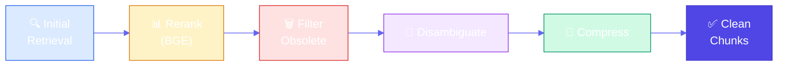

1. **Reranking**: Use more accurate models (like BGE) to rerank chunks
2. **Hybrid Search**: Combine BM25 (keyword) and semantic (embedding) retrieval
3. **Query Expansion and Decomposition**: Expand queries and break into sub-queries
4. **Filtering**: Remove obsolete, conflicting, or irrelevant chunks
5. **Contextual Compression**: Extract only relevant parts from verbose chunks
6. **Disambiguation**: Resolve ambiguous entities and clarify context

### Use Cases

- Legal documents (handle ambiguous entities, conflicting interpretations, obsolete laws)
- Medical records (filter outdated treatments, disambiguate medical terms)
- Technical documentation (compress verbose chunks, filter deprecated APIs)
- Research papers (handle conflicting findings, disambiguate technical terms)
- News articles (filter outdated news, disambiguate entity names)

### Constraints & Tradeoffs

**Constraints:**
- Reranking requires additional model (latency and cost)
- Filtering needs domain knowledge and thresholds
- Compression may lose important context
- Disambiguation requires entity knowledge bases

**Tradeoffs:**
- ✅ More accurate retrieval
- ✅ Handles ambiguous entities
- ✅ Filters problematic content
- ✅ Compresses verbose chunks
- ⚠️ More complex than basic retrieval
- ⚠️ Higher computational cost
- ⚠️ Requires additional models/infrastructure

### Code Snippet

```python
# TECHNIQUE 1: RERANKING (BGE-style Cross-Encoder)
class Reranker:
    def rerank(self, query: str, chunks: List[DocumentChunk], top_k: int = 5):
        """
        Rerank using cross-encoder (more accurate than embeddings).
        
        In production:
        from sentence_transformers import CrossEncoder
        model = CrossEncoder('BAAI/bge-reranker-base')
        scores = model.predict([(query, chunk.content) for chunk in chunks])
        """
        # Cross-encoder sees query + chunk together
        # More accurate than bi-encoder (embedding) models
        scored_chunks = []
        for chunk in chunks:
            # Cross-encoder understands context better
            score = calculate_relevance(query, chunk.content)
            scored_chunks.append((chunk, score))
        
        return sorted(scored_chunks, key=lambda x: x[1], reverse=True)[:top_k]

# TECHNIQUE 2: HYBRID SEARCH (BM25 + Semantic)
class HybridRetriever:
    def retrieve(self, query: str, top_k: int = 5):
        query_embedding = embedding_generator.generate_embedding(query)
        
        scored_chunks = []
        for chunk in chunks:
            # BM25 score (keyword-based)
            bm25_score = bm25_scorer.score(query, chunk)
            bm25_normalized = normalize(bm25_score)
            
            # Semantic score (embedding-based)
            semantic_score = cosine_similarity(query_embedding, chunk.embedding)
            
            # Hybrid score: weighted combination
            # α = 0.4 means 40% BM25, 60% semantic
            hybrid_score = 0.4 * bm25_normalized + 0.6 * semantic_score
            scored_chunks.append((chunk, hybrid_score))
        
        return sorted(scored_chunks, key=lambda x: x[1], reverse=True)[:top_k]

# TECHNIQUE 3: QUERY EXPANSION & DECOMPOSITION
class QueryProcessor:
    def expand_query(self, query: str) -> str:
        """Expand with synonyms and related terms."""
        term_expansions = {
            "breach": ["violation", "infringement", "non-compliance"],
            "damages": ["compensation", "reparation", "restitution"]
        }
        
        expanded_terms = [query]
        for term, synonyms in term_expansions.items():
            if term in query.lower():
                expanded_terms.extend(synonyms)
        
        return " ".join(expanded_terms)
    
    def decompose_query(self, query: str) -> List[str]:
        """Break complex queries into sub-queries."""
        if " and " in query.lower():
            return [p.strip() for p in query.split(" and ")]
        return [query]

# TECHNIQUE 4: FILTERING
class ChunkFilter:
    def filter_obsolete(self, chunks: List[DocumentChunk]) -> List[DocumentChunk]:
        """Remove obsolete chunks (superseded by newer versions)."""
        return [c for c in chunks if not c.is_obsolete and c.superseded_by is None]
    
    def filter_by_relevance(self, chunks: List[Tuple[DocumentChunk, float]], 
                           threshold: float = 0.3):
        """Remove chunks below relevance threshold."""
        return [chunk for chunk, score in chunks if score >= threshold]
    
    def filter_conflicting(self, chunks: List[DocumentChunk], query: str):
        """Remove chunks with conflicting information."""
        # Detect and remove contradictory chunks
        return filtered_chunks

# TECHNIQUE 5: CONTEXTUAL COMPRESSION
class ContextualCompressor:
    def compress(self, chunk: DocumentChunk, query: str, max_length: int = 200):
        """
        Extract only relevant parts from verbose chunks.
        
        In production, would use LLM to intelligently extract relevant sections.
        """
        query_words = set(query.lower().split())
        sentences = chunk.content.split('.')
        
        # Extract sentences containing query terms
        relevant_sentences = [
            s for s in sentences 
            if query_words & set(s.lower().split())
        ]
        
        # Combine relevant sentences
        compressed_content = '. '.join(relevant_sentences[:3]) + '.'
        if len(compressed_content) > max_length:
            compressed_content = compressed_content[:max_length] + "..."
        
        return DocumentChunk(
            id=chunk.id + "_compressed",
            content=compressed_content,
            # ... other fields
        )

# TECHNIQUE 6: DISAMBIGUATION
class Disambiguator:
    def disambiguate(self, chunks: List[DocumentChunk], query: str):
        """Resolve ambiguous entities based on context."""
        entity_contexts = {
            "apple": {
                "company": ["technology", "iphone", "corporate"],
                "fruit": ["nutrition", "eating", "food"]
            }
        }
        
        query_words = set(query.lower().split())
        for chunk in chunks:
            for entity, contexts in entity_contexts.items():
                if entity in chunk.content.lower():
                    # Determine entity type from context
                    entity_type = determine_from_context(entity, query_words, chunk.content)
                    if entity_type:
                        chunk.entities.append(f"{entity}:{entity_type}")
        
        return chunks

# COMPLETE POSTPROCESSING PIPELINE
def query_with_postprocessing(question: str):
    # 1. Query expansion
    expanded = query_processor.expand_query(question)
    
    # 2. Hybrid search (initial retrieval)
    candidates = hybrid_retriever.retrieve(expanded, top_k=10)
    
    # 3. Filtering
    filtered = filter.filter_obsolete([c for c, _ in candidates])
    filtered = filter.filter_by_relevance(candidates, threshold=0.3)
    filtered = filter.filter_conflicting(filtered, question)
    
    # 4. Reranking (more accurate)
    reranked = reranker.rerank(question, filtered, top_k=5)
    
    # 5. Disambiguation
    disambiguated = disambiguator.disambiguate([c for c, _ in reranked], question)
    
    # 6. Contextual compression
    compressed = [compressor.compress(c, question) for c in disambiguated]
    
    return compressed
```

**Full Example**: [View on GitHub](https://github.com/bhatti/agentic-patterns/blob/main/patterns/node-postprocessing/example.py)

---

## Pattern 11: Trustworthy Generation

**Category**: Adding Knowledge  
**Complexity**: High  
**Use When**: RAG systems need to build user trust by preventing hallucination, providing citations, and detecting out-of-domain queries

### Real-World Problem

**Medical Q&A System**: Your RAG system answers medical questions, but users lose trust because: the system answers questions outside its knowledge domain (hallucination), answers lack citations (unverifiable), the system provides confident answers when retrieval failed (unreliable), and there are no warnings when information is uncertain or unsupported.

### Problem (General)

RAG systems can erode user trust due to several issues:
- **Retrieval Failures**: System retrieves irrelevant or no chunks, but still generates answers
- **Contextual Reliability Issues**: Retrieved context doesn't actually support the answer
- **Reasoning Errors**: LLM makes logical errors when reasoning about retrieved content
- **Hallucination Risks**: LLM generates information not present in knowledge base
- **Out-of-Domain Queries**: System answers questions outside its knowledge domain
- **Lack of Transparency**: Users can't verify where information came from

### Solution

**Trustworthy Generation** builds user trust through multiple mechanisms:

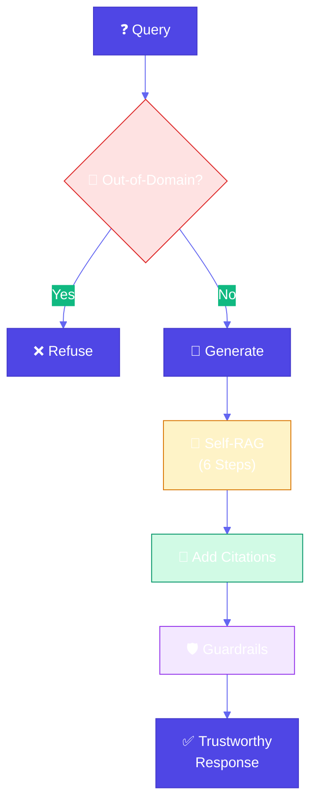

1. **Out-of-Domain Detection**: Detect when knowledge base doesn't contain relevant information
2. **Embedding Distance Checking**: Measure similarity between query and retrieved chunks
3. **Zero-Shot Classification**: Categorize queries to determine if they're answerable
4. **Domain-Specific Keywords**: Require domain terminology to ensure query is in-domain
5. **Citations**: Provide source citations for all factual claims
6. **Source-Level Tracking**: Track which sources support each part of the answer
7. **Classification-Based Citation**: Use classification to determine what needs citations
8. **Token-Level Attribution**: Attribute each token/claim to its source
9. **Guardrails**: Prevent generation of unsafe or unreliable content
10. **Self-RAG Workflow**: 6-step self-reflective process to verify responses

### Use Cases

- Medical Q&A (ensure all medical advice is cited and within knowledge domain)
- Legal research (provide citations for all legal claims)
- Academic research (attribute all facts to sources)
- Technical documentation (verify all technical claims are documented)
- News/content (ensure all information is verifiable)

### Constraints & Tradeoffs

**Constraints:**
- Out-of-domain detection needs domain knowledge
- Citations add complexity and latency
- Self-RAG requires multiple LLM calls
- Guardrails may be too restrictive

**Tradeoffs:**
- ✅ Builds user trust through transparency
- ✅ Prevents hallucination
- ✅ Enables verification
- ✅ Catches errors through self-reflection
- ⚠️ More complex than basic RAG
- ⚠️ Higher latency (multiple steps)
- ⚠️ May refuse valid queries (false positives)

### Code Snippet

```python
# OUT-OF-DOMAIN DETECTION
class OutOfDomainDetector:
    def is_out_of_domain(self, query: str, chunks: List[DocumentChunk]) -> Tuple[bool, str]:
        """Detect if query is outside knowledge base domain."""
        # Method 1: Embedding distance
        if chunks:
            query_embedding = embedding_generator.generate_embedding(query)
            min_distance = min([
                1 - cosine_similarity(query_embedding, chunk.embedding)
                for chunk in chunks
            ])
            if min_distance > threshold:
                return True, "Query too far from knowledge base"
        
        # Method 2: Zero-shot classification
        if not has_domain_keywords(query):
            return True, "Query lacks domain-specific terminology"
        
        # Method 3: Check if any chunks retrieved
        if not chunks:
            return True, "No relevant chunks found"
        
        return False, ""

# SELF-RAG WORKFLOW (6 Steps)
class SelfRAGProcessor:
    def process(self, query: str, retrieved_chunks: List[DocumentChunk]):
        # STEP 1: Generate initial response
        initial_response = generate_initial_response(query, retrieved_chunks)
        
        # STEP 2: Chunk the response into smaller sections
        response_chunks = chunk_response(initial_response)
        # Example: ["High blood pressure is treated with medications.",
        #           "ACE inhibitors are commonly prescribed."]
        
        # STEP 3: Check whether chunk needs citation
        for chunk in response_chunks:
            chunk.needs_citation = needs_citation(chunk.text)
            # Uses classification: factual claims need citations
        
        # STEP 4: Lookup sources
        for chunk in response_chunks:
            if chunk.needs_citation:
                chunk.sources = lookup_sources(chunk.text, retrieved_chunks)
                # Find which chunks support this claim
        
        # STEP 5: Incorporate citations into response
        final_response = incorporate_citations(response_chunks)
        # "High blood pressure is treated with medications [1].
        #  ACE inhibitors are commonly prescribed [1].
        #  References: [1] Cardiology Guidelines 2023"
        
        # STEP 6: Add necessary warnings or corrections
        warnings = generate_warnings(response_chunks)
        # "⚠️ Warning: Low confidence in medication dosages"
        
        return {"response": final_response, "warnings": warnings}

# CITATIONS
def incorporate_citations(chunks: List[ResponseChunk]) -> str:
    """Add inline citations to claims that need them."""
    source_map = {}  # Map source names to citation numbers
    
    for chunk in chunks:
        if chunk.needs_citation and chunk.sources:
            citations = []
            for source in chunk.sources:
                if source not in source_map:
                    source_map[source] = len(source_map) + 1
                citations.append(f"[{source_map[source]}]")
            
            # Add citations: "Claim [1][2]"
            cited_text = f"{chunk.text} {''.join(citations)}"
    
    # Add references section
    response += "\n\nReferences:\n"
    for source, num in source_map.items():
        response += f"  [{num}] {source}\n"
    
    return response

# GUARDRAILS
class GuardrailSystem:
    def check(self, query: str, response: Dict, chunks: List[DocumentChunk]):
        """Enforce guardrails: relevance, source support, confidence."""
        # Guardrail 1: Must have retrieved chunks
        if not chunks:
            return False, "No relevant information found"
        
        # Guardrail 2: Must have citations for factual claims
        if has_factual_claims(response) and not response.get("has_citations"):
            return False, "Factual claims without citations"
        
        # Guardrail 3: Confidence check
        if avg_confidence(response) < min_confidence:
            return False, "Confidence too low"
        
        return True, None

# COMPLETE TRUSTWORTHY GENERATION PIPELINE
def query_with_trustworthiness(question: str):
    # 1. Out-of-domain detection
    is_ood, reason = out_of_domain_detector.is_out_of_domain(question, chunks)
    if is_ood:
        return {"response": f"Cannot answer: {reason}", "out_of_domain": True}
    
    # 2. Self-RAG workflow (6 steps)
    result = self_rag.process(question, retrieved_chunks)
    
    # 3. Guardrails
    passed, reason = guardrails.check(question, result, retrieved_chunks)
    if not passed:
        result["response"] = f"Cannot provide reliable answer: {reason}"
    
    return result
```

**Full Example**: [View on GitHub](https://github.com/bhatti/agentic-patterns/blob/main/patterns/trustworthy-generation/example.py)

---

## Pattern 12: Deep Search

**Category**: Adding Knowledge  
**Complexity**: High  
**Use When**: Complex information needs require iterative retrieval, multi-hop reasoning, or comprehensive research across multiple sources

### Real-World Problem

**Market Research Analyst System**: Investment analysts need comprehensive research on companies/industries. Basic RAG retrieves a few chunks and provides incomplete answers. They need a system that iteratively explores multiple sources, identifies gaps, follows up on missing information, and synthesizes comprehensive reports with citations.

### Problem (General)

RAG systems are less effective for complex information retrieval due to:
- **Context Window Constraints**: Single retrieval can't capture all relevant information
- **Query Ambiguity**: Complex questions require clarification through exploration
- **Information Verification**: Facts need cross-referencing from multiple sources
- **Shallow Reasoning**: Single-pass retrieval lacks depth for nuanced questions
- **Information Staleness**: Knowledge bases may have outdated information
- **Multihop Query Challenges**: Answers require connecting information across multiple documents

### Solution

**Deep Search** uses an iterative loop that consists of retrieval and thinking until a good enough answer is found or time/cost budget is exhausted:

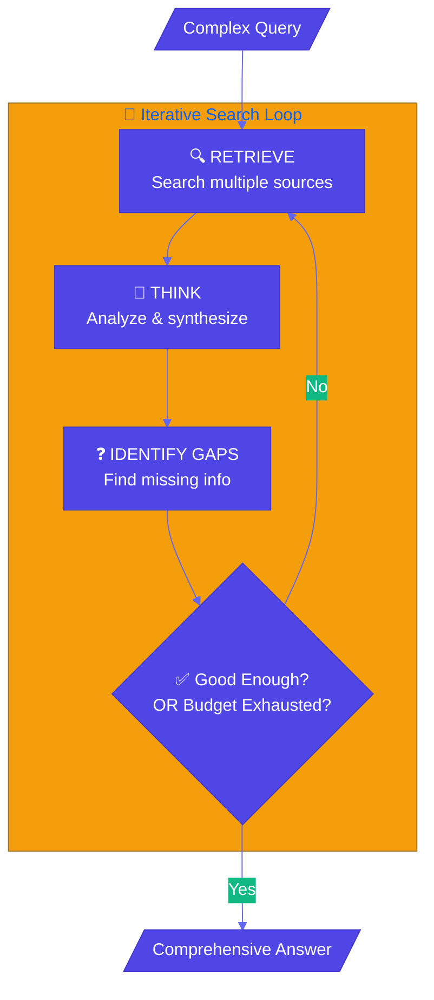

### Use Cases

- Market research (comprehensive company/industry analysis)
- Due diligence (investment research with multiple factors)
- Competitive analysis (deep competitive landscape research)
- Technical research (complex questions requiring multiple sources)
- Legal research (multi-document legal analysis)
- Academic research (literature review and synthesis)

### Constraints & Tradeoffs

**Constraints:**
- Cost: Multiple API calls and LLM invocations increase cost
- Latency: Iterative process takes longer than single retrieval
- Complexity: More complex to implement than basic RAG
- Source availability: Limited by available APIs and search engines

**Tradeoffs:**
- ✅ Comprehensive answers for complex questions
- ✅ Handles multi-hop reasoning
- ✅ Verifies information across sources
- ✅ Adapts to query complexity
- ⚠️ Higher cost than basic RAG
- ⚠️ Longer response times
- ⚠️ Requires budget management

### Code Snippet

```python
# DEEP SEARCH ORCHESTRATOR - Iterative retrieval-reasoning loop
class DeepSearchOrchestrator:
    """
    Orchestrates deep search: iterative retrieval, reasoning, and synthesis.
    """
    
    def __init__(self, budget: Budget):
        self.retriever = MultiSourceRetriever()  # Web, APIs, knowledge bases
        self.reasoner = LLMReasoner()  # Synthesis, gap identification
        self.budget = budget  # Time/cost constraints
    
    def search(self, query: str, depth: int = 2) -> DeepSearchResult:
        """
        Execute deep search with iterative retrieval and reasoning.
        
        MAIN LOOP: Retrieve → Think → Identify Gaps → Follow Up
        """
        # STEP 1: Initial retrieval and synthesis
        root_section = self._create_section(query)
        sections = [root_section]
        
        # STEP 2: Iterative deep search
        sections_to_expand = [root_section]
        current_depth = 0
        
        while current_depth < depth:
            current_depth += 1
            
            # Check budget before each iteration
            exhausted, reason = self.budget.is_exhausted()
            if exhausted:
                break
            
            next_sections = []
            for section in sections_to_expand:
                # Identify gaps and generate follow-ups
                gaps = self.reasoner.identify_gaps(query, section.answer, section.sources)
                follow_ups = self.reasoner.generate_follow_ups(query, gaps)
                
                # Create subsections for each follow-up
                for follow_up in follow_ups:
                    subsection = self._create_section(follow_up)
                    section.subsections.append(subsection)
                    sections.append(subsection)
                    next_sections.append(subsection)
            
            sections_to_expand = next_sections
            
            # Check if answer is good enough
            is_good_enough, quality = self.reasoner.assess_answer_quality(
                query, root_section.answer, sections
            )
            if is_good_enough:
                break
        
        # STEP 3: Final synthesis
        final_answer = self.reasoner.final_synthesis(query, sections)
        return DeepSearchResult(query, final_answer, sections, self.all_sources)
    
    def _create_section(self, query: str) -> ResearchSection:
        """Retrieve from multiple sources and synthesize."""
        # Multi-source retrieval (web, news, financial APIs, knowledge base)
        sources = self.retriever.retrieve(query)
        
        # Synthesize answer from sources
        answer, confidence = self.reasoner.synthesize(query, sources)
        
        return ResearchSection(query, answer, sources, confidence)

# MULTI-SOURCE RETRIEVER - Search multiple sources
class MultiSourceRetriever:
    """Retrieves from web search, news APIs, financial APIs, knowledge bases."""
    
    def retrieve(self, query: str) -> List[Source]:
        all_sources = []
        all_sources.extend(self.search_web(query))       # Google, Bing
        all_sources.extend(self.search_news_api(query))  # NewsAPI, Bloomberg
        all_sources.extend(self.search_financial_api(query))  # Alpha Vantage
        all_sources.extend(self.search_knowledge_base(query))  # Internal KB
        return sorted(all_sources, key=lambda x: x.relevance_score, reverse=True)

# LLM REASONER - Synthesis, gap identification, follow-up generation
class LLMReasoner:
    """Handles reasoning: synthesis, gap identification, follow-ups."""
    
    def identify_gaps(self, query: str, answer: str, sources: List[Source]) -> List[str]:
        """Identify information gaps in current answer."""
        # Check coverage of essential topics
        essential_topics = {
            "financial": "Detailed financial metrics and valuation",
            "competitor": "Competitive landscape and positioning",
            "risk": "Risk factors and mitigation strategies",
            "growth": "Growth opportunities and future outlook"
        }
        
        gaps = []
        for topic, desc in essential_topics.items():
            if topic not in answer.lower():
                gaps.append(desc)
        return gaps[:3]  # Top 3 gaps
    
    def generate_follow_ups(self, query: str, gaps: List[str]) -> List[str]:
        """Generate follow-up queries to fill identified gaps."""
        follow_ups = []
        for gap in gaps:
            follow_ups.append(f"Tell me more about {gap} for the company")
        return follow_ups

# BUDGET MANAGER - Track time/cost constraints
@dataclass
class Budget:
    max_iterations: int = 5
    max_time_seconds: float = 60.0
    max_cost_dollars: float = 1.0
    iterations_used: int = 0
    time_used: float = 0.0
    cost_used: float = 0.0
    
    def is_exhausted(self) -> Tuple[bool, str]:
        if self.iterations_used >= self.max_iterations:
            return True, "max_iterations"
        if self.time_used >= self.max_time_seconds:
            return True, "max_time"
        if self.cost_used >= self.max_cost_dollars:
            return True, "max_cost"
        return False, ""

# USAGE: Market Research Analyst
analyst = MarketResearchAnalyst()
result = analyst.research(
    query="What factors should I consider when evaluating TechCorp as an investment?",
    max_iterations=10,
    max_time_seconds=30.0
)
# Returns comprehensive research report with citations
```

**Full Example**: [View on GitHub](https://github.com/bhatti/agentic-patterns/blob/main/patterns/deep-search/example.py)

---

### 🧠 LLM Reasoning Patterns

Patterns 13–16 address reasoning and task specialization: how to get step-by-step or multi-path reasoning from LLMs and how to specialize a foundation model on a small dataset with adapter tuning.

---

## Pattern 13: Chain of Thought (CoT)

**Category**: LLM Reasoning  
**Complexity**: Low to Medium  
**Use When**: Problems require multistep reasoning, logical deduction, or an auditable reasoning trace (e.g., policy eligibility, math, troubleshooting)

### Real-World Problem

**Refund Eligibility Advisor**: Support must decide refund eligibility from policy rules and case facts. Zero-shot often returns a bare "Yes/No" with no justification or misinterprets rules (e.g., "within 30 days" from which date?). CoT produces an explicit step-by-step trace for compliance and customer trust.

### Problem (General)

Foundational models suffer from critical limitations on math, logical deduction, and sequential reasoning:
- **Zero-shot often fails** when the problem requires multistep reasoning
- **Black-box answers** with no insight into how the conclusion was reached
- **Misinterpretation** of rules (e.g., "final destination" in a multi-leg itinerary)

### Solution

**Chain of Thought (CoT)** prompts request a step-by-step reasoning process before the final answer. Three variants:

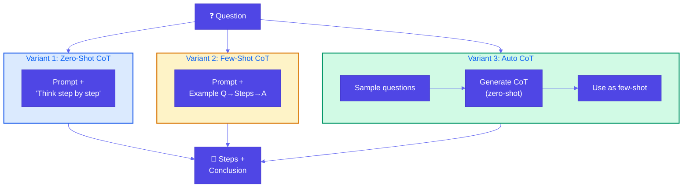

1. **Zero-shot CoT**: Append "Think step by step" (no examples).
2. **Few-shot CoT**: Provide example (question → step-by-step reasoning → answer). *RAG gives fish; few-shot CoT shows how to fish.*
3. **Auto CoT**: Sample questions → generate reasoning for each with zero-shot CoT → use as few-shot examples for the actual query.

### Use Cases

- Policy/eligibility reasoning (refund, warranty, discounts, program eligibility)
- Technical troubleshooting (sequential diagnosis)
- Pricing and discount rules (multi-step application)
- Compliance and auditing (visible reasoning trace)
- Math and logic (word problems, multi-step deduction)

### Constraints & Tradeoffs

**Constraints:**
- CoT does not add new knowledge; it only structures reasoning
- Longer output (more tokens, possible latency/cost increase)
- Quality of steps depends on model and prompt design

**Tradeoffs:**
- ✅ Better accuracy on multi-step math and logic
- ✅ Interpretable, auditable reasoning trace
- ✅ Few-shot CoT teaches reasoning format; RAG teaches facts
- ⚠️ More tokens and possibly higher cost

### Code Snippet

```python
# VARIANT 1: ZERO-SHOT COT
ZERO_SHOT_COT_SUFFIX = "\n\nThink step by step. Show your reasoning and then state the final conclusion."

def zero_shot_cot(policy: str, case_description: str, question: str, llm=None) -> CoTResult:
    prompt = f"{policy}\n\nCase: {case_description}\n\nQuestion: {question}{ZERO_SHOT_COT_SUFFIX}"
    full_response = llm(prompt)
    # Parse reasoning + conclusion from response
    return CoTResult(question=question, reasoning=..., conclusion=..., variant="zero_shot")

# VARIANT 2: FEW-SHOT COT — "show how to fish"
FEW_SHOT_EXAMPLES = """
Example 1:
Q: Customer purchased 10 days ago, unopened, has receipt. Eligible for full refund?
A: Step 1: Within 30 days? Yes. Step 2: Unopened? Yes. Step 3: Receipt? Yes.
   Conclusion: Yes, full refund.
"""
def few_shot_cot(policy: str, case_description: str, question: str, llm=None) -> CoTResult:
    prompt = f"{policy}\n\n{FEW_SHOT_EXAMPLES}\n\nNew question:\nQ: {question}\n\nCase: {case_description}\n\nA:"
    return ...

# VARIANT 3: AUTO COT — build few-shot automatically
def auto_cot(policy: str, case_description: str, question: str, num_demos: int = 2, llm=None) -> CoTResult:
    demos = []
    for sample_q in question_pool[:num_demos]:
        response = llm(f"{policy}\n\nQuestion: {sample_q}\n\nThink step by step.")  # zero-shot CoT
        demos.append(f"Q: {sample_q}\nA:\n{response}\n")
    prompt = f"{policy}\n\n" + "\n".join(demos) + f"\n\nNew question:\nQ: {question}\n\nCase: {case_description}\n\nA:"
    return ...

# REFUND ELIGIBILITY ADVISOR
advisor = RefundEligibilityAdvisor(policy=REFUND_POLICY)
result = advisor.check_eligibility(case, variant="few_shot")  # zero_shot | few_shot | auto_cot
# result.reasoning, result.conclusion
```

**Full Example**: [View on GitHub](https://github.com/bhatti/agentic-patterns/blob/main/patterns/chain-of-thought/example.py)

---

## Pattern 14: Tree of Thoughts (ToT)

**Category**: LLM Reasoning  
**Complexity**: High  
**Use When**: Strategic tasks with multiple plausible paths (e.g., root-cause analysis, roadmap prioritization, design exploration); single linear CoT is insufficient

### Real-World Problem

**Incident Root-Cause Analysis**: API latency has spiked; possible causes include DB, cache, dependencies, and resources. A single CoT path might lock onto one hypothesis and miss the real cause. ToT explores multiple hypotheses in parallel, evaluates how promising each direction is, keeps the top K paths (beam search), and summarizes the best root cause and next steps.

### Problem (General)

Many tasks that demand **strategic thinking** cannot be solved by a single multistep reasoning path:
- **Single-path limitation**: CoT follows one sequence; if that path is wrong, the answer suffers
- **Branching decisions**: Multiple plausible next steps (which hypothesis first, which design option)
- **Need for exploration**: Best solution often requires exploring several directions and comparing partial solutions
- **Evaluation of progress**: Not all paths are equally promising; partial solutions must be evaluated to guide search

### Solution

**Tree of Thoughts** treats problem-solving as **tree search** with four components:

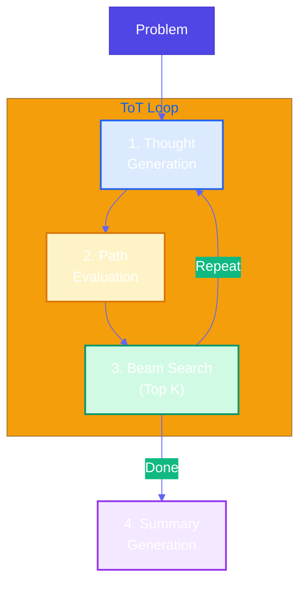

1. **Thought generation**: From current state, generate **N** possible next steps (thoughts)
2. **Path evaluation**: Score each partial solution (e.g., 0–100) for promise (correctness, progress, potential)
3. **Beam search (top K)**: Keep only the **top K** states; prune the rest
4. **Summary generation**: Produce a concise summary and answer from the best path

### Use Cases

- Incident root-cause analysis (explore hypotheses, evaluate, beam, summarize)
- Strategic roadmap / prioritization (explore orderings, evaluate impact/risk, recommend plan)
- Design exploration (architecture options as thoughts; evaluate; summarize chosen design)
- Game playing or puzzles (moves as thoughts; evaluate state; best move)
- Supply chain or configuration optimization

### Constraints & Tradeoffs

**Constraints:**
- More LLM calls than CoT (generate + evaluate per node)
- Requires thought format and evaluation criteria
- Quality depends on thought diversity and evaluator accuracy

**Tradeoffs:**
- ✅ Explores multiple strategies; avoids committing to one bad path
- ✅ Evaluation guides search toward promising directions
- ✅ Beam search limits cost while preserving diversity
- ⚠️ Higher cost and latency than single-path CoT

### Code Snippet

```python
# FOUR COMPONENTS
class TreeOfThoughts:
    def generate_thoughts(self, state: str, step: int, problem: str) -> List[str]:
        """Generate N possible next thoughts from current state."""
        # LLM: "Generate num_thoughts distinct next steps..."
        return thoughts

    def evaluate_state(self, state: str, problem: str) -> float:
        """Score path promise (0-1). Correctness, progress, potential."""
        # LLM: "Rate 0-100 how promising is this reasoning path..."
        return score

    def solve(self, problem: str) -> ToTResult:
        beam = [(0.5, initial_state, [], 0)]
        for step in range(1, self.max_steps + 1):
            candidates = []
            for score, state, path, _ in beam:
                thoughts = self.generate_thoughts(state, step, problem)
                for thought in thoughts:
                    new_state = state + "\nStep N: " + thought
                    new_score = self.evaluate_state(new_state, problem)
                    candidates.append((new_score, new_state, path + [thought], step))
            beam = sorted(candidates, key=lambda x: -x[0])[: self.beam_width]  # Top K
        best_state, best_path = beam[0]
        summary = self.generate_summary(problem, best_state)
        return ToTResult(..., solution_summary=summary, reasoning_path=best_path)

# INCIDENT ROOT-CAUSE ANALYZER
analyzer = IncidentRootCauseAnalyzer()
result = analyzer.analyze("API latency spiked; DB, cache, dependencies in use.")
# result.solution_summary, result.reasoning_path
```

**Full Example**: [View on GitHub](https://github.com/bhatti/agentic-patterns/blob/main/patterns/tree-of-thoughts/example.py)

---

## Pattern 15: Adapter Tuning

**Category**: LLM Reasoning  
**Complexity**: Medium to High  
**Use When**: You need a foundation model to perform a specialized task (e.g., intent routing, content moderation, domain captioning) with a small dataset (hundreds to thousands of input-output pairs) and want to keep base weights frozen while training only a small adapter (e.g., LoRA)

### Real-World Problem

**Support Ticket Intent Routing**: Incoming tickets must be routed to billing, technical, sales, or general. Prompt-only or few-shot classification can be brittle and prompt-heavy. Adapter tuning trains a small task-specific head on a few hundred labeled tickets while keeping the foundation model frozen — reliable routing without long prompts.

### Problem (General)

Pretrained foundation models have strong capabilities but often need to be *unlocked* for a specific task. Prompt engineering and few-shot learning help but have limits. Full fine-tuning is expensive and needs large datasets. You need a middle path: teach the model the specialized task from a **small** training set while **freezing** the foundation and updating only a **small adapter**.

### Solution

**Adapter tuning** (PEFT) has three key aspects:

1. **Teaches the foundation model a specialized task** — Train on input-output pairs (e.g., ticket text → intent, image → caption).
2. **Foundation weights frozen; only a small adapter is updated** — Base model stays fixed; LoRA or adapter layers are trained. Fewer parameters, lower data and compute.
3. **Training dataset can be smaller than typical deep learning** — Often a few hundred to a few thousand high-quality pairs suffice.

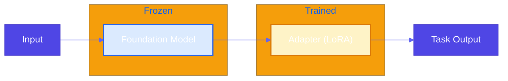

### Use Cases

- Support ticket intent routing (text → billing / technical / sales / general)
- Content moderation (learn from human moderation decisions, e.g., Change.org)
- Domain-specific captioning (e.g., radiology images with Gemma + QLoRA)
- Internal jargon or code mapping; structured output for a fixed schema

### Constraints & Tradeoffs

**Constraints:**
- Requires a training pipeline and labeled (or synthetic) input-output pairs.
- Foundation model must be loadable (e.g., HuggingFace); GPU memory needed for large models even with frozen weights + LoRA.

**Tradeoffs:**
- ✅ Specialized task performance with limited data
- ✅ Preserves foundation capabilities (frozen base)
- ✅ Fewer parameters to train and store than full fine-tuning
- ⚠️ Need to collect and maintain task-specific training data

### Code Snippet

```python
# Conceptual: frozen foundation + trainable adapter (in production: PEFT/LoRA on HuggingFace)
class TicketIntentRouter:
    def __init__(self):
        self._pipeline = Pipeline([
            ("foundation", TfidfVectorizer(max_features=2000)),  # frozen after fit
            ("adapter", LogisticRegression(max_iter=500)),      # only this is "trained"
        ])

    def train(self, examples: List[TicketExample]) -> None:
        texts = [ex.text for ex in examples]
        labels = [ex.intent for ex in examples]
        self._pipeline.fit(texts, labels)

    def predict(self, text: str) -> AdapterTuningResult:
        pred = self._pipeline.predict([text])[0]
        probs = self._pipeline.predict_proba([text])[0]
        return AdapterTuningResult(intent=pred, confidence=float(probs.max()))

# Usage: small dataset (100s of pairs), then inference
router = TicketIntentRouter()
router.train(train_examples)  # e.g. 200–2000 (text, intent) pairs
result = router.predict("I was charged twice, please refund.")
# result.intent -> "billing"
```

**Full Example**: [View on GitHub](https://github.com/bhatti/agentic-patterns/blob/main/patterns/adapter-tuning/example.py)

---

## Pattern 16: Evol-Instruct

**Category**: LLM Reasoning  
**Complexity**: High  
**Use When**: You need to teach a pretrained (e.g., enterprise) model new, complex tasks from private data — by evolving simple instructions into harder ones, generating answers, filtering by quality, and instruction tuning (SFT/LoRA) on open-weight models

### Real-World Problem

**Internal Policy Q&A**: The company wants a model that answers complex policy questions (vacation, expenses, remote work, parental leave) from internal docs under data privacy. Manually creating thousands of hard (question, answer) pairs is expensive. Evol-Instruct: start from simple seed questions, evolve them into deeper/concrete/multi-step instructions, generate answers, score and filter, then SFT/LoRA to produce a specialized model.

### Problem (General)

Enterprise tasks often require **new or highly specialized capabilities** and must use **private data**. Off-the-shelf models do not know your domain; you need a repeatable way to build a curriculum of hard instructions and high-quality answers, then post-train the model (instruction tuning). Evol-Instruct provides a four-step pipeline: evolve instructions → generate answers → evaluate and filter → instruction tuning (SFT with PEFT/LoRA).

### Solution

**Evol-Instruct** in four steps:

1. **Evolve instructions** — From seed questions, create harder variants: deeper (constraints, hypotheticals), more concrete ("list 3 reasons," "what are the steps"), multi-step (combine two questions).
2. **Generate answers** — For each instruction, produce a high-quality answer (LLM with access to your private context).
3. **Evaluate and filter** — Score each (instruction, answer) 1–5; keep only examples above a threshold.
4. **Instruction tuning** — SFT on an open-weight model (Llama, Gemma) using the filtered dataset; PEFT/LoRA for efficient training.


### Use Cases

- Internal policy Q&A (vacation, expenses, remote work, leave) with private docs
- SEC / business strategy Q&A (evolve analytical questions from filings)
- Compliance and risk playbooks; technical documentation Q&A; support escalation playbooks

### Constraints & Tradeoffs

**Constraints:**
- Requires a pipeline (evolve → generate → score) and an LLM for evolution and answer generation; SFT requires GPU and HuggingFace/TRL/PEFT (or similar).
- Seed quality and evolution prompts strongly affect dataset quality.

**Tradeoffs:**
- ✅ Teaches complex, domain-specific tasks with private data
- ✅ Scalable dataset creation from simple seeds
- ⚠️ Pipeline and training setup are more involved than prompt-only or single-step fine-tuning

### Code Snippet

```python
# STEP 1: Evolve instructions (in production: LLM with "make harder" prompts)
def evolve_instructions(seeds: List[str]) -> List[str]:
    # Deeper: add constraints/hypotheticals
    # Concrete: "List 3 reasons...", "What are the steps..."
    # Multi-step: combine two questions
    return all_instructions

# STEP 2: Generate answers (LLM + policy context)
qa_pairs = generate_answers(all_instructions)

# STEP 3: Score and filter (LLM or model; 1-5)
scored = [score_instruction_answer(ia) for ia in qa_pairs]
filtered = [ex for ex in scored if ex.score >= 4]

# STEP 4: SFT-ready dataset (chat format) -> then HuggingFace SFT/LoRA
sft_dataset = [{"messages": [{"role": "user", "content": ex.instruction},
                             {"role": "assistant", "content": ex.answer}]}
               for ex in filtered]
# Train with transformers + peft + trl SFTTrainer
```

**Full Example**: [View on GitHub](https://github.com/bhatti/agentic-patterns/blob/main/patterns/evol-instruct/example.py)

---

### 🛡️ Reliability Patterns

Patterns 17–20 focus on evaluation, safety, and reliability: using LLMs to judge quality, guard against harmful or off-policy outputs, and improve system trustworthiness.

---

## Pattern 17: LLM as Judge

**Category**: Reliability  
**Complexity**: Low to Medium  
**Use When**: You need scalable, nuanced evaluation of model or human outputs (support replies, drafts, content) with scores and justifications to drive feedback loops, filtering, or training

### Real-World Problem

**Support Reply Quality**: Teams must evaluate thousands of support replies for helpfulness, tone, accuracy, clarity, and completeness. Human review does not scale; simple metrics (length, keyword match) miss nuance. LLM as Judge: define a rubric in a prompt, call the judge with temperature=0, get per-criterion scores and brief justifications for logging, filtering, or prompt refinement.

### Problem (General)

Effective evaluation is fundamental — it provides the **feedback loop** that drives model and prompt improvements. Traditional approaches have limitations: outcome-only metrics are shallow; human evaluation does not scale; automated metrics lack nuance. You need evaluation that **scales**, is **nuanced**, and **interpretable** (scores + justification).

### Solution

**LLM as Judge**: Use an LLM to score and justify outputs against a **scoring rubric**. Three options:

1. **Prompting** — Criteria and instructions in the prompt; LLM returns score (e.g., 1–5) per criterion and brief justification. Temperature=0 for consistency. No training.
2. **ML** — Create rubric, collect historical (item, scores) data, train a **classification model** to replicate the rubric; faster/cheaper at scale.
3. **Fine-tuning** — Fine-tune a model as a dedicated judge on your rubric and labeled data.

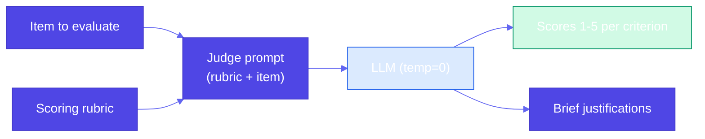

### Use Cases

- Support reply quality (helpfulness, tone, accuracy, clarity, completeness)
- Voter pamphlet / editorial content; brand voice and guardrails
- Model and prompt evaluation (A/B tests, model comparison)
- Draft and copy review; content moderation (with human-in-the-loop where needed)

### Constraints & Tradeoffs

**Constraints:**
- Judge quality depends on model and rubric clarity; cost/latency scale with volume.

**Tradeoffs:**
- ✅ Scales better than human-only; more nuanced than simple metrics; interpretable justifications
- ⚠️ Calibrate with human ratings; not a replacement for human judgment in high-stakes decisions without oversight

### Code Snippet

```python
# Option 1: Prompting — rubric + item -> scores + justification
SUPPORT_REPLY_CRITERIA = """
- Helpfulness: Addresses the customer's question; actionable next steps.
- Tone: Professional, empathetic.
- Accuracy: Factually correct.
- Clarity: Easy to read; no unnecessary jargon.
- Completeness: Covers the main ask.
"""

def build_judge_prompt(item: str, criteria: str) -> str:
    return f"""You are evaluating a customer support reply. Score 1-5 per criterion with brief justification.
Criteria: {criteria}
Reply: --- {item} ---
Scores:"""

# Invoke judge with temperature=0 for consistency
raw = run_judge(build_judge_prompt(reply))  # LLM or simulated
result = parse_judge_response(raw, reply)  # -> List[CriterionScore]
# result.scores -> [CriterionScore(criterion="Helpfulness", score=4, justification="..."), ...]
```

**Full Example**: [View on GitHub](https://github.com/bhatti/agentic-patterns/blob/main/patterns/llm-as-judge/example.py)

---

## Pattern 18: Reflection

**Category**: Reliability (also **Agentic** — *Gulli* **reflector**)  
**Complexity**: Medium  
**Use When**: You invoke the LLM via a stateless API and want it to correct or improve its first response without the user sending a follow-up — use two (or more) calls: **execute** → **evaluate / critique** → **reflect / refine** → optional **iteration** (cap rounds).

### Real-World Problem

**Apology email draft**: The API must return a short apology email for a delayed shipment. A single LLM call may omit an order reference, sound generic, or lack a clear next step. In a stateless API the client cannot say "add an order number." Reflection: first call produces a draft; an evaluator (LLM or rules) checks tone, clarity, order ref, actionability; we build a modified prompt (original + initial draft + feedback); second call produces a revised draft that addresses the feedback. Return the revised response to the client.

### Problem (General)

When an LLM gives a suboptimal answer in chat, the user can ask a follow-up. When you invoke through an **API**, calls are **stateless** — the model has no memory of the previous turn. How do you get the LLM to correct an earlier response? Retrying the same prompt often yields similar output; the model needs **feedback** on what to change.

### Solution

**Reflection**: Do not return the first response to the client. (1) **First call**: user prompt → initial response. (2) **Evaluate**: send initial response to an evaluator (LLM-as-Judge, human, or rules); get feedback. (3) **Modified prompt**: original request + initial response + feedback. (4) **Second call**: modified prompt → revised response. Return the revised response. The modified prompt carries the "memory" so the second call is still stateless from the API's perspective.

**Agentic Design Patterns** (*Antonio Gulli*, **reflector** agent): same **generator–critic** loop with explicit **quality dimensions**, **convergence** / max-iteration limits, and emphasis on **systematic** critique—not ad-hoc retries. **LangChain**: compose with LCEL ``RunnableLambda`` steps or a **LangGraph** loop with a **stop** when the judge passes.

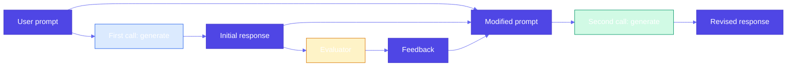

### Use Cases

- Email or copy drafts (apology, marketing); product listings (generate → validate → revise, e.g., Amazon)
- Support replies (first reply → judge → revised reply); API response text; structured output with validation feedback
- **Writing** and long-form (draft → critic → refine); **code** (implement → tests/linter/review → patch)
- **Complex problems** and **plans** (solution or strategy v1 → challenge assumptions → v2+)

### Constraints & Tradeoffs

**Constraints:** Two or more LLM calls per request (higher latency and cost); evaluator quality affects improvement.

**Tradeoffs:** ✅ Self-correction in stateless APIs without user follow-up; better first-response quality. ⚠️ Higher cost and latency than single call.

### Code Snippet

```python
# LCEL: RunnableLambda(initial) | RunnableLambda(eval) | RunnableLambda(modify) | RunnableLambda(revise)
# LangGraph: conditional edge — if judge OK then END else revise (max rounds)
# Reflection: generate -> evaluate -> modified prompt -> revise
def run_reflection(user_prompt: str) -> ReflectionResult:
    initial_response = generate_initial(user_prompt)       # First call
    feedback, notes = evaluate(user_prompt, initial_response)  # Evaluator (LLM or human)
    modified_prompt = (
        f"Original request:\n{user_prompt}\n\n"
        f"Your previous response:\n---\n{initial_response}\n---\n\n"
        f"Feedback to apply:\n{feedback}\n\nProduce an improved version."
    )
    revised_response = generate_revised(modified_prompt)  # Second call
    return ReflectionResult(initial_response, feedback, revised_response)
# Return revised_response to client; initial_response is not sent.
```

**Full Example**: [View on GitHub](https://github.com/bhatti/agentic-patterns/blob/main/patterns/reflection/example.py)  
**Dependencies**: **None** for mocks + multi-round loop; optional **langchain-core** for `build_reflection_lcel_chain()` (repo root `requirements.txt`).

---

## Pattern 19: Dependency Injection

**Category**: Reliability  
**Complexity**: Low to Medium  
**Use When**: Developing and testing GenAI apps — they are nondeterministic, models change quickly, and you need code to be LLM-agnostic; inject LLM and tool calls and replace them with lightweight mocks in tests

### Real-World Problem

**Support ticket pipeline**: Summarize ticket → suggest action (e.g., route to billing, send template). Developing and testing is hard: LLM output is nondeterministic, APIs change, and you want CI and local dev without API keys. Solution: inject `summarize_fn` and `suggest_action_fn`; production passes real LLM callables, tests pass mocks that return hardcoded strings. The pipeline code never calls an LLM directly — it only calls the injected functions. Tests become fast and deterministic.

### Problem (General)

GenAI apps are **nondeterministic**, **model churn** is frequent, and you want **LLM-agnostic** code. If the pipeline hardcodes LLM calls, you cannot unit-test steps in isolation, run tests without the API, or swap providers. You need a way to replace LLM and external tool calls with lightweight mocks for development and testing.

### Solution

**Dependency Injection**: Pass LLM and tool calls into the pipeline as **dependencies** (e.g., function parameters). Production uses real implementations; tests and dev use **mocks** that return hardcoded, deterministic results. The application stays LLM-agnostic and testable.

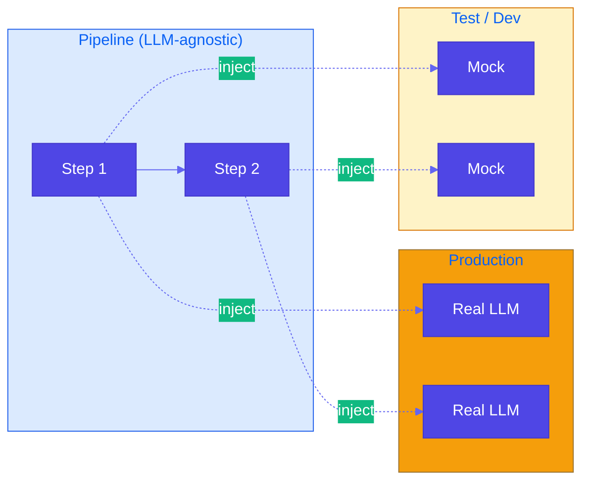

### Use Cases

- Multi-step chains (critique → improve; summarize → suggest action); agents with tools; RAG (inject retriever/generator); CI and offline dev without API keys

### Constraints & Tradeoffs

**Tradeoffs:** ✅ Deterministic, fast tests; LLM-agnostic; test steps in isolation. ⚠️ Slightly more boilerplate; mocks need maintenance if contracts change.

### Code Snippet

```python
# Pipeline accepts dependencies; no direct LLM calls inside
def run_ticket_pipeline(
    ticket_text: str,
    summarize_fn: Callable[[str], str],
    suggest_action_fn: Callable[[str, str], str],
) -> TicketResult:
    summary = summarize_fn(ticket_text)
    suggested_action = suggest_action_fn(ticket_text, summary)
    return TicketResult(summary=summary, suggested_action=suggested_action, ...)

# Production: real implementations (call LLM)
result = run_ticket_pipeline(ticket, real_summarize, real_suggest_action)

# Tests: mocks (hardcoded, deterministic)
result = run_ticket_pipeline(ticket, mock_summarize, mock_suggest_action)
assert result.summary == "Customer reports an issue..."
```

**Full Example**: [View on GitHub](https://github.com/bhatti/agentic-patterns/blob/main/patterns/dependency-injection/example.py)

---

## Pattern 20: Prompt Optimization

**Category**: Reliability  
**Complexity**: Medium to High  
**Use When**: You want better results from prompt engineering but changing the foundational model would force repeating all trials — use a repeatable optimization loop with pipeline, dataset, evaluator, and optimizer so you can re-run when the model changes

### Real-World Problem

**Support ticket one-line summary**: You need good one-line summaries; prompt wording and model choice both matter. If you hand-tweak prompts and then switch models, all trials are lost. Solution: define a **pipeline** (prompt + ticket → summary), a **dataset** of tickets, an **evaluator** (e.g. length + key-info score), and an **optimizer** that tries candidate prompts and picks the best by average score. When you change the model, re-run the optimizer with the same dataset and evaluator to get a prompt suited to the new model.

### Problem (General)

Prompt engineering and few-shot examples help, but when you **change the foundational model**, what worked before may not; all manual trials need to be repeated. You need a **repeatable, model-agnostic** way to find good prompts.

### Solution

**Indirection**: Prompt optimization as four components — (1) **Pipeline** of steps that use the prompt (prompt is a parameter), (2) **Dataset** to evaluate on, (3) **Evaluator** that scores each output, (4) **Optimizer** that proposes candidates and picks the best by score. Run: for each candidate prompt, run pipeline on dataset → evaluate → aggregate; optimizer returns best prompt. When the model changes, keep pipeline/dataset/evaluator and re-run the optimizer.

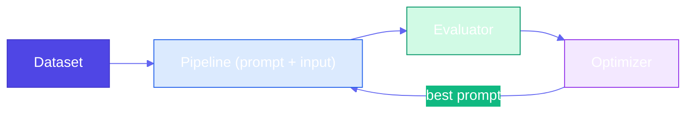

### Use Cases

- Ticket summarization; marketing copy/blurb generation; classification or extraction (optimize for accuracy/F1); any task where prompt wording matters — re-run when the model changes

### Constraints & Tradeoffs

**Tradeoffs:** ✅ Repeatable, model-agnostic prompt selection. ⚠️ Requires dataset, evaluator, and optimizer runs (cost/setup).

### Code Snippet

```python
# Four components: pipeline, dataset, evaluator, optimizer
def run_pipeline(prompt_template: str, ticket: str) -> str:
    return generate_fn(prompt_template, ticket)  # LLM call

dataset = get_dataset()  # list of inputs
def evaluate_summary(summary: str, ticket: str) -> float:
    return 0.0  # ... length, key-info, or LLM-as-Judge

best_prompt, best_score = optimize_prompt(
    candidate_prompts=["Summarize in one sentence.", "Write a one-line summary.", ...],
    dataset=dataset,
    run_fn=lambda p, t: run_pipeline(p, t),
    eval_fn=evaluate_summary,
)
# When model changes: re-run optimize_prompt with same dataset/evaluator
```

**Full Example**: [View on GitHub](https://github.com/bhatti/agentic-patterns/blob/main/patterns/prompt-optimization/example.py)

---

### 🔧 Tools & Agents Patterns

Patterns 21+ extend LLMs with **tool calling**, **code execution** (DSL + sandbox for diagrams, plots, queries), **multi-agent collaboration** (specialized roles, decomposition, optional adversarial verification), agents, and protocols like **MCP** and **A2A**: the model reasons about when to invoke external software (APIs, enterprise systems), emit specs that a renderer runs, or delegate to peer agents, not only retrieve documents (RAG).

---

## Pattern 21: Tool Calling

**Category**: Tools & Agents  
**Complexity**: Medium to High  
**Use When**: You need the model to **act** — call APIs, look up live order status, search internal systems — not only generate text or use RAG; use **LangGraph** (and optionally **MCP**) for a ReAct-style loop

### Real-World Problem

**Customer support + enterprise data**: RAG can inject policy docs, but the model cannot by itself query **order management**, **live inventory**, or **booking** APIs. Software does those things; the LLM should **decide** which tool to call and **interleave** reasoning and action (ReAct). Tool calling is also an extension of **grammar** (Pattern 2): you constrain *which* external operations are allowed and with what arguments.

### Problem (General)

Content generation is limited by training knowledge; RAG helps with knowledge injection but not **actions**. LLMs cannot book flights or charge cards without **tools** that wrap real APIs.

### Solution

**Tool calling**: Bind tools to the model (`bind_tools`); run a **LangGraph** with an **assistant** node (LLM) and **ToolNode** (executes tools). Conditional routing: if the last message has `tool_calls`, run tools and loop back; **MCP** can expose enterprise tools via a standard protocol; LangChain MCP adapters connect them to the same graph.

```mermaid
%%{init: {'theme': 'base', 'themeVariables': { 'primaryColor': '#4f46e5', 'primaryTextColor': '#fff', 'primaryBorderColor': '#4338ca', 'lineColor': '#6366f1', 'secondaryColor': '#10b981', 'tertiaryColor': '#f59e0b'}}}%%
flowchart LR
    U["User"] --> A["assistant (LLM + tools)"]
    A -->|"tool_calls"| T["ToolNode"]
    T --> A
    A -->|"done"| R["Answer"]
    style T fill:#fef3c7,stroke:#d97706
```

### Use Cases

- Order status, inventory, internal FAQ search (mocked or real APIs)
- Travel/booking when tools wrap verified backends
- RAG + tools: retrieve then compute or submit

### Constraints & Tradeoffs

**Tradeoffs:** ✅ Live data and actions; composable with RAG. ⚠️ Security, authz, and latency in tools; must be model- and tool-capable.

### Code Snippet

```python
# LangGraph: assistant <-> ToolNode until no tool_calls
from langgraph.graph import END, MessagesState, StateGraph
from langgraph.prebuilt import ToolNode
from langchain_core.tools import tool

@tool
def lookup_order_status(order_id: str) -> str:
    """Look up order in OMS."""
    return '{"status":"shipped",...}'

workflow = StateGraph(MessagesState)
workflow.add_node("assistant", call_model)
workflow.add_node("tools", ToolNode([lookup_order_status]))
workflow.set_entry_point("assistant")
workflow.add_conditional_edges("assistant", route_tools_or_end)
workflow.add_edge("tools", "assistant")
app = workflow.compile()
```

**Full Example**: [View on GitHub](https://github.com/bhatti/agentic-patterns/blob/main/patterns/tool-calling/example.py)  
**Dependencies**: `pip install -r patterns/tool-calling/requirements.txt` and Ollama with a tool-capable model (e.g. `llama3.2`).

---

## Pattern 22: Code Execution

**Category**: Tools & Agents  
**Complexity**: Medium to High  
**Use When**: The task is not a single API call but an **artifact** (diagram, plot, query): the model should emit a **DSL** (Graphviz DOT, Matplotlib, Mermaid, SQL) and a **sandbox** runs it; combine with **ReAct / LangGraph** (Pattern 21) so *generate → execute → observe error → refine* is a tool loop.

### Real-World Problem

**Diagrams and analytics**: RAG answers in prose; **tool calling** hits APIs. Many jobs need a **spec** the right software renders — e.g. a tournament bracket (book reference), an architecture diagram, or pandas/SQL over a table. The LLM should not draw pixels; it should output **constrained DSL**, then a **postprocessor** validates and executes in isolation.

### Problem (General)

One-shot generation cannot match layout engines, plot libraries, or databases. You need **LLM → DSL string → sandbox execution → PNG / table / file**.

### Solution

**Code execution**: Prompt the model for **DSL** (low temperature). A **sandbox** writes temp files, runs `dot`, `python` (restricted), or a DB driver with timeouts and allowlists. **LangGraph** can wire `generate_dsl` → `execute_sandbox` as a linear graph, or expose **run_compiler** as a tool in a ReAct agent (Pattern 21). This extends **grammar** (Pattern 2): validity is both **syntactic** and **executable**.

```mermaid
%%{init: {'theme': 'base', 'themeVariables': { 'primaryColor': '#4f46e5', 'primaryTextColor': '#fff', 'primaryBorderColor': '#4338ca', 'lineColor': '#6366f1', 'secondaryColor': '#10b981', 'tertiaryColor': '#f59e0b'}}}%%
flowchart LR
    U["User goal"]
    LLM["LLM emits DSL"]
    SB["Sandbox"]
    SW["Graphviz / runtime"]
    OUT["Artifact"]
    U --> LLM
    LLM --> SB
    SB --> SW
    SW --> OUT
    style SB fill:#fef3c7,stroke:#d97706
```

### Use Cases

- Architecture / flow diagrams (DOT, Mermaid); plots (Matplotlib, Vega-Lite)
- Analytics: LLM writes **pandas** or **SQL**; executor runs with row limits (see book USAGE references)
- ReAct: *emit code → stderr → fix DSL* in a loop

### Constraints & Tradeoffs

**Tradeoffs:** ✅ Precise, reproducible artifacts. ⚠️ Sandbox policy, dependency installs (`graphviz` binary, Python env), and never run unconstrained user code.

### Code Snippet

```python
# LangGraph: generate_dsl -> execute_in_sandbox (mock LLM returns DOT; sandbox runs `dot` or Matplotlib fallback)
from langgraph.graph import END, StateGraph

workflow = StateGraph(CodeExecutionState)
workflow.add_node("generate_dsl", node_generate_dsl)
workflow.add_node("sandbox", execute_in_sandbox)
workflow.set_entry_point("generate_dsl")
workflow.add_edge("generate_dsl", "sandbox")
workflow.add_edge("sandbox", END)
app = workflow.compile()
final = app.invoke({"user_request": "..."})
```

**Full Example**: [View on GitHub](https://github.com/bhatti/agentic-patterns/blob/main/patterns/code-execution/example.py)  
**Dependencies**: `pip install -r patterns/code-execution/requirements.txt`; optional **Graphviz** (`brew install graphviz` / `apt install graphviz`) for native DOT rendering.

---

## Pattern 23: Multi-Agent Collaboration

**Category**: Tools & Agents  
**Complexity**: High  
**Use When**: Work is **multistep**, **multi-domain**, and **long-running**; a single agent hits **cognitive**, **tool**, and **tuning** limits—use **specialized agents** with **task decomposition**, **parallel branches**, **hierarchical orchestration**, and optional **adversarial verification** or **human-in-the-loop** gates.

### Real-World Problem

**Enterprise workflows** (vendor security, incident command, research pipelines) need more than chained API calls: they need **roles** (technical vs. compliance), **state** across steps, and **quality control** without a human at every keystroke. One bloated system prompt cannot match **domain-specific** expertise and **parameter-efficient** routing (small model for classification, large for synthesis).

### Problem (General)

A **single agent** is a bottleneck for **reasoning breadth**, **domain adaptation**, and **parallel exploration**. You need explicit **architecture**: orchestrator, workers, integrator, critic.

### Solution

**Multi-agent collaboration**: Define agents with **narrow mandates** and **clear handoffs**. Patterns include **hierarchical** (planner delegates), **prompt chaining** (sequential pipelines), **peer-to-peer** / **blackboard** (shared store, debate), and **parallel** execution where subtasks are independent. Frameworks such as **CrewAI**, **LangGraph**, and **AutoGen / AG2** implement these patterns; **market-style** coordination (bids, utility) appears in research and cost-aware schedulers. **Agent2Agent (A2A)** standardizes **agent-to-agent** interoperability (agent cards, tasks, messages)—complementary to **MCP** (tools/resources). Reference book example: AutoGen **ConversableAgent** with a **task assigner** and domain **writers** (history vs. math).

```mermaid
%%{init: {'theme': 'base', 'themeVariables': { 'primaryColor': '#4f46e5', 'primaryTextColor': '#fff', 'primaryBorderColor': '#4338ca', 'lineColor': '#6366f1', 'secondaryColor': '#10b981', 'tertiaryColor': '#f59e0b'}}}%%
flowchart TB
    U["User"]
    O["Orchestrator"]
    A["Specialist A"]
    B["Specialist B"]
    M["Merge"]
    V["Critic / verifier"]
    F["Deliverable"]
    U --> O
    O --> A
    O --> B
    A --> M
    B --> M
    M --> V
    V --> F
    style V fill:#fee2e2,stroke:#b91c1c
```

### Use Cases

- Parallel research branches; complex **multistep** reasoning with **breadth-first** exploration
- **Adversarial verification**: dedicated critic before release (pairs with **LLM-as-Judge**, Pattern 17)
- **Human-in-the-loop**: approval before irreversible actions

### Constraints & Tradeoffs

**Tradeoffs:** ✅ Modularity, specialization, parallelism. ⚠️ Orchestration complexity, cost, and failure modes (handoff errors, duplicate work).

### Code Snippet

```python
# LangGraph: plan → technical → compliance → merge → adversarial critic → finalize
from langgraph.graph import END, StateGraph

g = StateGraph(MultiAgentState)
g.add_node("plan", node_plan)
g.add_node("technical", node_technical)
g.add_node("compliance", node_compliance)
g.add_node("merge", node_merge)
g.add_node("critic", node_critic)
g.add_node("finalize", node_finalize)
g.set_entry_point("plan")
# ... add edges: linear or fan-out/fan-in for parallel specialists
app = g.compile()
result = app.invoke({"user_request": "..."})
```

**Full Example**: [View on GitHub](https://github.com/bhatti/agentic-patterns/blob/main/patterns/multiagent-collaboration/example.py)  
**Dependencies**: `pip install -r patterns/multiagent-collaboration/requirements.txt` (mock LLMs; plug in Ollama or cloud models for live runs).

---

### 📌 Addressing constraints (book chapter)

Patterns **24–28** map to the **Addressing constraints** chapter in *Generative AI Design Patterns*: running under **hardware and cost** limits, avoiding **redundant** work, **serving** efficiently, **measuring** LLM SLOs under load, and keeping **durable** user context.

| # | Pattern |
|---|---------|
| 24 | Small language model |
| 25 | Prompt caching |
| 26 | Inference optimization |
| 27 | Degradation testing |
| 28 | Long-term memory |

---

## Pattern 24: Small Language Model

**Category**: Efficiency & deployment  
**Complexity**: Medium to High  
**Use When**: **Frontier** models are **too large** or **too expensive** to self-host (GPU count, VRAM, cloud $/hr); you want **smaller** models, **distillation**, **quantization**, or **faster decoding** without always renting multi-H100 nodes.

### Real-World Problem

**Hardware and cost**: Running the largest open weights can require **many high-end GPUs** and large **memory** footprints; **FP32** weight storage alone scales to **hundreds of GB** for the biggest parameter counts. **Smaller** models (e.g. Gemma-class SLMs) or **compressed** weights often suffice for **narrow** tasks.

### Problem (General)

You need **quality** near a **teacher** with **latency and cost** closer to a **student**—and **throughput** improvements at decode time.

### Solution

1. **Knowledge distillation**: Train a **student** on **teacher** soft targets; **KL divergence** aligns token distributions (often with **temperature**).
2. **Quantization**: **4-bit / 8-bit** weights (e.g. **BitsAndBytesConfig**, NF4, double quant) shrink **footprint**; **accuracy** can drop—validate per task.
3. **Speculative decoding**: A **small draft** model proposes tokens; a **large target** **verifies** in parallel—higher **tokens/sec** without changing the target’s distribution when implemented correctly.

```mermaid
%%{init: {'theme': 'base', 'themeVariables': { 'primaryColor': '#4f46e5', 'primaryTextColor': '#fff', 'primaryBorderColor': '#4338ca', 'lineColor': '#6366f1', 'secondaryColor': '#10b981', 'tertiaryColor': '#f59e0b'}}}%%
flowchart LR
    T["Teacher / target"]
    S["Student / draft"]
    K["KL + CE loss"]
    Q["4-bit weights"]
    T --> K
    S --> K
    T --> Q
    S -->|"draft"| V["Verify"]
    T --> V
```

### Use Cases

- On-prem / edge **SLM** serving; **high-throughput** APIs with speculative decoding
- **Task-specific** quality via **distillation** from a cloud teacher

### Constraints & Tradeoffs

**Tradeoffs:** ✅ Lower cost and smaller footprint. ⚠️ Distillation needs **data and compute**; quantization **hurts** some tasks; speculative decoding adds **two-model** runtime complexity.

### Code Snippet

```python
# Distillation: minimize KL(student || teacher) on teacher softmax (often + CE on labels)
# Quantization: BitsAndBytesConfig(load_in_4bit=True, bnb_4bit_quant_type="nf4", ...)
# Speculative decoding: vLLM speculative_config={"model": draft_id, "num_speculative_tokens": k}
```

**Full Example**: [View on GitHub](https://github.com/bhatti/agentic-patterns/blob/main/patterns/small-language-model/example.py)  
**Dependencies**: **None** for the demo (`numpy` not required); use root `requirements.txt` + GPU stack for **transformers** / **bitsandbytes** / **vLLM** per book examples.

---

## Pattern 25: Prompt Caching

**Category**: Efficiency & deployment  
**Complexity**: Low to Medium  
**Use When**: The same or **similar** prompts hit your LLM **repeatedly**—you want **lower latency**, **lower cost**, and less load without changing model weights.

### Real-World Problem

**Recomputation**: Identical requests (and often **long static prefixes** like system prompts + RAG context) pay **full prefill** and **generation** every time. **Provider bills** and **user latency** scale with traffic.

### Problem (General)

You need **reuse** of past work: **exact** memoization, **semantic** near-matches, and—where available—**server-side** caching of stable prompt **prefixes**.

### Solution

1. **Client-side exact cache**: Hash `(model, params, messages)` → store response (**memory**, **SQLite**, **disk**).
2. **Framework caches**: e.g. LangChain **`InMemoryCache`** / **`SQLiteCache`** via `set_llm_cache`.
3. **Semantic cache**: **Embeddings** (or a toy **similarity** score) to match **paraphrases**; return cached answer if similarity ≥ threshold.
4. **Server-side prompt caching**: **Anthropic** / **OpenAI** (and others) may cache **eligible** long prompts **inside** the API—fewer **input tokens** charged and faster **TTFT** for repeated prefixes (check current provider docs).

```mermaid
%%{init: {'theme': 'base', 'themeVariables': { 'primaryColor': '#4f46e5', 'primaryTextColor': '#fff', 'primaryBorderColor': '#4338ca', 'lineColor': '#6366f1', 'secondaryColor': '#10b981', 'tertiaryColor': '#f59e0b'}}}%%
flowchart LR
    Q["Query"]
    X["Exact hit?"]
    S["Semantic hit?"]
    M["Call LLM"]
    Q --> X
    X -->|"yes"| R["Return"]
    X -->|"no"| S
    S -->|"yes"| R
    S -->|"no"| M
    M --> R
```

### Use Cases

- FAQ-style bots, **stable** system prompts, **eval** harnesses with repeated inputs
- **RAG** with large **fixed** document prefixes (combine with provider **prefix** caching when supported)

### Constraints & Tradeoffs

**Tradeoffs:** ✅ Speed and cost. ⚠️ **Stale** answers, **privacy** in cache stores, semantic **false positives**.

### Code Snippet

```python
# Exact: sha256(f"{model}\n{prompt}") -> response
# Semantic: cosine(embed(query), embed(cached_prompt)) >= threshold
# LangChain: set_llm_cache(SQLiteCache(database_path="..."))
# Provider: Anthropic cache_control / OpenAI automatic prefix caching (see docs)
```

**Full Example**: [View on GitHub](https://github.com/bhatti/agentic-patterns/blob/main/patterns/prompt-caching/example.py)  
**Dependencies**: **None** for the demo (stdlib + mock LLM); LangChain / SDKs optional for production.

---

## Pattern 26: Inference Optimization

**Category**: Efficiency & deployment  
**Complexity**: Medium to High  
**Use When**: You **self-host** LLMs (regulated / sensitive data) and must maximize **throughput**, cut **latency**, and control **KV-cache** memory—beyond what **prompt caching** alone provides.

### Real-World Problem

**Variable-length** requests break classic **static** batching: padding to the **longest** sequence in a batch wastes **compute**. **Long prompts** inflate **prefill** and **KV** storage. Frontier-scale **GPU** rental is costly; **efficiency** is not optional.

### Problem (General)

Serving stacks must **schedule** many concurrent requests, **decode** quickly, and **feed** the model **shorter** prompts when possible.

### Solution

1. **Continuous batching** (**dynamic batching**): Requests **enter and leave** at fine granularity (often **iteration**-level) instead of waiting for equal-length batches. **vLLM** (**PagedAttention**) and **SGLang** (among others) reduce **padding waste** and improve **GPU utilization**. Traditional **pad-to-max** within a micro-batch is a poor fit for LLMs.
2. **Speculative decoding**: **Draft** + **target** models (see **Pattern 24** and book `speculative_decoding.py`).
3. **Prompt compression**: Remove **redundancy** in system + RAG context to shrink **KV** footprint and prefill—**without** confusing **caching** (Pattern 25), which skips **compute** when answers repeat.

```mermaid
%%{init: {'theme': 'base', 'themeVariables': { 'primaryColor': '#4f46e5', 'primaryTextColor': '#fff', 'primaryBorderColor': '#4338ca', 'lineColor': '#6366f1', 'secondaryColor': '#10b981', 'tertiaryColor': '#f59e0b'}}}%%
flowchart TB
    R["Many client requests"]
    C["Continuous batching engine"]
    D["Speculative decode"]
    P["Prompt compression"]
    R --> C
    C --> D
    P --> C
```

### Use Cases

- **VPC / on-prem** chat APIs, **high QPS** gateways
- **Long-context** RAG after **compressing** retrieved text

### Constraints & Tradeoffs

**Tradeoffs:** ✅ Throughput and memory. ⚠️ Ops complexity; speculative decoding needs **two** models; compression can **lose** information.

### Code Snippet

```python
# Continuous batching: use vLLM / SGLang / TensorRT-LLM — not hand-rolled pad batches
# Speculative decoding: vLLM speculative_config={...} (see Pattern 24)
# Prompt compression: dedupe, summarize, or learned compressors before .generate()
```

**Full Example**: [View on GitHub](https://github.com/bhatti/agentic-patterns/blob/main/patterns/inference-optimization/example.py)  
**Dependencies**: **None** for the toy metrics; install **vLLM** etc. per book examples for GPU benchmarks.

---

## Pattern 27: Degradation Testing

**Category**: Efficiency & deployment  
**Complexity**: Medium to High  
**Use When**: You need **load testing** that matches **LLM inference** behavior—**not only** HTTP p95—with **TTFT**, **end-to-end latency**, **token throughput**, and **RPS** under **rising concurrency** until the system **degrades** past SLOs.

### Real-World Problem

**Conventional** load tests (requests/sec, generic latency) hide **prefill vs decode**, **streaming**, and **token-level** throughput. **Inference** setups need **fine-grained** metrics to catch **queueing**, **KV** pressure, and **batching** limits.

### Problem (General)

You must measure **how** **TTFT**, **EERL** (end-to-end request latency), **output tokens per second**, and **successful RPS** change as load increases—**degradation curves**.

### Solution

1. **TTFT** — time from **request** to **first token** (streaming).  
2. **EERL** — **end-to-end request latency** (wall time to **last** token or full response).  
3. **Output tokens / second** — generation throughput (often over decode duration).  
4. **Requests / second** — completed requests per second at a given **concurrency**.

Use **LLMPerf** for reproducible **OpenAI-compatible** benchmarks; use **LangSmith** for **trace-level** latency and failure analysis alongside load tests. Book reference: `llm_benchmark.py` with **streaming**, **concurrent users**, **TTFT** and **tokens_per_second** per request.

```mermaid
%%{init: {'theme': 'base', 'themeVariables': { 'primaryColor': '#4f46e5', 'primaryTextColor': '#fff', 'primaryBorderColor': '#4338ca', 'lineColor': '#6366f1', 'secondaryColor': '#10b981', 'tertiaryColor': '#f59e0b'}}}%%
flowchart LR
    L["Ramp concurrency"]
    M["TTFT / EERL / tok/s / RPS"]
    S["SLO breach?"]
    L --> M
    M --> S
```

### Use Cases

- **Pre-go-live** capacity planning; **regression** after changing model or serving stack

### Constraints & Tradeoffs

**Tradeoffs:** ✅ LLM-relevant SLOs. ⚠️ Results depend on **network**, **rate limits**, and **cache** state—**warm up** and **repeat**.

### Code Snippet

```python
# Per request: ttft_s, eerl_s, output_tokens -> tok/s = tokens / (eerl_s - ttft_s)
# Aggregate: p95_ttft, p95_eerl, mean tok/s, rps = n / wall_time
# Tools: LLMPerf, LangSmith traces; book: llm_benchmark.py + streaming
```

**Full Example**: [View on GitHub](https://github.com/bhatti/agentic-patterns/blob/main/patterns/degradation-testing/example.py)  
**Dependencies**: **None** (asyncio simulation); use **aiohttp** + real API for production benchmarks per book examples.

---

## Pattern 28: Long-Term Memory

**Category**: Memory & agents (Addressing constraints)  
**Complexity**: Medium to High  
**Use When**: LLM calls are **stateless**; you need **continuity** across sessions—beyond prepending raw chat history—with **working**, **episodic**, **procedural**, and **semantic** memory; optional **Mem0**-style extraction + vector search.

### Real-World Problem

**No native recall**: Each API call forgets prior context unless you **send** it. **Workflow agents** pass **state** explicitly; **chat** apps prepend **messages** until the **context window** fills. **Personalization** and **compliance** need **structured**, **queryable** memory.

### Problem (General)

You must **segment** what is **transient** (working), **historical** (episodic), **how-to** (procedural), and **factual** (semantic)—then **retrieve** the right slice for the next turn.

### Solution

1. **Working memory** — recent turns / scratch context (sliding window).  
2. **Episodic memory** — dated interactions (“what we did”).  
3. **Procedural memory** — playbooks and tool recipes.  
4. **Semantic memory** — stable facts; typically **embedding** search (**Mem0**, custom RAG-over-memories).

Book reference: `basic_memory.py` uses **Mem0** + OpenAI + **Chroma** for `add` / `search` per `user_id`.

```mermaid
%%{init: {'theme': 'base', 'themeVariables': { 'primaryColor': '#4f46e5', 'primaryTextColor': '#fff', 'primaryBorderColor': '#4338ca', 'lineColor': '#6366f1', 'secondaryColor': '#10b981', 'tertiaryColor': '#f59e0b'}}}%%
flowchart LR
    WM["Working"]
    EP["Episodic"]
    PR["Procedural"]
    SM["Semantic"]
    LLM["LLM + tools"]
    WM --> LLM
    EP --> SM
    SM --> LLM
    PR --> LLM
```

### Use Cases

- **Tutoring**, **support**, **copilots** with account-specific facts

### Constraints & Tradeoffs

**Tradeoffs:** ✅ Continuity. ⚠️ **Stale** memories, **PII**, retrieval **latency**.

### Code Snippet

```python
# Mem0: memory.add(messages, user_id=...); memory.search(query, user_id=...)
# Four layers: working (deque), episodic (log), procedural (playbooks), semantic (vector / KV)
```

**Full Example**: [View on GitHub](https://github.com/bhatti/agentic-patterns/blob/main/patterns/long-term-memory/example.py)  
**Dependencies**: **None** for the layered demo; `pip install mem0ai openai chromadb` for book-aligned **Mem0** (`basic_memory.py`).

---

### 📌 Setting Safeguard (book chapter)

Patterns **29–32** map to the **Setting Safeguard** chapter in *Generative AI Design Patterns*: **constraining** what reaches users—templates instead of unconstrained prose, structured assembly, self-checking, and guardrails.

| # | Pattern |
|---|---------|
| 29 | Template generation |
| 30 | Assembled reformat |
| 31 | Self-check |
| 32 | Guardrails |

---

## Pattern 29: Template Generation

**Category**: Setting Safeguard  
**Complexity**: Low to Medium  
**Use When**: You need **repeatable**, **reviewable** customer-facing text; **full free-form** generation is **too variable** or mixes **facts** with **creativity** unsafely—generate a **template** with **slots**, approve it, then **fill** from systems of record with **few-shot** grounding.

### Real-World Problem

**Non-determinism** and **hallucination risk**: A thank-you note or policy email must be **on-brand** and **factually** tied to **order ids**, **dates**, and **names**. Generating **final** copy per user forces **per-message** review or accepts **silent** errors.

### Problem (General)

Separate **structure and tone** (LLM, **low temperature**, **few-shot**) from **facts** (**deterministic** fill from CRM/OMS).

### Solution

1. Prompt the model to output a **template** only, with explicit placeholders (`[CUSTOMER_NAME]`, `[ORDER_ID]`, …)—book **tour** example uses `[TOUR_GUIDE]`, `[CUSTOMER_NAME]`.
2. **Human / comms** reviews the **template** (per locale/product), not every send.
3. **Fill** slots in code; optional second LLM pass only for **lint** or **translation** of **fixed** template ids.
4. **Few-shot** examples in the prompt show **approved** shapes so new templates stay **grounded**.

```mermaid
%%{init: {'theme': 'base', 'themeVariables': { 'primaryColor': '#4f46e5', 'primaryTextColor': '#fff', 'primaryBorderColor': '#4338ca', 'lineColor': '#6366f1', 'secondaryColor': '#10b981', 'tertiaryColor': '#f59e0b'}}}%%
flowchart LR
    G["LLM: template + slots"]
    R["Human review"]
    S["Store approved template"]
    F["Fill from OMS"]
    G --> R
    R --> S
    S --> F
```

### Use Cases

- **Transactional** email/SMS, **support** macros, **onboarding** sequences

### Constraints & Tradeoffs

**Tradeoffs:** ✅ Auditable, stable slot contract. ⚠️ Less “creative” variety; **locale** matrix multiplies templates.

### Code Snippet

```python
# Low temp + few-shot -> template with [SLOT_NAME]
# validate required [ORDER_ID], [CUSTOMER_NAME] present
# fill_template(template, slots_from_crm)
```

**Full Example**: [View on GitHub](https://github.com/bhatti/agentic-patterns/blob/main/patterns/template-generation/example.py)  
**Dependencies**: **None** for the mock; book notebook uses **pydantic-ai** + **Gemini**.

---

## Pattern 30: Assembled Reformat

**Category**: Setting Safeguard  
**Complexity**: Medium to High  
**Use When**: A **full** LLM-generated page can **hallucinate** **high-risk** attributes (battery chemistry, hazmat, allergens, medical claims)—**assemble** **verified** fields from **PIM/DB** first, then **reformat** only **safe** narrative; **validate** outputs.

### Real-World Problem

**Example**: A **camera** PDP **invents** “**lithium**” for a **NiMH** pack—customers get **wrong** **checked-baggage** / **IATA** guidance. **Marketing** and **compliance** must not be **one undifferentiated** generation.

### Problem (General)

You can **list** product attributes whose **misstatement** is **unacceptable**; then **forbid** the model from **originating** those fields.

### Solution

1. **Risk registry**: chemistry, Wh, hazmat, etc.—from **structured** sources only.  
2. **Assemble** deterministic **blocks** (specs, shipping, legal).  
3. **Optional LLM** for **tone/SEO** only, **conditioned** on the assembled facts.  
4. **Validate** (Self-check, Pattern 31): **banned** claims when chemistry contradicts PIM.

Book: **paper machine** parts — **structured** `CatalogContent` + low-temp fill, then **creative** Markdown from the **assembled** object (`assembled_reformat.ipynb`).

```mermaid
%%{init: {'theme': 'base', 'themeVariables': { 'primaryColor': '#4f46e5', 'primaryTextColor': '#fff', 'primaryBorderColor': '#4338ca', 'lineColor': '#6366f1', 'secondaryColor': '#10b981', 'tertiaryColor': '#f59e0b'}}}%%
flowchart LR
    V["Verified record"]
    A["Assemble compliance + specs"]
    R["LLM reformat (optional)"]
    C["Validate"]
    V --> A
    A --> R
    R --> C
```

### Use Cases

- **Electronics** PDPs, **travel** gear, **regulated** consumer goods

### Constraints & Tradeoffs

**Tradeoffs:** ✅ Grounded high-risk fields. ⚠️ Requires **data** discipline and **validation** pipelines.

### Code Snippet

```python
# facts = load_pim(sku)  # BatteryChemistry.NIMH, ...
# page = render_compliance_block(facts)  # deterministic
# fluff = llm_marketing(facts)  # constrained; validate_high_risk(page + fluff, facts)
```

**Full Example**: [View on GitHub](https://github.com/bhatti/agentic-patterns/blob/main/patterns/assembled-reformat/example.py)  
**Dependencies**: **None** for the demo; book uses **pydantic-ai** + **Gemini**.

---

## Pattern 31: Self-Check

**Category**: Setting Safeguard  
**Complexity**: Medium  
**Use When**: You can obtain **per-token** **logprobs** (or **logits**) from inference and want a **statistical** signal to **flag** uncertain or **fragile** generations for **review**—**not** as a substitute for **ground-truth** checks.

### Real-World Problem

Models can emit **fluent falsehoods**. **Post-hoc** checks alone may miss **calibration**: the model may be **splitting** probability mass across alternatives.

### Problem (General)

Use **log** **probabilities** of **selected** tokens (and **top-k** alternatives when available) to **estimate** **confidence** and **sequence** **perplexity**.

### Solution

1. **Logits** → **softmax** → **probabilities** \(p_i\).  
2. **Logprob** \(\log p\) for the **sampled** token (APIs often return this directly).  
3. **Flag** tokens with **low** \(p\) or **small** margin to the **second-best** token.  
4. **Perplexity** on a sequence: \(\mathrm{PPL} = \exp\left(-\frac{1}{N}\sum_i \log p_i\right)\) (interpret with care on **subword** tokens).

Book: `1_hallucination_detection.ipynb`, `2_self_check.ipynb` — **OpenAI**-style `logprobs`, `exp(logprob)` as **probability**, low-confidence **token** extraction.

```mermaid
%%{init: {'theme': 'base', 'themeVariables': { 'primaryColor': '#4f46e5', 'primaryTextColor': '#fff', 'primaryBorderColor': '#4338ca', 'lineColor': '#6366f1', 'secondaryColor': '#10b981', 'tertiaryColor': '#f59e0b'}}}%%
flowchart LR
    O["Output + logprobs"]
    F["Flag low p"]
    H["Human / RAG"]
    O --> F
    F --> H
```

### Use Cases

- **Triage** high-stakes answers; **monitoring** **batch** jobs

### Constraints & Tradeoffs

**Tradeoffs:** ✅ Cheap when exposed. ⚠️ **Low p ≠ false**; **High p ≠ true**; not all APIs expose **logprobs**.

### Code Snippet

```python
# p_i = exp(logprob_i); flag if p_i < threshold
# PPL = exp(-mean(logprobs))  # natural-log probs per token
```

**Full Example**: [View on GitHub](https://github.com/bhatti/agentic-patterns/blob/main/patterns/self-check/example.py)  
**Dependencies**: **None** (math demo); book uses **OpenAI** with `logprobs=True`.

---

## Pattern 32: Guardrails

**Category**: Setting Safeguard  
**Complexity**: Medium to High  
**Use When**: You must enforce **security**, **privacy**, **moderation**, and **alignment** around LLM and **RAG** systems—using **vendor** **prebuilt** filters **plus** **custom** **policy** code.

### Real-World Problem

**Prompt injection**, **PII** leakage, **toxic** or **off-policy** content, and **unsafe** outputs in **regulated** domains require **explicit** **boundary** controls—not only a good system prompt.

### Problem (General)

**Layer** **input** and **output** **scanners**; optionally wrap **retrieval** (chunk filtering). Combine **Gemini** / **OpenAI** **built-in** safety with **org-specific** rules.

### Solution

1. **Prebuilt**: **Gemini** safety settings (category thresholds); **OpenAI Moderation** API; **hosted** provider filters.  
2. **Custom**: **PII** redaction, **banned** topics, **allowlists**, **regex** injection detectors, **LLM-as-Judge** (Pattern 17).  
3. **Compose**: `apply_guardrails(text, scanners)` **pipeline**; **GuardedQueryEngine** pattern—scan **query**, then **answer** (book `1_with_guardrails.ipynb`).

```mermaid
%%{init: {'theme': 'base', 'themeVariables': { 'primaryColor': '#4f46e5', 'primaryTextColor': '#fff', 'primaryBorderColor': '#4338ca', 'lineColor': '#6366f1', 'secondaryColor': '#10b981', 'tertiaryColor': '#f59e0b'}}}%%
flowchart LR
    IN["Input guardrails"]
    LLM["RAG / LLM"]
    OUT["Output guardrails"]
    IN --> LLM
    LLM --> OUT
```

### Use Cases

- **Enterprise** assistants, **legal** / **health** search, **brand**-safe generation

### Constraints & Tradeoffs

**Tradeoffs:** ✅ Defense in depth. ⚠️ **False positives**; **latency**; **maintenance** of custom rules.

### Code Snippet

```python
# apply_guardrails(user_query, [pii_redact, banned_topic])
# answer = engine.query(sanitized); apply_guardrails(answer, [pii_redact, moderation])
```

**Full Example**: [View on GitHub](https://github.com/bhatti/agentic-patterns/blob/main/patterns/guardrails/example.py)  
**Dependencies**: **None** for the demo; book uses **LlamaIndex** + **Anthropic**.

---

### 🤖 Agentic Design Patterns (Antonio Gulli)

Patterns **33+** align with **Agentic Design Patterns** (*Antonio Gulli*): specialized **agent** roles, **orchestration**, and **production** agentic systems. Companion agent specs live in the **subagents-design-patterns** repo (e.g. `agents/prompt-chainer.md`). Earlier patterns **1–32** map primarily to *Generative AI Design Patterns* (*Lakshmanan* et al.) unless cross-listed.

| # | Pattern |
|---|---------|
| 33 | [Prompt chaining](#pattern-33-prompt-chaining) |
| 34 | [Routing](#pattern-34-routing) |
| 35 | [Parallelization](#pattern-35-parallelization) |
| — | **[Reflection](#pattern-18-reflection)** (*Gulli* **reflector** — same as Lakshmanan **Pattern 18**) |
| 36 | [Learning and adaptation](#pattern-36-learning-and-adaptation) |
| 37 | [Exception handling and recovery](#pattern-37-exception-handling-and-recovery) |
| 38 | [Human-in-the-loop (HITL)](#pattern-38-human-in-the-loop-hitl) |
| 39 | [Agentic RAG (knowledge retrieval)](#pattern-39-agentic-rag-knowledge-retrieval) |
| 40 | [Resource-aware optimization](#pattern-40-resource-aware-optimization) |
| 41 | [Reasoning techniques](#pattern-41-reasoning-techniques-agentic) |
| 42 | [Evaluation and monitoring](#pattern-42-evaluation-and-monitoring-agentic) |
| 43 | [Prioritization](#pattern-43-prioritization-agentic) |
| 44 | [Memory management](#pattern-44-memory-management-agentic) |
| 45 | [Planning and task decomposition](#pattern-45-planning-and-task-decomposition-agentic) |
| 46 | [Goal setting and monitoring](#pattern-46-goal-setting-and-monitoring-agentic) |
| 47 | [MCP integration](#pattern-47-mcp-integration-agentic) |
| 48 | [Inter-agent communication](#pattern-48-inter-agent-communication-agentic) |
| 49 | [Safety guardian](#pattern-49-safety-guardian-agentic) |
| 50 | [Exploration and discovery](#pattern-50-exploration-and-discovery-agentic) |
| 51+ | *(Additional patterns as implemented)* |

---

## Pattern 33: Prompt Chaining

**Category**: Agentic orchestration  
**Complexity**: Low to Medium  
**Use When**: A task benefits from **sequential decomposition**—each **LLM** (or tool) call has **one** job, **structured** output feeds the **next** step: **workflows**, **complex Q&A**, **code generate-then-refine**, **context** and **prompt** engineering per stage.

### Real-World Problem

A **single** mega-prompt is **fragile** and hard to **test**. **Reliability** improves when you **decompose**, pass **typed** or **JSON** handoffs, and **preserve** only needed **context**.

### Problem (General)

You need **pipelines** that mirror **information processing**: classify → decompose → answer → format—without conflating **intra-turn** reasoning (**CoT**, Pattern 13) with **inter-step** orchestration.

### Solution

1. **Task decomposition** into ordered steps.  
2. **Sequential** execution: output *n* → input *n+1*.  
3. **Structured** intermediate formats (JSON, outlines, ASTs).  
4. **System prompts** tuned **per** step; **tools** only where needed.  
5. **Error recovery** between links.

**Gulli** (*Agentic Design Patterns*): **prompt-chainer** agent — proactive use for multi-step sequential work. **Lakshmanan** (*Generative AI Design Patterns*): compose **RAG**, **tools**, **guardrails** as **chain** stages.

```mermaid
%%{init: {'theme': 'base', 'themeVariables': { 'primaryColor': '#4f46e5', 'primaryTextColor': '#fff', 'primaryBorderColor': '#4338ca', 'lineColor': '#6366f1', 'secondaryColor': '#10b981', 'tertiaryColor': '#f59e0b'}}}%%
flowchart LR
    S1["Step 1"]
    S2["Step 2"]
    S3["Step 3"]
    S4["Step 4"]
    S1 --> S2
    S2 --> S3
    S3 --> S4
```

### Use Cases

- **Complex query answering**, **document** workflows, **code** spec → implement → lint

### Constraints & Tradeoffs

**Tradeoffs:** ✅ Testable steps, clearer failures. ⚠️ **Latency**/**cost** per hop; **schema drift** breaks the chain.

### Code Snippet

```python
# state = classify(q); state = decompose(state); state = answer(state); state = format(state)
# Or LangGraph: add_node per step, linear edges
```

**Full Example**: [View on GitHub](https://github.com/bhatti/agentic-patterns/blob/main/patterns/prompt-chaining/example.py)  
**Dependencies**: **None** for the mock chain; use **LangGraph** for production (see Pattern 21).

---

## Pattern 34: Routing

**Category**: Agentic orchestration  
**Complexity**: Low to High (by mechanism)  
**Use When**: You must **classify** or **direct** each request to the right **handler**—**tools**, **subgraphs**, **models**, or **queues**—using **rules**, **embeddings**, **LLM structured output**, or a **trained classifier**; often combined in **stages**.

### Real-World Problem

A **single** assistant path **misuses** tools, **leaks** policy, or **wastes** tokens. **Billing** questions need **CRM** tools; **incidents** need **runbooks**; **ambiguous** text needs a **fallback** path.

### Problem (General)

You need **intent** or **topic** routing that is **fast** and **auditable** where possible, and **robust** to **paraphrase** where needed.

### Solution

1. **Register handlers** (ids + prompts + tool sets + optional entry nodes).  
2. **Rule-based** routing for **deterministic** paths (headers, regex, allowlists).  
3. **Embedding** similarity to **handler descriptions** or **labeled exemplars**.  
4. **LLM** routing with **JSON** / schema: `route`, `confidence`, optional `rationale`.  
5. **ML classifier** on **features** (e.g. embedding + metadata) for **scale** and **SLOs**.  
6. **Confidence** thresholds → **default** handler or **escalation**.

**Gulli** (*Agentic Design Patterns*): **router** agent — intent analysis, capability matching, load-aware direction. **Lakshmanan** (*Generative AI Design Patterns*): **adapters** and **eval** improve route quality; **RAG** often **behind** a route.

```mermaid
%%{init: {'theme': 'base', 'themeVariables': { 'primaryColor': '#4f46e5', 'primaryTextColor': '#fff', 'primaryBorderColor': '#4338ca', 'lineColor': '#6366f1', 'secondaryColor': '#10b981', 'tertiaryColor': '#f59e0b'}}}%%
flowchart TD
    IN[Incoming request]
    R1[Rules / flags]
    R2[Embedding NN]
    R3[LLM or ML classifier]
    H1[Handler A]
    H2[Handler B]
    H3[Default]
    IN --> R1
    R1 -->|match| H1
    R1 -->|no match| R2
    R2 -->|high confidence| H2
    R2 -->|low| R3
    R3 --> H1
    R3 --> H2
    R3 --> H3
```

### Use Cases

- **Multi-tenant** policies, **support** tiers, **safety** escalations, **LangGraph** conditional edges

### Constraints & Tradeoffs

**Tradeoffs:** ✅ Specialization and safer tool boundaries. ⚠️ **Misroutes**; **layer** complexity; keep **one** source of truth for **default** behavior.

### Code Snippet

```python
# RunnableBranch (langchain_core): (predicate, runnable), ..., default
# Or: rules_first = route_rules(text); if conf < 0.9: route_llm(text)
```

**Full Example**: [View on GitHub](https://github.com/bhatti/agentic-patterns/blob/main/patterns/routing/example.py)  
**Dependencies**: **None** for rules / embedding / ML mocks; optional **langchain-core** for ``RunnableBranch`` (repo root `requirements.txt`).

---

## Pattern 35: Parallelization

**Category**: Agentic orchestration  
**Complexity**: Low to Medium  
**Use When**: **Independent** subtasks can run **together**—**research** fan-out, **analytics** partitions, **parallel** **validators** / judges, **multimodal** extractors—then **merge** into one answer or report.

### Real-World Problem

**Serial** calls for unrelated work dominate **latency**. Users expect **fast** synthesis over **many** sources, checks, or modalities.

### Problem (General)

You need **safe** concurrency: **clear** branch boundaries, **rate** limits, and a **deterministic** aggregation contract.

### Solution

1. **Prove independence** (no hidden shared mutable state).  
2. **Fan-out** with **async**, **thread/process pools**, or **LCEL** `RunnableParallel` / **LangGraph** parallel paths.  
3. **Cap** concurrency and handle **per-branch** errors.  
4. **Reduce**: merge, **vote**, or **final LLM** synthesis.

**Gulli** (*Agentic Design Patterns*): **parallelizer** agent — decomposition, concurrent execution, synchronization, aggregation. **Lakshmanan** (*Generative AI Design Patterns*): **Deep Search**, **RAG**, **multi-agent** often **parallelize** retrieval or specialists before **merge**.

```mermaid
%%{init: {'theme': 'base', 'themeVariables': { 'primaryColor': '#4f46e5', 'primaryTextColor': '#fff', 'primaryBorderColor': '#4338ca', 'lineColor': '#6366f1', 'secondaryColor': '#10b981', 'tertiaryColor': '#f59e0b'}}}%%
flowchart TD
    IN[Input]
    B1[Branch A]
    B2[Branch B]
    B3[Branch C]
    B4[Branch D]
    M[Merge / synthesize]
    OUT[Result]
    IN --> B1
    IN --> B2
    IN --> B3
    IN --> B4
    B1 --> M
    B2 --> M
    B3 --> M
    B4 --> M
    M --> OUT
```

### Use Cases

- **Research** (multi-source gather), **data** processing, **verification** fan-out, **multimodal** fusion

### Constraints & Tradeoffs

**Tradeoffs:** ✅ Wall-clock wins when branches are truly independent. ⚠️ Quota **spikes**; **partial** failures; avoid **parallel** where **ordering** or **shared** context is required (**use chaining**).

### Code Snippet

```python
# LCEL: RunnableParallel(gather=..., analyze=..., verify=...) | RunnableLambda(merge)
# stdlib: ThreadPoolExecutor; submit each branch; as_completed → dict
```

**Full Example**: [View on GitHub](https://github.com/bhatti/agentic-patterns/blob/main/patterns/parallelization/example.py)  
**Dependencies**: **None** for ``ThreadPoolExecutor`` path; optional **langchain-core** for ``RunnableParallel`` (repo root `requirements.txt`).

---

## Pattern 36: Learning and Adaptation

**Category**: Agentic learning / alignment  
**Complexity**: High  
**Use When**: Systems must **improve** from **experience**—**RL** (e.g. **PPO** with **clipped** surrogate for **stability**), **preference** alignment (**DPO** without a separate reward model), **online** / **memory**-based adaptation—not only one-shot prompting.

### Real-World Problem

**Policies** (agents, rankers, assistants) **stale** as environments change: markets, fraud, user tastes, or safety expectations. You need a **deliberate** learning stack: what to **collect**, how to **evaluate** updates (**surrogate** objectives), and how to stay in a **safe** region around the current policy (**PPO** **clipping**).

### Problem (General)

Choose among **supervised**, **unsupervised**, **RL**, **few-shot** inference, **online** learning, and **memory-based** retrieval; for **LLM** alignment, compare **two-stage** **RLHF** (reward model + **PPO**) vs **DPO** on **preference** pairs.

### Solution

1. **Taxonomy**: match **signal** (labels, rewards, preferences, retrieval) to method.  
2. **RL agents**: collect trajectories → **advantage** estimates → **PPO**-style **clipped** ratio to limit destructive updates; **continual** data collection for **non-stationary** envs.  
3. **LLM alignment**: **RLHF** path (reward model + **PPO**) vs **DPO** (direct policy update from **chosen/rejected** completions; **no** separate reward net).  
4. **Online / memory**: **replay**, **regularization**, **retrieval** over past successes (see **Pattern 28**).

**Gulli** (*Agentic Design Patterns*): **learning-adapter** agent — experience processing, knowledge updates, strategy adaptation, performance tracking. **Lakshmanan** (*Generative AI Design Patterns*): **adapters** (15), **Evol-Instruct** (16), **memory** (28).

```mermaid
%%{init: {'theme': 'base', 'themeVariables': { 'primaryColor': '#4f46e5', 'primaryTextColor': '#fff', 'primaryBorderColor': '#4338ca', 'lineColor': '#6366f1', 'secondaryColor': '#10b981', 'tertiaryColor': '#f59e0b'}}}%%
flowchart LR
    D[Data / trajectories]
    RM[Reward or preferences]
    U[Policy update]
    P[Deployed policy]
    D --> RM
    RM --> U
    U --> P
    P --> D
```

### Use Cases

- **Trading** bots, **robotics**, **fraud** detection, **recommendations**; **LLM** **RLHF** / **DPO** alignment

### Constraints & Tradeoffs

**Tradeoffs:** ✅ **PPO** clipping improves **stability**; **DPO** simplifies **preference** pipelines. ⚠️ **Reward hacking**, **eval** gaps, **compute**, **catastrophic** forgetting without **replay** / **KL** control.

### Code Snippet

```python
# PPO: clip ratio r to [1-eps, 1+eps]; surrogate min(r*A, clip(r)*A)
# DPO: preference loss on log pi(y_w) - log pi(y_l) vs reference (see TRL / papers)
```

**Full Example**: [View on GitHub](https://github.com/bhatti/agentic-patterns/blob/main/patterns/learning-adaptation/example.py)  
**Dependencies**: **None** (scalar demos); production uses **PyTorch** / **TRL** / HF stack.

---

## Pattern 37: Exception Handling and Recovery

**Category**: Agentic reliability  
**Complexity**: Low to High  
**Use When**: **Agents**, **chains**, and **tools** must **survive** failures—**detect** and **classify** errors, **retry** wisely, **trip** **circuit breakers**, **fallback** to degraded paths, and **recover** without **corrupting** state.

### Real-World Problem

**LLM** and **API** calls **timeout**, **rate-limit**, return **invalid JSON**, or hit **policy** blocks. Without a **systematic** strategy, users see **crashes** or **nonsense**; **blind** retries **amplify** outages.

### Problem (General)

You need **centralized** policies: what is **retriable**, what **fails fast**, what **degrades** gracefully, and how to **observe** failures without **logging** secrets.

### Solution

1. **Detect**: structured errors, **validation**, **guardrails** (32), **timeouts**.  
2. **Classify**: **transient** vs **permanent** vs **policy**.  
3. **Handle**: **exponential backoff**, **circuit breaker**, **fallback** model or **cache**.  
4. **Recover**: **idempotent** retries, **compensation**, **checkpoint** resume (LangGraph).

**Gulli** (*Agentic Design Patterns*): **exception-handler** agent — classification, recovery strategies, graceful degradation, failure analysis.

```mermaid
%%{init: {'theme': 'base', 'themeVariables': { 'primaryColor': '#4f46e5', 'primaryTextColor': '#fff', 'primaryBorderColor': '#4338ca', 'lineColor': '#6366f1', 'secondaryColor': '#10b981', 'tertiaryColor': '#f59e0b'}}}%%
flowchart TD
    T[Try primary path]
    D{Error class?}
    R[Retry with backoff]
    C[Circuit open / fail fast]
    F[Fallback or degrade]
    T --> D
    D -->|transient| R
    D -->|saturated| C
    D -->|recoverable| F
    R --> T
```

### Use Cases

- **Tool** failures in **LangGraph**; **multi-step** chains; **API** integrations

### Constraints & Tradeoffs

**Tradeoffs:** ✅ Resilience and predictable **UX**. ⚠️ **Latency** from retries; **fallback** quality drift; **breaker** tuning.

### Code Snippet

```python
# classify → retry if transient → circuit breaker around vendor → fallback answer
```

**Full Example**: [View on GitHub](https://github.com/bhatti/agentic-patterns/blob/main/patterns/exception-handling-recovery/example.py)  
**Dependencies**: **None** (stdlib demo).

---

## Pattern 38: Human-in-the-Loop (HITL)

**Category**: Agentic safety / governance  
**Complexity**: Low (concept) to High (ops)  
**Use When**: **Automation** must yield to **people** for **quality**, **compliance**, or **risk**—**confidence**- and **stakes**-aware **escalation**, **review** queues, **feedback** into training—not only model scores.

### Real-World Problem

**Content**, **trades**, **fraud** flags, and **vehicle**-level decisions can **injure** users or the firm if wrong. You need **structured** **human** **oversight**, not informal Slack pings.

### Problem (General)

Define **when** humans **must** intervene, **how** they **review**, and how **decisions** are **audited** and **fed back** into **systems**.

### Solution

1. **Triggers**: low **confidence**, **high** **stakes**, **novel** situations, **regulatory** rules, **sampling**.  
2. **Review**: **queues**, **rubrics**, **SLAs**, **multi-level** approval.  
3. **Feedback**: labels and **edits** → **datasets**, **policies**, **routing** (Patterns **34**, **36**).  
4. **Orchestration**: LangGraph **interrupt** / **human** nodes; **workflow** engines with **wait** states.

**Gulli** (*Agentic Design Patterns*): **human-validator** agent — intervention evaluation, review mechanisms, feedback integration, quality assurance.

```mermaid
%%{init: {'theme': 'base', 'themeVariables': { 'primaryColor': '#4f46e5', 'primaryTextColor': '#fff', 'primaryBorderColor': '#4338ca', 'lineColor': '#6366f1', 'secondaryColor': '#10b981', 'tertiaryColor': '#f59e0b'}}}%%
flowchart TD
    A[Automated proposal]
    T{Escalate?}
    Q[Human queue]
    R[Approve / edit / reject]
    P[Commit or train]
    A --> T
    T -->|yes| Q
    T -->|no| P
    Q --> R
    R --> P
```

### Use Cases

- **Moderation**, **fraud** / **AML**, **trading** **approvals**, **autonomy** **handoff** scenarios, **clinical** / **legal** **draft** review

### Constraints & Tradeoffs

**Tradeoffs:** ✅ **Accountability** and **trust**. ⚠️ **Latency**, **staffing**, **reviewer** **variance**; **tooling** for **audit**.

### Code Snippet

```python
# if stakes == HIGH or conf < tau: enqueue(HumanReviewTicket)
# LangGraph: interrupt_before=[human_node]; resume with Command
```

**Full Example**: [View on GitHub](https://github.com/bhatti/agentic-patterns/blob/main/patterns/human-in-the-loop/example.py)  
**Dependencies**: **None** (stdlib demo).

---

## Pattern 39: Agentic RAG (Knowledge Retrieval)

**Category**: Agentic knowledge / retrieval  
**Complexity**: Medium to High  
**Use When**: You need **up-to-date**, **source-grounded** answers—**embeddings**, **semantic** **search**, **chunking**, **vector** **stores**, and **advanced** variants (**Graph** **RAG**, **agentic** **multi-step** retrieval)—composed with **LangChain** / **LangGraph**.

### Real-World Problem

Models **hallucinate** or **date** out; enterprises need **private**, **fresh** **corpora** and sometimes **relational** **structure** **beyond** flat **k**-NN.

### Problem (General)

Unify **indexing**, **similarity**, **hybrid** **search**, **graph**-aware **retrieval**, and **iterative** **agent** **loops**—without duplicating the **whole** **Lakshmanan** **RAG** **suite** in one page.

### Solution

1. **Chunk** → **embed** → **vector** **DB**; **measure** **relevance** via **cosine** / **distance** **metrics** **consistent** **across** **eval**.  
2. **Hybrid** **retrieval** (dense + sparse) where **lexical** **match** **matters**.  
3. **Graph** **RAG** for **entity**-**centric** **queries**; **agentic** **RAG** for **query** **rewrite**, **tool** **retrieval**, **multi-hop**.  
4. **LangChain** **LCEL** / **LangGraph** for **pipelines** and **cycles**.

**Gulli** (*Agentic Design Patterns*): **rag-retriever** agent — **document** **querying**, **embeddings**, **ranking**, **integration**. **Lakshmanan**: see **Patterns** **6–12** for **depth** **implementations**.

```mermaid
%%{init: {'theme': 'base', 'themeVariables': { 'primaryColor': '#4f46e5', 'primaryTextColor': '#fff', 'primaryBorderColor': '#4338ca', 'lineColor': '#6366f1', 'secondaryColor': '#10b981', 'tertiaryColor': '#f59e0b'}}}%%
flowchart LR
    DOC[Documents]
    CH[Chunk + embed]
    V[(Vector store)]
    Q[User query]
    R[Retrieve + rank]
    G[LLM generate]
    DOC --> CH --> V
    Q --> R
    V --> R --> G
```

### Use Cases

- Same as **Basic RAG** (6): docs, **policies**, **products**—plus **graph**-heavy **domains** and **agent** **orchestrated** **research**

### Constraints & Tradeoffs

**Tradeoffs:** Same **family** as Pattern **6**–**12**; **agentic** **loops** **cost** **latency**; **graphs** **cost** **ingestion** **ops**.

### Code Snippet

```python
# LCEL: RunnablePassthrough.assign(context=retriever) | prompt | llm
# LangGraph: retrieve -> grade_documents -> [rewrite_query | generate]
```

**Full Example**: [View on GitHub](https://github.com/bhatti/agentic-patterns/blob/main/patterns/agentic-rag/example.py)  
**Dependencies**: **None** for mocks; optional **langchain-core** for LCEL stub.

---

## Pattern 40: Resource-Aware Optimization

**Category**: Agentic efficiency / reliability  
**Complexity**: Medium to High  
**Use When**: You must **optimize** **LLM** and **agent** **workloads** for **cost**, **latency**, **capacity**, and **graceful** **degradation**—**dynamic** **model** **switching**, **adaptive** **tools**, **context** **pruning**, **budgets**, **prediction**, and **parallelism**-aware **scheduling**.

### Real-World Problem

**Unbounded** **frontier** **usage** **breaks** **budgets**; **interactive** **products** need **strict** **latency**; **clusters** **hit** **quotas** and **need** **fallbacks** **without** **full** **outages**.

### Problem (General)

Unify **monitoring**, **policies**, and **degradation** **paths** so **quality** **trades** **off** **predictably** **against** **resources**.

### Solution

1. **Budgets** and **tiered** **models**; **estimate** **$** **per** **request**.  
2. **Route** **by** **priority** and **load** (**Pattern** **34**).  
3. **Prune** / **summarize** **context**; **cache** (**25**); **smaller** **models** (**24**) **when** **appropriate**.  
4. **Degrade**: **fewer** **tools**, **shorter** **answers**, **async** **handoff**.  
5. **Observe** **p95** **latency**, **utilization**, **spend**—**tie** **to** **automation** (**27** **testing**).

**Gulli** (*Agentic Design Patterns*): **resource-optimizer** agent — **tracking**, **pressure** **detection**, **automatic** **optimization**, **behavior** **adjustment**.

```mermaid
%%{init: {'theme': 'base', 'themeVariables': { 'primaryColor': '#4f46e5', 'primaryTextColor': '#fff', 'primaryBorderColor': '#4338ca', 'lineColor': '#6366f1', 'secondaryColor': '#10b981', 'tertiaryColor': '#f59e0b'}}}%%
flowchart TD
    M[Metrics: cost latency load]
    P[Policy engine]
    A[Adapt: model tools context]
    M --> P --> A
```

### Use Cases

- **Cost**-**optimized** **assistants**, **latency**-**sensitive** **UIs**, **SRE**-**friendly** **fallbacks**, **multi**-**tenant** **fairness**

### Constraints & Tradeoffs

**Tradeoffs:** ✅ **Predictable** **spend** **and** **SLOs**. ⚠️ **Quality** **vs** **cost** **tension**; **threshold** **tuning**.

### Code Snippet

```python
# if budget.remaining() < need: summarize(history) or tier = "small"
# if degradation == MINIMAL: tool_gate.disable_heavy_tools()
```

**Full Example**: [View on GitHub](https://github.com/bhatti/agentic-patterns/blob/main/patterns/resource-aware-optimization/example.py)  
**Dependencies**: **None** (stdlib).

---

## Pattern 41: Reasoning Techniques (Agentic)

**Category**: Agentic reasoning / orchestration  
**Complexity**: Low (catalog) to Very High (full stacks)  
**Use When**: You need a **structured** **approach** to **complex** **Q&A**—**CoT**, **ToT**, **self**-**correction**, **PAL** / **code**-**aided** **reasoning**, **ReAct**, **RLVR**, **debates** (**CoD**), **MASS**-style **workflow** **optimization**, and **deep** **research**—with **clear** **links** to **implementations** **in** **this** **repo**.

### Real-World Problem

**One-shot** **answers** **fail** on **hard** **tasks**; **teams** **mix** **buzzwords** **without** **a** **coherent** **stack** (**tools**, **code**, **retrieval**, **evaluation**).

### Problem (General)

**Select** and **compose** **reasoning** **patterns**; **avoid** **duplicating** **Pattern** **12–23** **content** **here**—**Pattern** **41** **indexes** **them** **for** **Gulli**’s **reasoning**-**engine** **agent**.

### Solution

Use the **technique** **map** in `patterns/reasoning-techniques/README.md`: **CoT** (**13**), **ToT** (**14**), **Reflection** (**18**), **Deep** **Search** (**12**), **ReAct** / **tools** (**21**), **PAL**-**style** **code** (**22**), **multi**-**agent** **debates** (**23**), **prompt** / **workflow** **optimization** (**20**), **learning** **with** **verifiable** **rewards** (**36**).

**Gulli** (*Agentic Design Patterns*): **reasoning-engine** agent — **logical** **inference**, **knowledge** **structuring**, **uncertainty**, **explanations**.

```mermaid
%%{init: {'theme': 'base', 'themeVariables': { 'primaryColor': '#4f46e5', 'primaryTextColor': '#fff', 'primaryBorderColor': '#4338ca', 'lineColor': '#6366f1', 'secondaryColor': '#10b981', 'tertiaryColor': '#f59e0b'}}}%%
flowchart LR
    Q[Question]
    R{Reasoning mode}
    C[CoT / ToT]
    T[Tools ReAct]
    P[Code PAL]
    D[Deep research]
    Q --> R
    R --> C
    R --> T
    R --> P
    R --> D
```

### Use Cases

- **Complex** **QA**, **agents**, **research** **pipelines**, **verifiable** **tasks**

### Constraints & Tradeoffs

**Tradeoffs:** **Depth** **costs** **tokens** **and** **latency**; **verify** **safety** **for** **code** **and** **tools**.

### Code Snippet

```python
# See patterns 12–23; Pattern 41 example.py is structural stubs only
```

**Full Example**: [View on GitHub](https://github.com/bhatti/agentic-patterns/blob/main/patterns/reasoning-techniques/example.py)  
**Dependencies**: **None** (stdlib).

---

## Pattern 42: Evaluation and Monitoring (Agentic)

**Category**: Agentic observability / governance  
**Complexity**: Medium to High  
**Use When**: You need **performance** **tracking**, **A/B** **tests**, **compliance** **evidence**, **enterprise** **dashboards**, **latency** **SLOs**, **token**/**cost** **telemetry**, **custom** **quality** **metrics** (**LLM-as-judge**), and **multi-agent** **traces**.

### Real-world problem

**Shipped** **agents** **without** **metrics** **cannot** **prove** **reliability**, **control** **spend**, or **pass** **audits**.

### Solution

**Instrument** **calls**, **aggregate** **SLAs**, **run** **experiments** **with** **guardrail** **metrics**, **store** **audit** **evidence**, **trace** **multi-agent** **workflows**. **Cross-use** **Pattern** **17** **(judge)**, **27** **(load** **testing)**, **20** **(eval** **for** **optimization)**, **23** **(multi-agent** **telemetry)**.

**Gulli** (*Agentic Design Patterns*): **evaluator** agent — **success** **measurement**, **resource** **tracking**, **quality** **assessment**, **health** **monitoring**.

```mermaid
%%{init: {'theme': 'base', 'themeVariables': { 'primaryColor': '#4f46e5', 'primaryTextColor': '#fff', 'primaryBorderColor': '#4338ca', 'lineColor': '#6366f1', 'secondaryColor': '#10b981', 'tertiaryColor': '#f59e0b'}}}%%
flowchart LR
    I[Instrument]
    A[Aggregate SLOs]
    E[Experiments A/B]
    C[Compliance store]
    I --> A --> E
    A --> C
```

### Use cases

- **SRE** **dashboards**, **FinOps**, **model** **governance**, **regulated** **industries**, **multi-agent** **observability**

### Constraints and tradeoffs

**Tradeoffs:** **Judge** **cost**/**bias**; **cardinality** **explosion** **in** **labels**; **privacy** **of** **logged** **prompts**.

### Code snippet

```python
# trace_id + span per LLM/tool; tokens += pt+ct; export to OTLP
# ab_variant(user_key, "exp", ("a","b")); compare judge_score & p95_latency
```

**Full Example**: [View on GitHub](https://github.com/bhatti/agentic-patterns/blob/main/patterns/evaluation-monitoring/example.py)  
**Dependencies**: **None** (stdlib demo).

---

## Pattern 43: Prioritization (Agentic)

**Category**: Agentic scheduling / governance  
**Complexity**: Low to High  
**Use When**: **Competing** **tasks** **must** **be** **ordered**—**support** **queues**, **cloud** **jobs**, **trading** **paths**, **security** **incidents**—using **multi-criteria** **scores**, **dynamic** **re-ranking**, and **resource**-**aware** **scheduling**.

### Real-world problem

**First-in-first-out** **and** **single** **metrics** **fail** **under** **SLAs**, **severity**, **and** **cost** **pressure**.

### Solution

**Weighted** **dimensions** **(urgency**, **impact**, **effort**, **SLA**, **security)**, **recompute** **on** **events**, **integrate** **with** **routing** **(34)** **and** **capacity** **(40)**.

**Gulli** (*Agentic Design Patterns*): **prioritizer** agent — **multi-dimensional** **evaluation**, **dynamic** **calculation**, **resource** **awareness**, **goal** **alignment**.

```mermaid
%%{init: {'theme': 'base', 'themeVariables': { 'primaryColor': '#4f46e5', 'primaryTextColor': '#fff', 'primaryBorderColor': '#4338ca', 'lineColor': '#6366f1', 'secondaryColor': '#10b981', 'tertiaryColor': '#f59e0b'}}}%%
flowchart LR
    T[Tasks]
    S[Score / rank]
    Q[Queue]
    R[Run next]
    T --> S --> Q --> R
```

### Use cases

- **Customer** **support**, **cloud** **scheduling**, **trading**, **security** **response**

### Constraints and tradeoffs

**Tradeoffs:** **Fairness** **vs** **VIP**; **metric** **gaming**; **stale** **priorities** **without** **refresh**.

### Code snippet

```python
# score = w1*urgency + w2*importance - w3*effort + w4*f(sla) + w5*security
```

**Full Example**: [View on GitHub](https://github.com/bhatti/agentic-patterns/blob/main/patterns/prioritization/example.py)  
**Dependencies**: **None** (stdlib).

---

## Pattern 44: Memory Management (Agentic)

**Category**: Agentic state / personalization  
**Complexity**: Medium to High  
**Use When**: Agents need **short-term** **context**, **long-term** **persistence**, **episodic** **retrieval**, **procedural** **playbooks**, and **privacy**-**aware** **storage**—often with **LangGraph** **checkpointers** **per** **thread**.

### Real-world problem

**Raw** **chat** **history** **does** **not** **scale**; **users** **expect** **continuity** **and** **correct** **long**-**range** **facts** **without** **leaking** **PII**.

### Solution

**Tier** **memory** **(working**, **episodic**, **procedural**, **semantic)**; **extract** **and** **retrieve** **selectively**; **persist** **orchestrator** **state** **with** **`MemorySaver`** **/** **external** **savers**; **see** **Pattern** **28** **for** **Mem0**-**style** **depth**.

**Gulli** (*Agentic Design Patterns*): **memory-manager** agent — **selective** **storage**, **efficient** **retrieval**, **organization**, **privacy**.

```mermaid
%%{init: {'theme': 'base', 'themeVariables': { 'primaryColor': '#4f46e5', 'primaryTextColor': '#fff', 'primaryBorderColor': '#4338ca', 'lineColor': '#6366f1', 'secondaryColor': '#10b981', 'tertiaryColor': '#f59e0b'}}}%%
flowchart TB
    W[Working / short-term]
    E[Episodic]
    P[Procedural]
    S[Semantic / vector]
    L[LLM + tools]
    W --> L
    E --> L
    P --> L
    S --> L
```

### Use cases

- **Stateful** **assistants**, **support** **continuity**, **personalized** **workflows**

### Constraints and tradeoffs

**Tradeoffs:** **Retention** **policy** **vs** **utility**; **checkpoint** **migration**; **retrieval** **quality**.

### Code snippet

```python
# LangGraph: compile(..., checkpointer=MemorySaver()); thread_id in config
# External: memory.search(query, user_id=...) for semantic / episodic layers
```

**Full Example**: [View on GitHub](https://github.com/bhatti/agentic-patterns/blob/main/patterns/memory-management/example.py)  
**Dependencies**: **None** for **tiered** **demo**; **optional** **`langgraph`** for **checkpoint** **snippet**.

---

## Pattern 45: Planning and Task Decomposition (Agentic)

**Category**: Agentic orchestration  
**Use When**: You need **explicit** **task** **graphs**, **dependencies**, and **valid** **execution** **order** **(replanning** **optional)**. **Gulli**: **planner** agent. **Example**: [patterns/planning-task-decomposition/example.py](https://github.com/bhatti/agentic-patterns/blob/main/patterns/planning-task-decomposition/example.py) · **deps**: stdlib.

---

## Pattern 46: Goal Setting and Monitoring (Agentic)

**Category**: Agentic governance  
**Use When**: **SMART** **goals**, **progress** **vs** **targets**, **deviation** **detection**, **strategy** **updates**. **Gulli**: **goal-monitor** agent. **Example**: [goal-setting-monitoring/example.py](https://github.com/bhatti/agentic-patterns/blob/main/patterns/goal-setting-monitoring/example.py) · **deps**: stdlib.

---

## Pattern 47: MCP Integration (Agentic)

**Category**: Tooling / integration  
**Use When**: **Model** **Context** **Protocol** **servers**, **discovery**, **tools/list**, **tools/call**, **secure** **composition** **with** **Pattern** **21**. **Gulli**: **mcp-integrator** agent. **Example**: [mcp-integration/example.py](https://github.com/bhatti/agentic-patterns/blob/main/patterns/mcp-integration/example.py) · **deps**: stdlib.

---

## Pattern 48: Inter-Agent Communication (Agentic)

**Category**: Distributed agents  
**Use When**: **Message** **envelopes**, **routing**, **correlation**, **capability** **discovery** **(A2A-style)** **with** **Pattern** **23**. **Gulli**: **agent-communicator** agent. **Example**: [inter-agent-communication/example.py](https://github.com/bhatti/agentic-patterns/blob/main/patterns/inter-agent-communication/example.py) · **deps**: stdlib.

---

## Pattern 49: Safety Guardian (Agentic)

**Category**: Safety / compliance  
**Use When**: **Multi-layer** **defense**, **risk** **thresholds**, **shutdown** **paths** **beyond** **single** **guardrail** **scanners** **(extends** **32)**. **Gulli**: **safety-guardian** agent. **Example**: [safety-guardian/example.py](https://github.com/bhatti/agentic-patterns/blob/main/patterns/safety-guardian/example.py) · **deps**: stdlib.

---

## Pattern 50: Exploration and Discovery (Agentic)

**Category**: Search / learning  
**Use When**: **Explore** **vs** **exploit**, **novel** **environments**, **hypothesis** **cycles** **(pairs** **with** **12**, **14**, **41**, **36)**. **Gulli**: **explorer** agent. **Example**: [exploration-discovery/example.py](https://github.com/bhatti/agentic-patterns/blob/main/patterns/exploration-discovery/example.py) · **deps**: stdlib.

---

## 🏗️ Project Structure

```
agentic-patterns/
├── patterns/                   # All pattern implementations
│   ├── logits-masking/         # Pattern 1
│   ├── grammar/                # Pattern 2
│   ├── style-transfer/         # Pattern 3
│   ├── reverse-neutralization/ # Pattern 4
│   ├── content-optimization/   # Pattern 5
│   ├── basic-rag/              # Pattern 6
│   ├── semantic-indexing/      # Pattern 7
│   ├── indexing-at-scale/      # Pattern 8
│   ├── index-aware-retrieval/  # Pattern 9
│   ├── node-postprocessing/    # Pattern 10
│   ├── trustworthy-generation/ # Pattern 11
│   ├── deep-search/            # Pattern 12
│   ├── chain-of-thought/       # Pattern 13
│   ├── tree-of-thoughts/      # Pattern 14
│   ├── adapter-tuning/        # Pattern 15
│   ├── evol-instruct/         # Pattern 16
│   ├── llm-as-judge/          # Pattern 17
│   ├── reflection/            # Pattern 18
│   ├── dependency-injection/  # Pattern 19
│   ├── prompt-optimization/  # Pattern 20
│   ├── tool-calling/          # Pattern 21
│   ├── code-execution/        # Pattern 22
│   ├── multiagent-collaboration/ # Pattern 23
│   ├── small-language-model/    # Pattern 24
│   ├── prompt-caching/          # Pattern 25
│   ├── inference-optimization/ # Pattern 26
│   ├── degradation-testing/     # Pattern 27
│   ├── long-term-memory/        # Pattern 28
│   ├── template-generation/     # Pattern 29
│   ├── assembled-reformat/      # Pattern 30
│   ├── self-check/             # Pattern 31
│   ├── guardrails/             # Pattern 32
│   ├── prompt-chaining/         # Pattern 33 (Agentic / Gulli)
│   ├── routing/                 # Pattern 34 (Agentic / Gulli)
│   ├── parallelization/         # Pattern 35 (Agentic / Gulli)
│   ├── learning-adaptation/     # Pattern 36 (Agentic / Gulli)
│   ├── exception-handling-recovery/ # Pattern 37 (Agentic / Gulli)
│   ├── human-in-the-loop/       # Pattern 38 (Agentic / Gulli)
│   ├── agentic-rag/             # Pattern 39 (Agentic / Gulli; see also 6–12)
│   ├── resource-aware-optimization/ # Pattern 40 (Agentic / Gulli)
│   ├── reasoning-techniques/    # Pattern 41 (Agentic / Gulli; see 12–23)
│   ├── evaluation-monitoring/   # Pattern 42 (Agentic / Gulli)
│   ├── prioritization/          # Pattern 43 (Agentic / Gulli)
│   ├── memory-management/       # Pattern 44 (Agentic / Gulli; see also 28)
│   ├── planning-task-decomposition/ # Pattern 45 (Agentic / Gulli)
│   ├── goal-setting-monitoring/ # Pattern 46 (Agentic / Gulli)
│   ├── mcp-integration/         # Pattern 47 (Agentic / Gulli)
│   ├── inter-agent-communication/ # Pattern 48 (Agentic / Gulli)
│   ├── safety-guardian/         # Pattern 49 (Agentic / Gulli)
│   ├── exploration-discovery/   # Pattern 50 (Agentic / Gulli)
│   └── ...                     # Additional patterns
├── shared/                     # Shared utilities
│   ├── ollama_client.py        # Ollama client wrapper
│   ├── langchain_utils.py      # LangChain utilities
│   └── model_registry.py       # Model configurations
├── PATTERNS_PLAN.md            # Dynamic planning document
└── requirements.txt            # Python dependencies
```

## 🚀 Quick Start

### Prerequisites

- Python 3.10+ (managed via pyenv - see `.python-version`)
- [Ollama](https://ollama.ai/) installed and running
- Models downloaded (e.g., `ollama pull llama3`)

### Installation

```bash
# Clone the repository
git clone <repository-url>
cd agentic-patterns

# Set up Python environment (if using pyenv)
pyenv install 3.11.0
pyenv local 3.11.0

# Install dependencies (single requirements.txt for all patterns)
pip install -r requirements.txt

# Pull a model (example)
ollama pull llama3
```

See [SETUP.md](./SETUP.md) for detailed setup instructions.

### Running Examples

Navigate to any pattern directory and run the example:

```bash
cd patterns/logits-masking
python example.py
```

## 📊 Pattern Comparison Matrix

| Pattern | Complexity | Training Required | Use Case | Best For |
|---------|-----------|-------------------|----------|----------|
| **Logits Masking** | Medium | No | Enforce constraints | Valid JSON, banned words |
| **Grammar** | High | No | Formal grammar | API configs, schemas |
| **Style Transfer** | Low-Medium | Optional | Style transformation | Notes to emails |
| **Reverse Neutralization** | High | Yes | Personal style | Your writing style |
| **Content Optimization** | High | Yes | Performance goals | Open rates, conversions |
| **Basic RAG** | Medium | No | External knowledge | Documentation, knowledge bases |
| **Semantic Indexing** | High | No | Semantic search, complex content | Technical docs, multimedia, tables |
| **Indexing at Scale** | High | No | Large-scale, evolving knowledge | Healthcare guidelines, policies, regulations |
| **Index-Aware Retrieval** | High | No | Vocabulary mismatches, fine details | Technical docs, API docs, research papers |
| **Node Postprocessing** | High | No | Ambiguous entities, conflicting content | Legal docs, medical records, research papers |
| **Trustworthy Generation** | High | No | Hallucination risks, trust issues | Medical Q&A, legal research, academic content |
| **Deep Search** | High | No | Complex, multi-hop information needs | Market research, due diligence, academic research |
| **Chain of Thought** | Low-Medium | No | Multistep reasoning, audit trail | Policy eligibility, math, troubleshooting, compliance |
| **Tree of Thoughts** | High | No | Strategic exploration, multiple paths | Root-cause analysis, roadmap prioritization, design exploration |
| **Adapter Tuning** | Medium-High | Yes (adapter only) | Specialized task, small dataset | Intent routing, content moderation, domain captioning |
| **Evol-Instruct** | High | Yes (SFT/LoRA) | New complex tasks, private data | Policy Q&A, SEC/strategy Q&A, compliance playbooks |
| **LLM as Judge** | Low-Medium | No | Scalable nuanced evaluation | Support quality, content/copy review, model evaluation |
| **Reflection** | Medium | No | Self-correction in stateless API; *Gulli* iterate | Drafts, code, plans; LCEL sequence or LangGraph + judge |
| **Dependency Injection** | Low-Medium | No | Testable, LLM-agnostic pipelines | Chains, agents, RAG; fast deterministic tests with mocks |
| **Prompt Optimization** | Medium-High | No | Repeatable prompt selection when model changes | Summarization, copy, classification; pipeline + dataset + evaluator + optimizer |
| **Tool Calling** | Medium-High | No | APIs, live data, actions (ReAct) | Support OMS, booking, MCP; LangGraph + tools |
| **Code Execution** | Medium-High | No | DSL + sandbox → diagram, plot, query | Graphviz DOT, Matplotlib, SQL; LangGraph pipeline or tool |
| **Multi-Agent Collaboration** | High | No | Decomposition, parallel paths, specialists + merge | Vendor review, incidents, research crews; A2A for interop |
| **Small Language Model** | Medium-High | Optional (distillation) | Cost, VRAM, throughput | Distillation, 4-bit load, speculative decoding |
| **Prompt Caching** | Low-Medium | No | Repeated prompts, long prefixes | Exact + semantic client cache; provider prefix cache |
| **Inference Optimization** | Medium-High | No | Self-hosted throughput, KV memory | Continuous batching (vLLM, SGLang); speculative decode; prompt compression |
| **Degradation Testing** | Medium-High | No | LLM SLOs under load | TTFT, EERL, tok/s, RPS; LLMPerf, LangSmith |
| **Long-Term Memory** | Medium-High | No (Mem0 optional) | Stateful assistants | Working / episodic / procedural / semantic; Mem0 |
| **Template Generation** | Low-Medium | No | Brand-safe comms, transactional copy | Slots + human review + few-shot; fill from CRM |
| **Assembled Reformat** | Medium-High | No | PDPs with hazmat/travel/battery risk | Verified facts assembled; optional LLM; validate |
| **Self-Check** | Medium | No | Uncertainty triage | Logprobs, perplexity, low-p token flags |
| **Guardrails** | Medium-High | No | Security, moderation, PII | Prebuilt + custom scanners; input/output wrap |
| **Prompt Chaining** | Low-Medium | No | Sequential workflows, structured handoffs | Decompose → chain; LangGraph optional |
| **Routing** | Low-High | Optional (ML) | Intent → handler, tools, subgraph | Rules, embeddings, LLM JSON, classifier; LangChain branch |
| **Parallelization** | Low-Medium | No | Independent subtasks, merge | Research, analytics, validators, multimodal; LCEL RunnableParallel |
| **Learning and adaptation** | High | Yes (task) | RL, preferences, online drift | PPO clip, DPO, trading/robots/fraud/recs |
| **Exception handling and recovery** | Low-High | No | Retries, breakers, fallbacks | Agent tools, chains, APIs |
| **Human-in-the-loop (HITL)** | Low-High | No | Escalation, review queues | Moderation, fraud, trading, safety |
| **Agentic RAG** | Medium-High | No | Embeddings, chunking, vector DB, graph/agentic retrieval | Fresh knowledge; LangChain/LangGraph; extends P6–P12 |
| **Resource-aware optimization** | Medium-High | No | Cost/latency budgets, degradation | Model tiers, tools, context; parallel quota |
| **Reasoning techniques** | Low-Very High | Varies | CoT, ToT, ReAct, PAL, debates, deep research | Index to P12–23; Gulli reasoning-engine |
| **Evaluation and monitoring** | Medium-High | No | Traces, SLOs, A/B, compliance | LLM-as-judge metrics; multi-agent spans |
| **Prioritization** | Low-High | No | Multi-criteria task ranking | Support, cloud jobs, trading, security queues |
| **Memory management** | Medium-High | No | Working/episodic/procedural/semantic; checkpoints | LangGraph threads; extends P28 |
| **Planning / task decomposition** | Medium-High | No | DAG tasks, dependencies, replan | Gulli planner; LangGraph |
| **Goal setting & monitoring** | Medium | No | SMART goals, deviation | Gulli goal-monitor |
| **MCP integration** | Medium | No | Tool servers, discovery, JSON-RPC | With P21; Gulli mcp-integrator |
| **Inter-agent communication** | Medium-High | No | Messages, routing, A2A | Gulli agent-communicator; P23 |
| **Safety guardian** | High | No | Layered safety, shutdown | Extends P32; Gulli |
| **Exploration & discovery** | Medium | No | Explore/exploit, novel domains | Gulli explorer; P12/14/41 |

## 🎯 Choosing the Right Pattern

- **Need to enforce constraints?** → Use **Logits Masking**
- **Need formal grammar compliance?** → Use **Grammar Constrained Generation**
- **Need to change style quickly?** → Use **Style Transfer** (Few-Shot)
- **Need consistent personal style?** → Use **Reverse Neutralization**
- **Need to optimize for metrics?** → Use **Content Optimization**
- **Need external knowledge?** → Use **Basic RAG**
- **Need semantic search or handle complex content?** → Use **Semantic Indexing**
- **Need to handle large-scale, evolving knowledge with freshness?** → Use **Indexing at Scale**
- **Need to handle vocabulary mismatches or find fine details?** → Use **Index-Aware Retrieval**
- **Need to handle ambiguous entities, conflicting content, or verbose chunks?** → Use **Node Postprocessing**
- **Need to prevent hallucination and build user trust?** → Use **Trustworthy Generation**
- **Need comprehensive research with multi-hop reasoning?** → Use **Deep Search**
- **Need multistep reasoning or an auditable reasoning trace?** → Use **Chain of Thought**
- **Need to explore multiple strategies or hypotheses (not one path)?** → Use **Tree of Thoughts**
- **Need a foundation model to do a specialized task with a small labeled dataset (100s–1000s pairs)?** → Use **Adapter Tuning**
- **Need to teach a model new, complex tasks from private data (evolve instructions → generate → filter → SFT)?** → Use **Evol-Instruct**
- **Need scalable, nuanced evaluation of outputs with scores and justifications (feedback loop)?** → Use **LLM as Judge**
- **Need the LLM to correct its first response in a stateless API (no user follow-up)?** → Use **Reflection** (generate → evaluate/critique → refine; optional **iteration**; *Gulli* **reflector**; **LangChain** LCEL or LangGraph loop)
- **Need to develop and test GenAI pipelines without flaky LLM calls (nondeterministic, model churn)?** → Use **Dependency Injection** (inject LLM/tool callables; use mocks in tests)
- **Need to find good prompts and re-run when the foundational model changes?** → Use **Prompt Optimization** (pipeline + dataset + evaluator + optimizer)
- **Need the model to call APIs, live systems, or tools (not only RAG)?** → Use **Tool Calling** (LangGraph + ToolNode; optional MCP)
- **Need diagrams, plots, or queries as specs (DSL) executed in a sandbox, not raw model output?** → Use **Code Execution** (LLM → DSL → sandbox; optional ReAct with Pattern 21)
- **Need multiple specialized roles, decomposition, parallel work, or a critic—not one monolithic assistant?** → Use **Multi-Agent Collaboration** (LangGraph / CrewAI / AG2; optional **A2A** for agent-to-agent interop)
- **Need to run on smaller GPUs, cut $/hr, or speed up decoding without always using a frontier model?** → Use **Small Language Model** (distillation + KL, **BitsAndBytes** quantization, **speculative decoding**)
- **Need to avoid recomputing answers for repeated or paraphrased prompts?** → Use **Prompt Caching** (exact memoization, **semantic** similarity, LangChain cache, **provider** prefix caching)
- **Need higher throughput and lower KV pressure on self-hosted LLMs?** → Use **Inference Optimization** (continuous batching / vLLM or SGLang, **speculative decoding**, **prompt compression**)
- **Need load tests with LLM-native metrics (TTFT, end-to-end latency, tok/s, RPS)?** → Use **Degradation Testing** (**LLMPerf**, **LangSmith** traces, stepped concurrency)
- **Need durable user context beyond raw chat history (four memory types, Mem0-style search)?** → Use **Long-Term Memory** (working / episodic / procedural / semantic; **Mem0** optional)
- **Need on-brand, reviewable customer email/SMS without hallucinated order facts?** → Use **Template Generation** (LLM writes **template** + slots; **few-shot**; humans approve; **fill** from OMS/CRM)
- **Need product pages where wrong specs (battery, hazmat, etc.) are unacceptable?** → Use **Assembled Reformat** (PIM/DB **facts** assembled first; **optional** LLM for **safe** narrative; **validate**)
- **Need to flag uncertain generations using token probabilities?** → Use **Self-Check** (**logprobs** / **perplexity**; combine with RAG and facts—not a truth oracle)
- **Need policy enforcement (PII, banned topics, moderation, alignment) around prompts and answers?** → Use **Guardrails** (vendor prebuilt + **custom** scanners; **input** and **output**)
- **Need reliable multi-step workflows with structured outputs between LLM calls?** → Use **Prompt Chaining** (*Gulli* / prompt-chainer; distinct from **CoT** inside one completion)
- **Need to pick the right tool, model, or specialist path per request?** → Use **Routing** (*Gulli* / router: **rules**, **embeddings**, **LLM** classification, or **ML**; **LangChain** `RunnableBranch` or LangGraph edges)
- **Need to run independent retrieval, checks, or modality pipelines at the same time, then merge?** → Use **Parallelization** (*Gulli* / parallelizer: **LCEL** `RunnableParallel`, **async** / thread pools, LangGraph **parallel** edges)
- **Need policies or models to improve from rewards, preferences, or streaming feedback (not just prompts)?** → Use **Learning and adaptation** (*Gulli* / learning-adapter: **PPO**-style **clipped** surrogates, **DPO** vs **RLHF**, **online** / **memory**-based methods)
- **Need agents and chains to survive tool/API failures with retries, breakers, and fallbacks?** → Use **Exception handling and recovery** (*Gulli* / exception-handler: **detect** → **classify** → **handle** → **recover**)
- **Need people in the loop for high-stakes or low-confidence decisions (queues, approval, audit)?** → Use **Human-in-the-loop (HITL)** (*Gulli* / human-validator: **triggers**, **review**, **feedback**)
- **Need the Gulli-level RAG map (embeddings, similarity, chunking, vector DBs, Graph RAG, Agentic RAG, LangChain)?** → Use **Agentic RAG (Pattern 39)** + **Basic RAG (6)** / **semantic** / **deep** patterns (**7–12**) for **implementations**
- **Need cost/latency-aware agents (budgets, model tiers, pruning, adaptive tools, graceful degradation)?** → Use **Resource-aware optimization** (*Gulli* / resource-optimizer; complements **24–27**)
- **Need a map of reasoning methods (CoT, ToT, ReAct, PAL, debates, RLVR, MASS, deep research) tied to this repo?** → Use **Reasoning techniques (Pattern 41)** (*Gulli* / reasoning-engine) + **Patterns 12–23** for **depth**
- **Need production observability: latency, tokens, A/B tests, compliance evidence, LLM-judge metrics, multi-agent traces?** → Use **Evaluation and monitoring (Pattern 42)** (*Gulli* / evaluator) with **17**, **27**, **20**, **23**
- **Need to rank competing tasks or incidents (SLAs, severity, impact, cost)?** → Use **Prioritization (Pattern 43)** (*Gulli* / prioritizer) with **Routing (34)** and **Resource-aware optimization (40)**
- **Need Gulli-style memory tiers + LangGraph checkpointing (plus episodic/procedural depth)?** → Use **Memory management (Pattern 44)** (*Gulli* / memory-manager) with **Long-term memory (28)** and **Agentic RAG (39)** as needed
- **Need explicit task DAGs and dependency order?** → **Planning and task decomposition (45)** (*Gulli* / planner)
- **Need SMART goals and deviation from targets?** → **Goal setting and monitoring (46)** (*Gulli* / goal-monitor)
- **Need MCP tool servers with discovery and secure calls?** → **MCP integration (47)** (*Gulli* / mcp-integrator) with **Tool calling (21)**
- **Need agent message fabric / A2A-style coordination?** → **Inter-agent communication (48)** (*Gulli* / agent-communicator) with **Multi-agent (23)**
- **Need layered safety beyond I/O scanners?** → **Safety guardian (49)** (*Gulli* / safety-guardian) extends **Guardrails (32)**
- **Need explore vs exploit in open-ended search?** → **Exploration and discovery (50)** (*Gulli* / explorer)

## 📖 Pattern Implementation

Each pattern includes:
- **README.md**: Comprehensive explanation, use cases, best practices
- **example.py**: Working Python implementation
- **Real-world scenarios**: Practical use cases
- **Best practices**: Industry recommendations
- **References**: Links to resources and documentation

**Note**: Reference examples from *Generative AI Design Patterns* (*Lakshmanan* et al.) and companion materials for *Agentic Design Patterns* (*Gulli*, e.g. subagents specs) are used as conceptual inspiration; implementations are original with our own explanations and realistic use cases.

## 🛠️ Technology Stack

- **Ollama**: Local model serving
- **LangChain**: LLM orchestration
- **CrewAI**: Multi-agent systems
- **LangGraph**: Stateful agent workflows
- **HuggingFace**: Model hub and transformers
- **PyTorch**: For direct model access and logits manipulation

## 📝 Contributing

See [PATTERNS_PLAN.md](./PATTERNS_PLAN.md) for the implementation plan and checklist.

## 📚 Resources

- [Ollama Documentation](https://ollama.ai/docs)
- [LangChain Documentation](https://python.langchain.com/)
- [CrewAI Documentation](https://docs.crewai.com/)
- [LangGraph Documentation](https://langchain-ai.github.io/langgraph/)
- [HuggingFace](https://huggingface.co/)
- [DPO Paper](https://arxiv.org/abs/2305.18290)

## 📄 License

See [LICENSE](./LICENSE) file for details.
