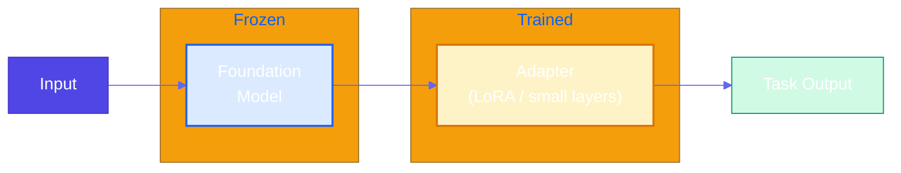
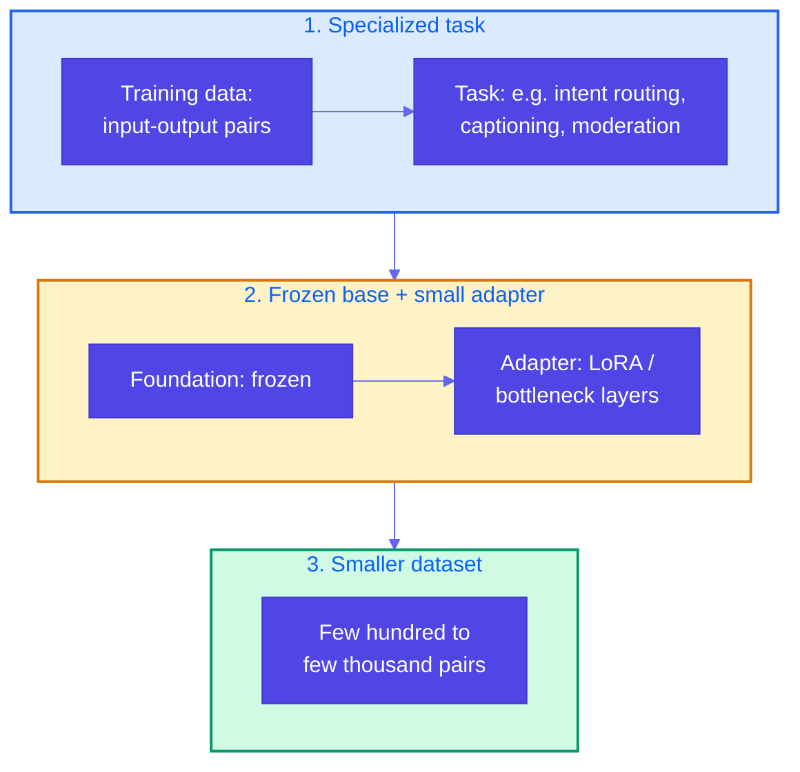
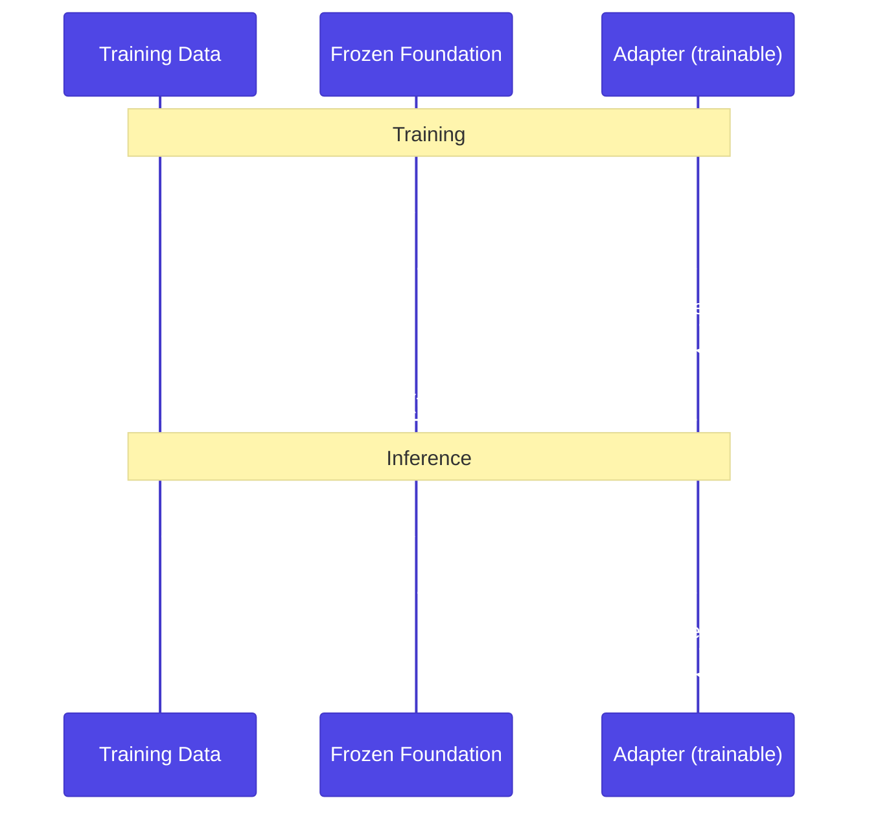

# Pattern 15: Adapter Tuning

## Overview

**Adapter tuning** (also called parameter-efficient fine-tuning, PEFT) is a post-training approach that teaches a pretrained foundational model to perform a **specialized task** using a relatively small dataset (hundreds to thousands of input-output pairs), while **freezing** the foundation model weights and training only a small set of **adapter** parameters (e.g., LoRA, adapter layers).

## Problem Statement

Pretrained foundational models have strong general capabilities but often need to be **unlocked** for a specific task:

- **Prompt engineering (zero-shot)** and **few-shot learning** can help but have limits: prompt length, consistency, and task complexity.
- For a **specialized, repeatable task** (e.g., radiology captions, support intent routing, content moderation), you want the model to behave reliably without relying on long or brittle prompts.
- **Full fine-tuning** of a large model is expensive, requires large datasets, and risks catastrophic forgetting.

Adapter tuning addresses this by:

- Teaching the foundation model the specialized task from a **small training set** (few hundred to few thousand pairs).
- Keeping the **foundation weights frozen** so general knowledge is preserved.
- Adding and training only **small adapter** parameters (e.g., LoRA), which is efficient and needs less data than full deep learning training.

## Solution Overview

**Adapter tuning** has three key aspects:

1. **Teaches the pretrained foundational model to do a specialized task** — Training is done on input-output pairs for that task (e.g., image → caption, ticket text → intent).
2. **Foundation model weights are frozen; only a small adapter is updated** — The base model stays fixed; adapter modules (e.g., LoRA matrices, small bottleneck layers) are trained. This keeps compute and data requirements lower and preserves base capabilities.
3. **Training dataset can be smaller than typical deep learning** — Often a few hundred to a few thousand high-quality pairs are enough for strong task performance, unlike full fine-tuning which typically needs much more data.

### High-Level Architecture

### Three Key Aspects

### Training vs Inference

### Adapter Tuning vs Other Approaches

| Approach | Foundation | Data size | Use when |
|----------|------------|-----------|----------|
| **Zero-shot / prompt** | Unchanged | 0 | Quick try, no training |
| **Few-shot** | Unchanged | 0 (examples in prompt) | Few examples, no training |
| **Adapter tuning** | Frozen + adapter | 100s–1000s pairs | Specialized task, limited data |
| **Full fine-tuning** | All params updated | Large | When you have big data and need full adaptation |

## Use Cases

- **Support ticket intent routing**: Map ticket text to intent (billing, technical, sales) with a few hundred labeled tickets.
- **Content moderation**: Classify or score content (e.g., allow/flag/reject) from human moderation decisions (e.g., Change.org case).
- **Radiology or domain image captioning**: Image + text → domain-specific caption with a few thousand image-caption pairs.
- **Internal jargon or code mapping**: Company/product jargon → standard terms or codes.
- **Structured output for a fixed schema**: Generate a fixed JSON/format for a domain (e.g., support ticket → structured fields) with small supervised set.

## Implementation Details

### Key Components

1. **Foundation model**: Pretrained LLM or encoder; weights are **frozen**.
2. **Adapter**: Small trainable component (e.g., LoRA, adapter layers, or a task head). In HuggingFace: `peft.LoraConfig`, `get_peft_model()`.
3. **Training data**: Dataset of input-output pairs (e.g., messages in chat format, or prompt-completion pairs), typically 100–5000 examples.
4. **Trainer**: Standard supervised training loop; only adapter parameters receive gradients.

### LoRA (Low-Rank Adaptation)

A common adapter method: for selected linear layers, add low-rank matrices **A** and **B** so the update is `W + A·B`. Only **A** and **B** are trained; **W** is frozen. Few parameters, small dataset, good results.

### Dataset Size

- Often **100–1000** pairs for narrow tasks (e.g., intent, moderation).
- **1000–5000+** for richer tasks (e.g., captioning, generation with style).
- Quality and consistency matter more than raw size.

## Best Practices

- **Freeze foundation**: Do not update base model weights; only adapter (and optionally a task head).
- **Curate data**: Clean, consistent labels and formats; avoid duplicates and leakage.
- **Validate**: Hold out a validation set; monitor overfitting given small data.
- **Save adapter only**: For deployment, store only adapter weights (and config) to keep size small; load foundation + adapter at inference.
- **Consider LoRA/QLoRA**: Use PEFT libraries (e.g., HuggingFace PEFT) for LoRA/QLoRA to reduce memory and training cost.

## Constraints & Tradeoffs

**Constraints:**
- Requires a training pipeline and labeled (or synthetic) pairs.
- Foundation model must be available and loadable (e.g., HuggingFace, with license).
- For very large models, you still need sufficient GPU memory for forward pass (even with frozen weights and LoRA).

**Tradeoffs:**
- ✅ Specialized task performance with limited data
- ✅ Preserves foundation capabilities (frozen base)
- ✅ Fewer parameters to train and store than full fine-tuning
- ⚠️ Need to collect and maintain task-specific training data
- ⚠️ More setup than prompt engineering or few-shot

## References

- [LoRA: Low-Rank Adaptation of Large Language Models](https://arxiv.org/abs/2106.09685)
- [HuggingFace PEFT](https://huggingface.co/docs/peft)
- [QLoRA](https://arxiv.org/abs/2305.14314)
- [Gemma HuggingFace vision fine-tune (QLoRA)](https://ai.google.dev/gemma/docs/core/huggingface_vision_finetune_qlora)
- [Fractional AI – Content moderation with adapter tuning (Change.org)](https://www.fractional.ai/case-study/how-fractional-ai-automated-content-moderation-for-change-org)
- Reference example: `generative-ai-design-patterns/examples/15_adapter_tuning` (radiology captioning with Gemma + QLoRA)

## Related Patterns

- **Chain of Thought / Tree of Thoughts**: Reasoning patterns; can be used with an adapter-tuned model for task-specific reasoning.
- **Style Transfer / Reverse Neutralization**: Also use fine-tuning; adapter tuning is a parameter-efficient variant.
- **Content Optimization**: Preference-based tuning (e.g., DPO); can be combined with adapter tuning (train adapter with DPO).
- **Learning and adaptation (36)**: Broader **taxonomy** (RL, **PPO**, **DPO**, online, memory); adapter tuning is often one **supervised** or **PEFT** slice inside that stack (*Gulli* **learning-adapter**).
