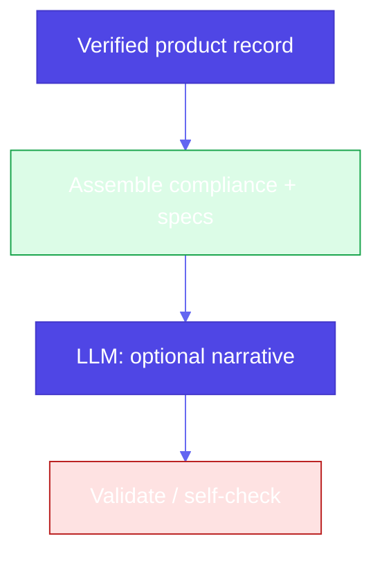

# Pattern 30: Assembled Reformat

## Overview

**Assembled reformat** builds **customer-facing pages** by **assembling** **verified** facts from systems of record (PIM, compliance, logistics), then optionally letting an LLM **reformat** only **low-risk** prose (tone, SEO). **High-risk attributes**—anything where a **hallucination** could cause **legal**, **safety**, or **operational** harm—must **never** be invented by the model. Example: a **camera** listing that **hallucinates “lithium”** for a **NiMH** pack could misstate **checked-baggage** rules (IATA / airline policies).

## Problem Statement

- **End-to-end** “write my product page” prompts let the LLM **blend** marketing with **specs** and **hazard** language.
- **One wrong chemistry** or **shipping claim** creates **liability** and **customer harm**.

## Solution Overview

1. **Identify risk-bearing characteristics** per vertical: battery chemistry, hazmat class, allergen, age rating, jurisdiction-specific claims, medical statements, etc.
2. **Load trusted fields** from **structured** sources (database, validated PIM, regulatory API)—same spirit as the book’s **CatalogContent** filled from **known** part ids and warranty.
3. **Assemble** mandatory **blocks** deterministically: shipping, compliance, warranty, SKU/price—**no** LLM.
4. **Reformat** (optional, higher temperature) **narrative** sections that **only reference** the assembled facts (or **quoted** snippets), then **validate** output against **allowlists** / **banned phrases** (pair with **Pattern 31: Self-check**).

Book reference: `assembled_reformat.ipynb` — **paper machine** part: **structured** `CatalogContent` filled with low temperature, then **creative** Markdown from the **assembled** object; comment notes **Self-check** / **citations** for validation.

### Camera / battery scenario (motivating example)

| Source | Field |
|--------|--------|
| PIM | `battery_chemistry = NiMH` |
| Compliance | `spillable = false`, `carry_on_only = false` |

The **assembled** page states **NiMH** and generic battery guidance from **rules**, not from model imagination. A **banned** post-check rejects copy that asserts **lithium** when the **verified** row does not.

### High-level flow

## Use Cases

- **E‑commerce** PDPs, travel **electronics**, **children’s** products, **regulated** copy

## Implementation Details

- Maintain a **risk registry**: which fields are **LLM-forbidden**.
- **Version** compliance rule packs; **log** which rule version produced a page.
- Prefer **quoted** manufacturer strings for **spec** tables.

## Constraints & Tradeoffs

**Tradeoffs:** ✅ Safer facts, clearer audit. ⚠️ More engineering than “one prompt”; creative copy is **narrower**.

## References

- Book: `generative-ai-design-patterns/examples/30_assembled_reformat/assembled_reformat.ipynb`
- **Pattern 29 (Template generation)**: slots and **templates**; assembled reformat is **structured assembly** + **optional** reformat pass
- **Pattern 31 (Self-check)**: automated **validation** of assembled + LLM layers

## Related Patterns

- **Trustworthy generation (11)**: citations and OOD; assembled reformat **removes** the need to cite what **never** came from the model
- **Grammar (2)**: optional structural validation of assembled output
