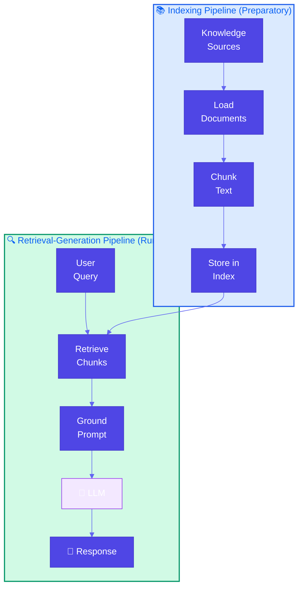
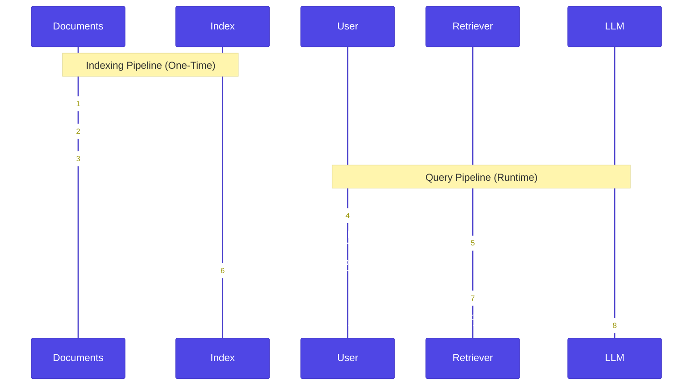

# Basic RAG (Retrieval-Augmented Generation)

**Source Books**: Generative AI Design Patterns

**Agentic catalog**: **Pattern 39 (Agentic RAG)** in this repo summarizes the same **retrieval** theme for *Agentic Design Patterns* (*Gulli*)—**embeddings**, **vector** stores, **Graph** / **Agentic** RAG, and **LangChain** composition—while **Pattern 6** remains the **hands-on** **basic** **pipeline** here.

## Problem Statement

Large Language Models (LLMs) have limitations when it comes to knowledge:

1. **Static Knowledge Cutoff**: Models are trained on data up to a specific date and don't know about events, facts, or information after their training cutoff
2. **Model Capacity Limits**: Even with large context windows, models can't store all knowledge in their parameters
3. **Lack of Access to Private Data**: Models don't have access to your organization's internal documents, databases, or proprietary information

For example, if you ask a model about:
- Recent events (after training cutoff)
- Your company's internal policies
- Product documentation that's constantly updated
- Private databases or knowledge bases

The model will either hallucinate, provide outdated information, or admit it doesn't know.

## Solution Overview

**Retrieval-Augmented Generation (RAG)** solves this by using trusted knowledge sources when generating LLM responses. The pattern consists of two pipelines:

### 1. Indexing Pipeline (Preparatory)
Build an efficient data store from your knowledge sources:
- **Load**: Extract documents from various sources (files, databases, APIs)
- **Chunk**: Split documents into manageable pieces (chunks/nodes)
- **Embed**: Convert chunks into vector representations (optional for basic RAG)
- **Store**: Index chunks in a searchable data store

### 2. Retrieval-Generation Pipeline (Runtime)
Use relevant knowledge to augment LLM responses:
- **Query**: Receive user question
- **Retrieve**: Search knowledge base for relevant chunks
- **Ground**: Add relevant chunks to prompt context
- **Generate**: LLM generates response using retrieved knowledge

### Key Concepts

- **Indexing**: The preparatory step of building an efficient data store
- **Retrieval**: The runtime step of searching for relevant information
- **Grounding**: Adding relevant chunks from knowledge base into the prompt
- **Augmentation**: Enhancing LLM responses with external knowledge

## Use Cases

- **Product Documentation**: Answer questions about product features, APIs, or usage
- **Company Knowledge Base**: Query internal wikis, policies, or procedures
- **Customer Support**: Provide accurate answers from support documentation
- **Research Assistance**: Search through research papers or technical documents
- **Legal/Compliance**: Query legal documents, regulations, or compliance guides
- **Educational Content**: Answer questions from textbooks or course materials

## Implementation Details

### Architecture



### Two Pipelines Detailed



### Key Components

1. **Document Loader**: Extracts content from various sources
2. **Text Splitter**: Chunks documents into manageable pieces
3. **Index/Store**: Stores chunks for efficient retrieval
4. **Retriever**: Searches for relevant chunks given a query
5. **LLM**: Generates response using retrieved context

### Basic RAG Flow

1. **Indexing Phase** (one-time or periodic):
   - Load documents
   - Split into chunks
   - Store in index

2. **Query Phase** (runtime):
   - User asks question
   - Retrieve relevant chunks
   - Construct prompt with chunks
   - Generate response

## Code Example

This example demonstrates a product documentation RAG system:

- **Indexing Pipeline**: Load and chunk product documentation
- **Retrieval**: Search for relevant documentation chunks
- **Generation**: Answer questions using retrieved context

### Running the Example

```bash
python example.py
```

## Best Practices

- **Chunk Size**: Balance between too small (loses context) and too large (irrelevant content)
- **Chunk Overlap**: Use overlap to preserve context across boundaries
- **Retrieval Strategy**: Choose appropriate retrieval method (keyword, semantic, hybrid)
- **Top-K Selection**: Retrieve enough chunks for context but not too many
- **Prompt Engineering**: Clearly separate retrieved context from user query
- **Source Attribution**: Include source references in responses
- **Index Updates**: Keep index updated as knowledge changes
- **Error Handling**: Handle cases where no relevant chunks are found

## Constraints & Tradeoffs

**Constraints:**
- Requires knowledge base preparation (indexing)
- Retrieval quality depends on chunking strategy
- May retrieve irrelevant chunks
- Limited by retrieval method effectiveness

**Tradeoffs:**
- ✅ Access to up-to-date and private knowledge
- ✅ Can handle large knowledge bases
- ✅ Transparent (can cite sources)
- ⚠️ Requires indexing infrastructure
- ⚠️ Retrieval quality affects response quality
- ⚠️ May include irrelevant context

## References

- [RAG Paper (Lewis et al., 2020)](https://arxiv.org/abs/2005.11401)
- [LlamaIndex Documentation](https://docs.llamaindex.ai/)
- [LangChain RAG Tutorial](https://python.langchain.com/docs/use_cases/question_answering/)
- [Building RAG Applications](https://www.pinecone.io/learn/retrieval-augmented-generation/)

## Related Patterns

- **Agentic RAG (Pattern 39)**: *Gulli* **catalog** entry—embeddings, **Graph** / **Agentic** RAG, **LangChain**—cross-reference; **Pattern 6** is the **concrete** basic pipeline here.
- **Semantic Indexing**: Advanced retrieval using embeddings
- **Index-Aware Retrieval**: Patterns for improving retrieval quality
- **Node Postprocessing**: Patterns for refining retrieved chunks

