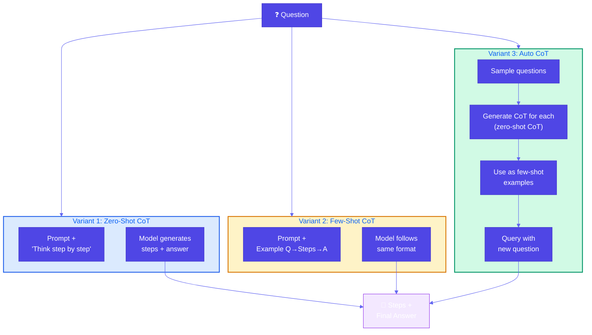
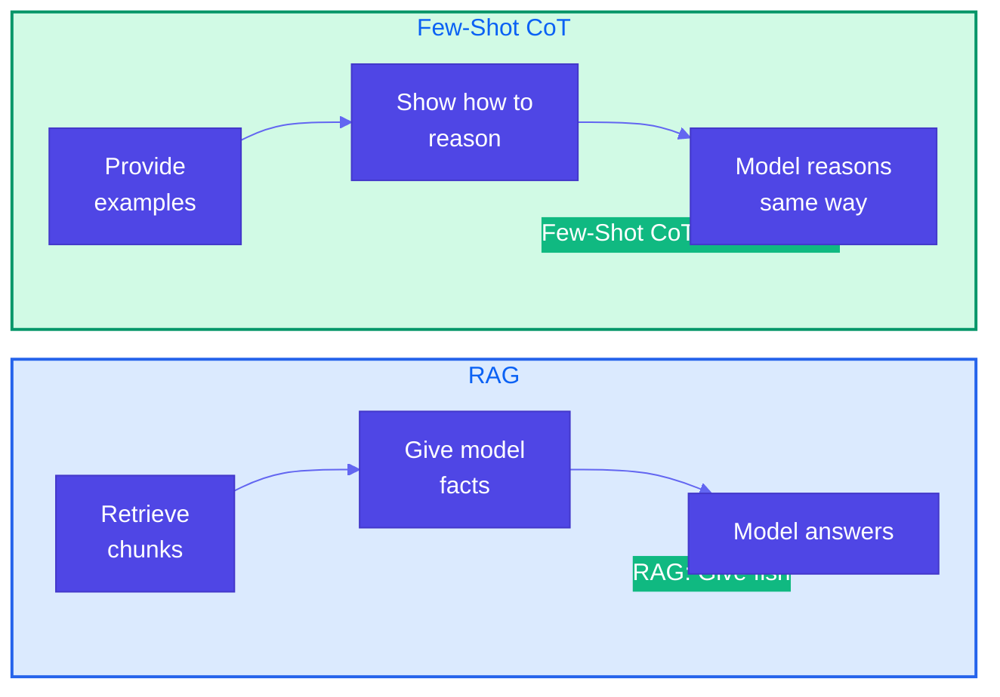
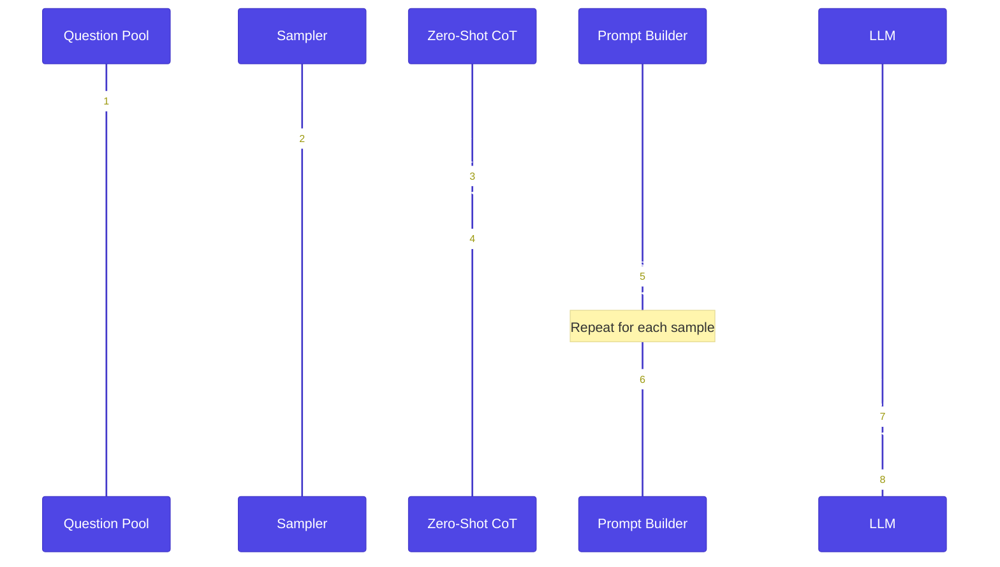

# Pattern 13: Chain of Thought (CoT)

## Overview

**Chain of Thought (CoT)** is a prompting pattern that requests a step-by-step reasoning process from the model. It addresses foundational model limitations on math, logical deduction, and sequential reasoning by making the reasoning trace explicit instead of a black-box answer.

## Problem Statement

Foundational models suffer from critical limitations when problems require multistep reasoning:

- **Math and Logical Deduction**: Zero-shot capability often fails on problems that need sequential reasoning (e.g., applying policy rules in order, computing multi-step formulas).
- **Black-Box Answers**: Models frequently give a final answer without showing how they reached it, which is unacceptable for compliance, auditing, and user trust.
- **Interpretation Errors**: Without an explicit reasoning trace, models may misinterpret rules (e.g., "final destination" in a multi-leg itinerary) or skip steps and hallucinate conclusions.

### When Zero-Shot Fails

```
User: "Is this customer eligible for a refund? Purchased 25 days ago, item unopened, receipt available."

Zero-shot: "Yes."  ← No reasoning, no audit trail, possible error.

Or: Wrong interpretation of "within 30 days" (e.g., counting from ship date instead of purchase date).
```

## Solution Overview

**Chain of Thought prompting** asks the model to reason step by step before giving the final answer. The model produces an explicit reasoning trace (steps) and then a conclusion, which improves accuracy and provides interpretability.

### Three Variants

#### Variant 1: Zero-Shot CoT

Add a short instruction such as **"Think step by step"** (or "Reason step by step and show your work") to the prompt. No examples are provided.

- **Pros**: No examples needed, minimal prompt change, works across many tasks.
- **Cons**: Structure of reasoning is not controlled; quality depends on model.

#### Variant 2: Few-Shot CoT

Provide one or more **example (question → step-by-step reasoning → answer)** pairs in the prompt. The model follows the same reasoning format for the new question.

- **Pros**: Teaches the desired reasoning format and domain logic; often more accurate than zero-shot CoT.
- **Cons**: Uses context window; examples must be representative.

**Few-Shot CoT vs RAG**

- **RAG**: Gives the model *facts* (retrieved chunks). "Here are some fish."
- **Few-Shot CoT**: Shows the model *how to reason* with those facts. "Here is how to fish."

Use RAG when the gap is **knowledge** (missing documents/data). Use Few-Shot CoT when the gap is **reasoning structure** (how to apply rules step by step). They can be combined: RAG supplies policy text; Few-Shot CoT supplies the reasoning template.

#### Variant 3: Auto CoT

**Automatic Chain of Thought**: Automatically build few-shot CoT prompts without hand-written examples.

1. **Sample questions**: From a pool of representative questions (or cluster similar questions), select a diverse subset.
2. **Generate reasoning**: For each sampled question, use **zero-shot CoT** ("Think step by step") to generate a (question, reasoning, answer) triple.
3. **Build few-shot prompt**: Use these triples as demonstrations in the prompt.
4. **Query**: Ask the actual user question; the model reasons using the same format as the auto-generated examples.

- **Pros**: No manual example authoring; scales to new domains; still enforces step-by-step structure.
- **Cons**: Depends on zero-shot CoT quality for the sampled questions; may need filtering/validation of auto-generated examples.

### CoT Flow



### Few-Shot CoT vs RAG



### Auto CoT Pipeline



## Use Cases

- **Policy / eligibility reasoning**: Refund, warranty, discount, or program eligibility given rules and case facts (multi-step conditions).
- **Technical troubleshooting**: Diagnose issues by applying checks and deductions in sequence.
- **Pricing and discounts**: Apply multiple rules (coupons, volume, membership) in a defined order.
- **Compliance and auditing**: Require a visible reasoning trace for decisions (e.g., lending, claims).
- **Math and logic**: Word problems, multi-step arithmetic, logical deduction (when no external knowledge is needed).

## Implementation Details

### Key Components

1. **Prompt templates**: For zero-shot CoT (e.g., "Think step by step"), few-shot CoT (example format), and Auto CoT (sampling + generation).
2. **Example store**: For few-shot CoT, curated (question, reasoning, answer) triples; for Auto CoT, generated triples from a question pool.
3. **Parser (optional)**: Extract final answer and/or steps from model output for downstream use (e.g., APIs, audit logs).
4. **LLM interface**: Same as other patterns (Ollama, OpenAI, etc.); CoT is prompt-level only.

### When CoT Does Not Help

- **Data gap**: Question requires information the model does not have (e.g., "Where is X on this map?"). Use RAG or tools (e.g., map API) to supply data; CoT can still structure reasoning over that data.
- **Non-sequential logic**: Problems where the best strategy is not a linear sequence (e.g., some probabilistic or game-theoretic reasoning). CoT may still help but may not capture all nuances.
- **Lazy or wrong base reasoning**: If zero-shot CoT produces bad steps, Auto CoT can propagate those errors into few-shot examples; validate or filter auto-generated examples when possible.

## Best Practices

- **Be explicit**: Prefer "Reason step by step and show your work" over vague "think carefully" when you want a visible trace.
- **Match examples to the task**: Few-shot CoT examples should mirror the structure (rules → steps → conclusion) of your real queries.
- **Combine with RAG**: Use RAG for policy/knowledge and Few-Shot CoT for how to apply it step by step.
- **Validate Auto CoT examples**: Check auto-generated reasoning for correctness before using as few-shot demos.
- **Parse and log**: Extract steps and final answer for auditing, UX (show steps to user), and evaluation.

## Constraints & Tradeoffs

**Constraints:**
- CoT does not add new knowledge; it only structures reasoning.
- Output is longer (more tokens, possibly higher latency/cost).
- Quality of steps depends on model and prompt design.

**Tradeoffs:**
- ✅ Better accuracy on multi-step math and logic.
- ✅ Interpretable, auditable reasoning trace.
- ✅ Few-shot CoT teaches reasoning format; RAG teaches facts.
- ⚠️ More tokens and sometimes more API cost.
- ⚠️ Not a fix for missing data or inherently non-sequential reasoning.

## References

- [Chain-of-Thought Prompting (Wei et al.)](https://arxiv.org/abs/2201.11903)
- [Zero-Shot CoT ("Let's think step by step") (Kojima et al.)](https://arxiv.org/abs/2205.11916)
- [Auto-CoT: Automatic Chain of Thought Prompting](https://arxiv.org/abs/2210.03493)
- [Invisible: Teaching CoT in Legal (A&O)](https://www.invisible.co/blog/how-to-teach-chain-of-thought-reasoning-to-your-llm)
- [K2view: CoT in GenAI Data Fusion](https://www.k2view.com/blog/chain-of-thought-reasoning/)

## Related Patterns

- **RAG (Basic RAG, Index-Aware Retrieval)**: Supplies knowledge; combine with CoT for structured reasoning over that knowledge.
- **Tree of Thoughts**: Explores multiple reasoning paths; CoT is typically a single path.
- **Self-Check / Trustworthy Generation**: CoT can feed into verification steps (e.g., check each step or conclusion).
- **Prompt chaining (Pattern 33)**: **Multiple** calls with **handoffs** between steps; CoT is usually **one** completion with an **explicit** reasoning trace inside it.
- **Reasoning techniques (Pattern 41)**: *Gulli* **index**—CoT **vs** ToT, ReAct, PAL, **deep** **research**, **etc.**
