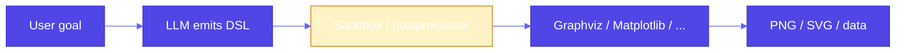

# Pattern 22: Code Execution

## Overview

**Code execution** is the pattern where an LLM **does not** directly draw a chart or call a rich visualization API; instead it emits a **specification** in a domain-specific language (DSL) — e.g. Graphviz DOT, Matplotlib/Python, Mermaid, SQL — and a **sandboxed postprocessor** sends that DSL to the real software (renderer, DB, runtime). This separates **reasoning in natural language** from **deterministic execution** in a constrained environment.

## Problem Statement

- **Content generation** is limited by the model’s internal knowledge; **RAG** injects text, but many tasks are not “answer in prose” — they are **produce an artifact** (diagram, plot, query result).
- **Calling a single API** is not enough when the right abstraction is **code or a spec** (e.g. “this tournament bracket,” “this time series with these series names”).
- **Software** (Graphviz, Matplotlib, a SQL engine) does what the LLM cannot: exact layout, rendering, aggregation.

You need a pipeline: **LLM → DSL string → validated / sandboxed execution → artifact** (image, file, table).

## Solution Overview

1. **LLM generates DSL** (temperature low for precision): DOT for graphs, Python for Matplotlib (with strong constraints), Mermaid for diagrams, etc.
2. **Postprocessor / sandbox** receives the DSL:
   - Writes to a temp file or parses safely.
   - Invokes the **target system** (`dot`, `python` in a restricted env, `mmdc`, DB driver).
   - Captures stdout, images, or errors; never trusts arbitrary code without boundaries.
3. **Optional ReAct / LangGraph**: The generation and execution steps can be **tools** in a ReAct loop (Pattern 21): *think → emit code → observe result → refine* — same as tool calling, but the “tool” is **run compiler / renderer**.

**Extension of grammar (Pattern 2)**: Grammar constrains **tokens**; code execution constrains **what gets executed** (allowed DSL, allowed imports, timeouts). Together they keep outputs safe and valid.

### High-Level Flow

### LangGraph Orchestration

Use **LangGraph** to wire steps explicitly: e.g. `generate_dsl` → `execute_in_sandbox` → `package_result`. That is clearer than an opaque single prompt and matches **interleaving reasoning and action** when combined with a model that can branch (ReAct-style).

## Use Cases

- **Diagrams**: Tournament brackets, org charts, architecture (DOT, Mermaid) — reference book example uses Graphviz for basketball results.
- **Plots**: Time series / bar charts from structured intent (Matplotlib or Vega-Lite specs).
- **Analytics**: LLM writes **pandas** or **SQL**; executor runs in a sandbox with row limits (see USAGE references: Gemini + pandas for analysis).
- **Infrastructure-as-code**: Generate Terraform/CloudFormation snippets; validator runs `terraform validate` in CI.

## Implementation Details

- **Prefer DSL over raw Python** when possible: easier to validate than full Python.
- **Sandbox**: separate process, timeouts, resource limits, no network if not required.
- **Validate before execute**: lint DOT, parse SQL with allowlist, etc.
- **Observability**: log DSL and exit codes; surface errors back to the model for retry (ReAct).

## Constraints & Tradeoffs

**Constraints:**
- Arbitrary code execution is dangerous; use DSL + restricted runners or heavy isolation (containers).
- Graphviz / Python environments must be installed where the sandbox runs.

**Tradeoffs:**
- ✅ Precise visuals and reproducible artifacts
- ⚠️ Operational complexity (sandbox, dependencies, validation)

## References

- Reference example: `generative-ai-design-patterns/examples/22_code_execution` (Graphviz DOT + `dot -Tpng`; basketball tournament).
- [Claude + Mermaid for diagrams](https://www.micahwalter.com/2024/11/generating-aws-architecture-diagrams-with-claude/)
- [Gemini + Pandas for analysis](https://www.narrative.bi/analytics/using-gemini-for-data-analysis)
- **Pattern 2 (Grammar)**, **Pattern 21 (Tool Calling / LangGraph)**

## Related Patterns

- **Grammar (Pattern 2)**: Structural validity of generated text; code execution adds **execution** validity.
- **Tool Calling (Pattern 21)**: “Run this DSL in the sandbox” is a **tool**; LangGraph composes steps.
- **Dependency Injection (Pattern 19)**: Inject mock executors for tests.
