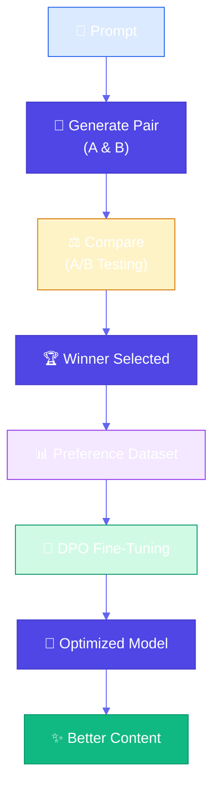
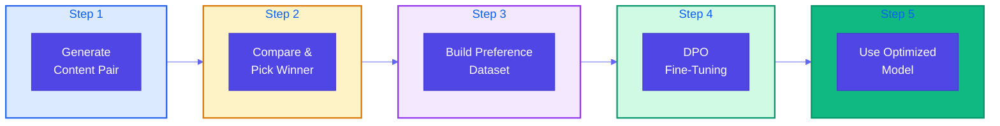
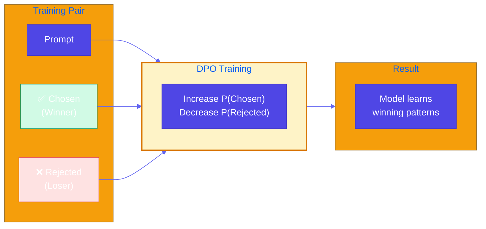

# Content Optimization

**Source Books**: Generative AI Design Patterns

## Problem Statement

When creating content for specific purposes (e.g., marketing emails, product descriptions, landing pages), you need to optimize for specific outcomes like:

- **Email subject lines**: Maximize open rates
- **Product descriptions**: Increase conversion rates
- **Social media posts**: Boost engagement
- **Landing page copy**: Improve sign-up rates
- **Ad copy**: Enhance click-through rates

Traditional A/B testing is a simple approach if you have a hypothesis, but it has limitations:
- Requires manual creation of variants
- Time-consuming to test many variations
- Doesn't learn from patterns across different content
- Limited by the number of hypotheses you can test

The challenge is: **How do you systematically create content that performs better for your specific goal?**

## Solution Overview

**Content Optimization** uses preference-based fine-tuning (like Direct Preference Optimization - DPO) to train a model to generate content that consistently wins in head-to-head comparisons. The model learns from pairwise comparisons to understand what makes content more effective for your specific use case.

### Why This Works

Instead of manually testing hypotheses, you:
1. Generate multiple content variations automatically
2. Compare pairs to identify winners
3. Train the model to learn what makes content win
4. The model internalizes the patterns and generates better content

### Key Insight

By comparing just two pieces of content at a time and identifying the winner, you create a preference dataset. The model learns from these preferences and adjusts its weights to produce content that is more likely to win in future comparisons.

## Implementation Steps

### Step 1: Generate Pair of Contents
From the same prompt, generate two different content variations. Use different temperatures or sampling strategies to get diverse outputs.

**Example**: Generate two email subject lines for the same email:
- Variation A: "New Product Launch: Check It Out!"
- Variation B: "You're Invited: Exclusive Preview Inside"

### Step 2: Compare and Pick Winner
Compare the two content pieces based on your optimization goal and select the winner. This can be:
- **Automated**: Use metrics (open rates, click rates, engagement)
- **Human judgment**: Have reviewers pick the better option
- **Hybrid**: Combine metrics with human feedback

**Example**: Test both subject lines, measure open rates, pick the winner.

### Step 3: Create Training Dataset
Collect many such pairs with winners to create a preference dataset. Format:
- **Prompt**: The original request
- **Chosen**: The winning content
- **Rejected**: The losing content

**Example**: 100+ pairs of (prompt, winning subject line, losing subject line)

### Step 4: Perform Preference Tuning
Use Direct Preference Optimization (DPO) or similar methods to fine-tune the model on the preference dataset. This adjusts the model weights to favor content that wins comparisons.

**Process**:
1. Load base model
2. Prepare preference dataset
3. Train using DPO trainer
4. Validate on held-out examples

### Step 5: Use Tuned LLM
Use the fine-tuned model going forward. It will generate content that is more likely to perform well based on learned preferences.

## Use Cases

- **Email Marketing**: Optimize subject lines for open rates
- **E-commerce**: Optimize product descriptions for conversions
- **Social Media**: Optimize posts for engagement
- **Landing Pages**: Optimize copy for sign-ups
- **Ad Copy**: Optimize for click-through rates
- **Content Marketing**: Optimize headlines for clicks
- **Support Documentation**: Optimize for clarity and helpfulness

## Implementation Details

### Key Components

1. **Content Generator**: Base model for generating content variations
2. **Comparison System**: Mechanism to compare and select winners
3. **Preference Dataset**: Collection of prompt-winner-loser triplets
4. **DPO Trainer**: Fine-tuning infrastructure for preference learning
5. **Optimized Model**: Fine-tuned model that generates winning content

### Architecture



### Five-Step DPO Process



### DPO Training Concept



### How It Works

1. **Generation**: Create multiple variations from same prompt
2. **Comparison**: Head-to-head comparison to identify winner
3. **Learning**: Model learns patterns from winning content
4. **Optimization**: Model weights adjusted to favor winning patterns
5. **Application**: Future content generation benefits from learned preferences

### Direct Preference Optimization (DPO)

DPO is a training method that:
- Takes pairs of responses (chosen vs rejected)
- Trains the model to increase probability of chosen responses
- Decreases probability of rejected responses
- No need for a separate reward model (unlike RLHF)

## Code Example

This example demonstrates optimizing email subject lines for open rates:

- **Step 1**: Generate pair of subject lines
- **Step 2**: Compare and pick winner (based on open rates)
- **Step 3**: Create preference dataset
- **Step 4**: Fine-tune with DPO
- **Step 5**: Use optimized model

### Running the Example

```bash
python example.py
```

## Best Practices

- **Clear Optimization Goal**: Define what "better" means (open rates, conversions, engagement)
- **Diverse Generation**: Use different temperatures/sampling to get varied content
- **Consistent Comparison**: Use same criteria for all comparisons
- **Quality Dataset**: Collect 100+ high-quality preference pairs
- **Validation**: Test fine-tuned model on held-out examples
- **Iterative Improvement**: Continuously collect new pairs and retrain
- **Metrics Tracking**: Measure improvement in your optimization goal
- **Human-in-the-Loop**: Combine automated metrics with human judgment when needed

## Comparison with Traditional A/B Testing

### Traditional A/B Testing
- ✅ Simple and straightforward
- ✅ Works with clear hypotheses
- ⚠️ Manual variant creation
- ⚠️ Limited number of tests
- ⚠️ Doesn't learn patterns

### Content Optimization (DPO)
- ✅ Automated content generation
- ✅ Learns from all comparisons
- ✅ Scales to many variations
- ✅ Model internalizes patterns
- ⚠️ Requires training data collection
- ⚠️ More complex setup

## References

- [Direct Preference Optimization (DPO)](https://arxiv.org/abs/2305.18290)
- [Preference Learning in NLP](https://huggingface.co/docs/trl/main/en/dpo_trainer)
- [Content Optimization Techniques](https://www.promptingguide.ai/techniques/optimization)
- [RLHF vs DPO](https://huggingface.co/blog/dpo-trl)

## Related Patterns

- **Style Transfer**: Similar but focuses on style rather than performance
- **Reverse Neutralization**: Uses fine-tuning but for style, not optimization
- **Content Generation**: Patterns for generating structured content

