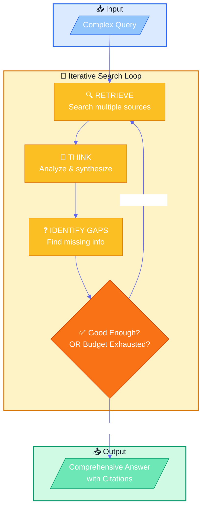
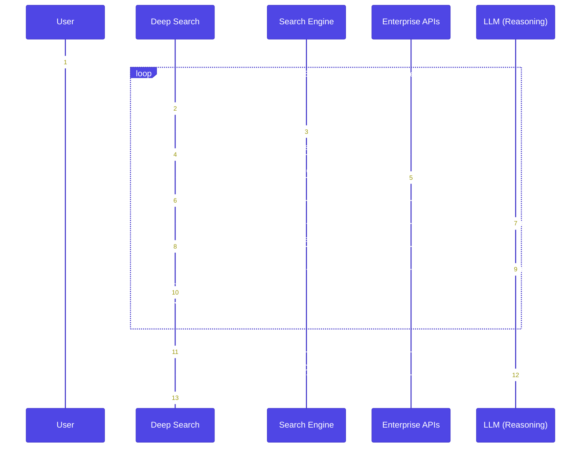
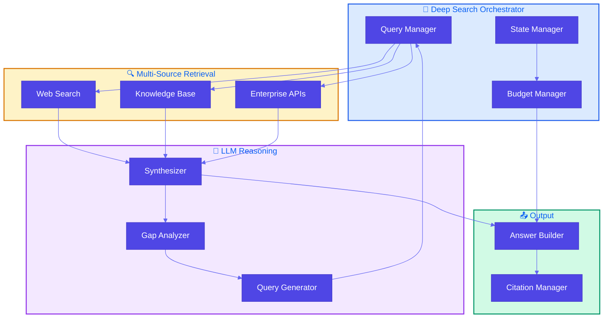

# Pattern 12: Deep Search

## Overview

**Deep Search** is an iterative retrieval-reasoning pattern for complex information needs that basic RAG cannot handle. It continuously retrieves, analyzes, and refines until a comprehensive answer is found or a budget is exhausted.

## Problem Statement

RAG systems are less effective for complex information retrieval due to:

- **Context Window Constraints**: Single retrieval can't capture all relevant information
- **Query Ambiguity**: Complex questions require clarification through exploration
- **Information Verification**: Facts need cross-referencing from multiple sources
- **Shallow Reasoning**: Single-pass retrieval lacks depth for nuanced questions
- **Information Staleness**: Knowledge bases may have outdated information
- **Multihop Query Challenges**: Answers require connecting information across multiple documents

### When Basic RAG Fails

```
User: "What factors should I consider when evaluating Company X as an investment?"

Basic RAG: Retrieves a few chunks about Company X → Incomplete answer
- Misses financial trends
- Misses competitive landscape
- Misses recent news
- Misses industry context
```

## Solution

**Deep Search** uses an iterative loop that consists of retrieval and thinking until a good enough answer is found or time/cost budget is exhausted.

### Deep Search Flow



### Detailed Process Flow



### Key Components

1. **Multi-Source Retrieval**: Search engines, enterprise APIs, knowledge bases
2. **Iterative Reasoning**: Analyze findings, identify gaps, generate follow-ups
3. **Budget Management**: Track time and cost, stop when exhausted
4. **Answer Quality Assessment**: Determine when answer is "good enough"
5. **Citation Tracking**: Track sources for all claims

## Use Cases

- **Market Research**: Comprehensive company/industry analysis
- **Due Diligence**: Investment research with multiple factors
- **Competitive Analysis**: Deep competitive landscape research
- **Technical Research**: Complex technical questions requiring multiple sources
- **Legal Research**: Multi-document legal analysis
- **Academic Research**: Literature review and synthesis

## Implementation Details

### Architecture



### Key Classes

1. **DeepSearchOrchestrator**: Manages the iterative loop
2. **MultiSourceRetriever**: Searches multiple sources (web, APIs, knowledge bases)
3. **LLMReasoner**: Synthesizes answers, identifies gaps, generates follow-ups
4. **BudgetManager**: Tracks time/cost and determines when to stop
5. **CitationManager**: Tracks and formats source citations

## Best Practices

### Budget Management
- Set clear time and cost limits before starting
- Track API calls and processing time
- Implement early stopping for low-value iterations

### Quality Assessment
- Define clear criteria for "good enough" answers
- Use confidence scoring for answer completeness
- Cross-reference information from multiple sources

### Source Diversity
- Use multiple search engines and APIs
- Prioritize authoritative sources
- Balance breadth vs. depth of sources

### Follow-up Generation
- Generate specific, targeted follow-up queries
- Avoid redundant searches
- Prioritize high-value gaps

## Constraints & Tradeoffs

### Constraints
- **Cost**: Multiple API calls and LLM invocations increase cost
- **Latency**: Iterative process takes longer than single retrieval
- **Complexity**: More complex to implement than basic RAG
- **Source Availability**: Limited by available APIs and search engines

### Tradeoffs
- ✅ Comprehensive answers for complex questions
- ✅ Handles multi-hop reasoning
- ✅ Verifies information across sources
- ✅ Adapts to query complexity
- ⚠️ Higher cost than basic RAG
- ⚠️ Longer response times
- ⚠️ Requires budget management

## Related Patterns

- **Basic RAG** (Pattern 6): Foundation for retrieval
- **Index-Aware Retrieval** (Pattern 9): Advanced retrieval techniques
- **Node Postprocessing** (Pattern 10): Improving retrieved chunks
- **Trustworthy Generation** (Pattern 11): Citations and verification
- **Chain of Thought**: Step-by-step reasoning (complementary)
- **Tree of Thoughts**: Exploring multiple reasoning paths (complementary)
- **Parallelization** (Pattern 35): **Fan-out** retrieval or sub-queries **concurrently**, then **merge** (LCEL ``RunnableParallel``, pools, LangGraph).
- **Reasoning techniques** (Pattern 41): *Gulli* **map**—**deep** **research** sits among CoT, ReAct, **etc.**

## References

- [IBM Deep Search Toolkit](https://research.ibm.com/blog/deep-search-toolkit)
- [OpenAI Deep Research](https://openai.com/index/introducing-deep-research/)
- [Perplexity Pro Search](https://www.perplexity.ai/)
- [HuggingFace Transformers](https://huggingface.co/docs/transformers)
- [LangChain Agents](https://python.langchain.com/docs/modules/agents/)
