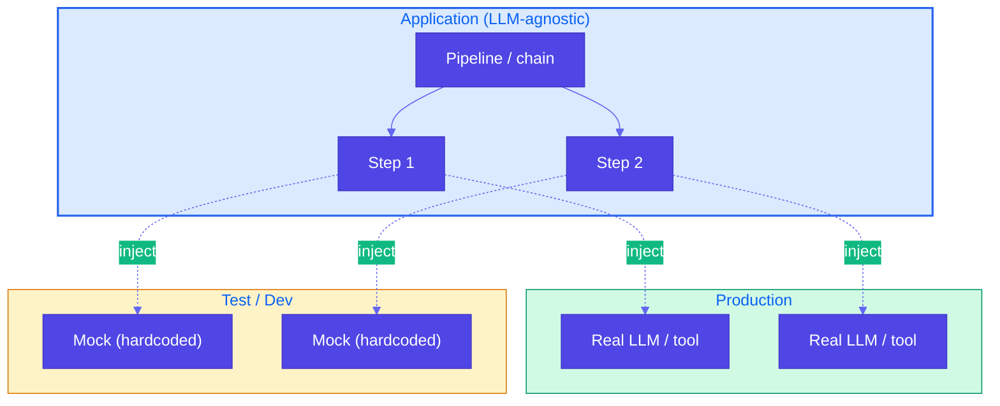

# Pattern 19: Dependency Injection

## Overview

**Dependency Injection** for GenAI apps means **injecting** the components that perform LLM calls and external tool calls (e.g., summarizer, classifier, API client) instead of hardcoding them. In development and tests, you replace those dependencies with **lightweight mocks** that return hardcoded, deterministic results. This makes development and testing tractable despite nondeterminism, model churn, and the need to stay LLM-agnostic.

## Problem Statement

Developing and testing GenAI applications is hard:

- **Nondeterminism**: Same prompt can yield different outputs; tests and debugging become flaky.
- **Model churn**: Models and APIs change frequently; you do not want application logic tightly coupled to one provider or model.
- **LLM-agnostic code**: Business logic (chains, pipelines, branching) should not depend on a specific LLM or API so you can swap providers, use mocks in tests, or run offline.

If your code calls the LLM directly inside a long pipeline, you cannot easily:
- Unit-test one step without calling the real LLM (slow, costly, non-deterministic).
- Run the app in CI or on a machine without API keys.
- Switch to another model or mock for a demo.

## Solution Overview

**Dependency Injection**: Treat LLM calls and external tools as **dependencies** that are passed into your pipeline or service (e.g., as function parameters or constructor arguments). Then:

- **Production**: Pass the real implementation (e.g., a function that calls Ollama or an API).
- **Tests and dev**: Pass **mock** implementations that return hardcoded, deterministic results.

Your application code stays **LLM-agnostic**: it only depends on interfaces (e.g., "something that takes text and returns a summary"), not on a concrete LLM client. Mocks are lightweight (no network, no API keys) and make tests fast and deterministic.

### High-Level Flow

### How It Works in Code

1. **Define an interface** (e.g., a callable type or protocol): e.g. `Summarizer = Callable[[str], str]`, or `def summarize(text: str) -> str`.
2. **Pipeline accepts dependencies as parameters**: e.g. `def run_pipeline(input: str, summarize_fn: Summarizer, suggest_fn: SuggestAction) -> Result`.
3. **Production**: Pass functions that call the real LLM or API.
4. **Tests**: Pass mock functions that return fixed strings or structured data. No API keys, no network, deterministic assertions.

### Benefits

- **Deterministic tests**: Mocks return known outputs; you assert on exact or structured values.
- **Fast tests**: No LLM or network calls; CI runs in seconds.
- **LLM-agnostic**: Swap provider or model by swapping the injected implementation.
- **Test each step in isolation**: e.g. test "Step 2" by injecting a mock for "Step 1" and asserting on Step 2's behavior.

## Use Cases

- **Multi-step chains**: Critique → improve (e.g., marketing copy); summarize → suggest action (e.g., support ticket). Inject critique/summarize/improve so you can test the chain with mocks or run only one step with fakes.
- **Agents with tools**: Inject tool executors; in tests, use mocks that return fixed results so agent logic is testable without calling real APIs.
- **RAG pipelines**: Inject retriever and generator; mock retriever with fixed chunks and assert on generator output or mock generator and assert on retrieval usage.
- **CI and offline dev**: Run full test suite without API keys or network by injecting mocks everywhere.

## Implementation Details

### Interfaces

Use **callable types** (e.g., `Callable[[str], str]`) or **protocols** (e.g., `typing.Protocol`) to describe what each dependency does. The pipeline only depends on the interface, not on Ollama/OpenAI/etc.

### Mock Implementations

- Return **hardcoded** strings or structured data that satisfy the contract (e.g., valid JSON, expected fields).
- Optionally vary mocks by input (e.g., if input contains "billing", return a billing-related summary) to test branching.
- Keep mocks in the same repo (e.g., `mocks.py` or test fixtures) so tests stay self-contained.

### Defaults

- In production entrypoints, pass the real implementations as defaults or from config: e.g. `run_pipeline(text, summarize_fn=real_summarize, suggest_fn=real_suggest)`.
- In tests, pass mocks explicitly: `run_pipeline(text, summarize_fn=mock_summarize, suggest_fn=mock_suggest)`.

### Best Practices

- **One interface per logical dependency**: e.g. one for "summarize", one for "suggest action"; do not bundle unrelated calls into a single giant injectable.
- **No LLM calls inside core logic**: Core logic should call the injected function, not `requests.post(...)` or a global LLM client.
- **Document the contract**: Docstrings or types should state what the injectable takes and returns so mock authors know what to implement.

## Constraints & Tradeoffs

**Constraints:**
- You must structure the app so that LLM/tool calls are behind injectable boundaries; refactoring may be needed if the codebase currently calls the LLM inline everywhere.
- Mocks can drift from real behavior; periodically validate that real implementations still match expectations (e.g., integration tests or spot checks).

**Tradeoffs:**
- ✅ Deterministic, fast tests; LLM-agnostic; test steps in isolation
- ⚠️ Slightly more boilerplate (interfaces, passing dependencies); mocks need maintenance if contracts change

## References

- Reference example: `generative-ai-design-patterns/examples/19_dependency_injection` (marketing critique → improve chain; `improvement_chain(..., critique_fn=..., improve_fn=...)` with `mock_critique` for testing Step 2 in isolation).

## Related Patterns

- **LLM as Judge (Pattern 17)**: The judge can be an injected dependency so the rest of the pipeline is testable with a mock judge.
- **Reflection (Pattern 18)**: Generate and evaluate are natural injection points; inject mock generator or mock evaluator to test the other half.
- **Chain of Thought / RAG / Agents**: Any multi-step flow benefits from injecting each step so steps can be tested separately and replaced with mocks in CI.
