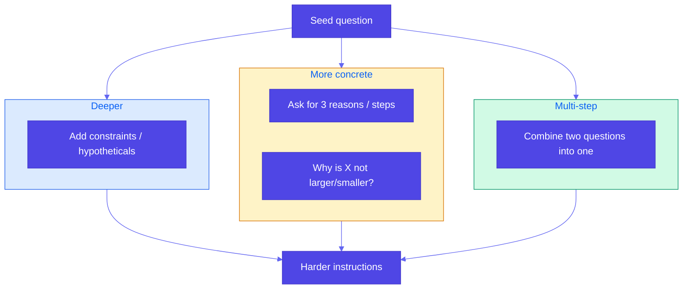

# Pattern 16: Evol-Instruct

## Overview

**Evol-Instruct** is a pipeline for teaching pretrained (often enterprise-deployed) models **new and complex tasks** by creating a custom instruction-tuning dataset: evolve simple instructions into harder ones, generate answers, evaluate and filter examples, then perform **instruction tuning** (e.g., SFT with PEFT/LoRA) on open-weight models. Enterprise versions of foundational models are typically made available under data-privacy policies; Evol-Instruct lets you post-train on your own private data to teach complex, domain-specific tasks.

## Problem Statement

Enterprise tasks often require **new or highly specialized capabilities** that off-the-shelf models do not provide out of the box:

- **Domain-specific reasoning**: e.g., answering complex questions from internal policy docs, SEC filings, or proprietary playbooks.
- **Data privacy**: Training data (and sometimes the model) must stay on-prem or in a compliant environment; you cannot rely on public APIs or external data leakage.
- **Complexity**: Simple prompts or small fixed datasets are not enough; you need a **curriculum** of instructions that range from simple to hard so the model learns robust, multi-step reasoning.
- **Quality and scale**: Manually writing thousands of hard (instruction, answer) pairs is expensive; you need a repeatable way to **evolve** simple seeds into harder instructions and then filter for quality.

Evol-Instruct addresses this by:

1. **Evolving instructions** — Start from simple seed questions/instructions and use an LLM (or rules) to rewrite them into harder variants (deeper, more concrete, multi-step).
2. **Generating answers** — Produce high-quality answers for each evolved instruction (e.g., using an LLM with access to your private context).
3. **Evaluating and filtering** — Score each (instruction, answer) pair (e.g., 1–5) and keep only high-quality examples for training.
4. **Instruction tuning** — Run supervised fine-tuning (SFT) on an open-weight model (e.g., Llama, Gemma) using the filtered dataset; PEFT/LoRA keeps training efficient and preserves base capabilities.

## Solution Overview

### Four-Step Pipeline

1. **Evolve instructions** — From seed instructions, generate harder variants:
   - **Deeper**: Add constraints (e.g., market conditions, hypotheticals like cost overruns).
   - **More concrete**: Ask for "three reasons," "list the steps," or "why is X not larger/smaller?"
   - **Multi-step reasoning**: Combine two related questions so both must be answered implicitly.
2. **Generate answers** — For each instruction, generate a grounded, high-quality answer (using context from your private docs when applicable).
3. **Evaluate and filter** — Score each (instruction, answer) pair (e.g., 1–5 with explanation); retain only examples above a quality threshold.
4. **Instruction tuning** — Build an SFT dataset (e.g., chat format) and train an open-weight model (HuggingFace Transformers); use PEFT/LoRA for parameter-efficient training.

### High-Level Flow

```mermaid
%%{init: {'theme': 'base', 'themeVariables': { 'primaryColor': '#4f46e5', 'primaryTextColor': '#fff', 'primaryBorderColor': '#4338ca', 'lineColor': '#6366f1', 'secondaryColor': '#10b981', 'tertiaryColor': '#f59e0b'}}}%%
flowchart LR
    subgraph STEP1["1. Evolve"]
        S1["Seed instructions"] --> E["Evolve (deeper, concrete, multi-step)"]
        E --> E1["Harder instructions"]
    end
    
    subgraph STEP2["2. Generate"]
        E1 --> G["Generate answers"]
        G --> QA["(instruction, answer) pairs"]
    end
    
    subgraph STEP3["3. Evaluate & Filter"]
        QA --> SC["Score 1–5"]
        SC --> FL["Filter by threshold"]
        FL --> DS["Training dataset"]
    end
    
    subgraph STEP4["4. Instruction Tuning"]
        DS --> SFT["SFT / LoRA on open-weight model"]
        SFT --> OUT["Specialized model"]
    end
    
    STEP1 --> STEP2 --> STEP3 --> STEP4
    
    style STEP1 fill:#dbeafe,stroke:#2563eb,stroke-width:2px
    style STEP2 fill:#fef3c7,stroke:#d97706,stroke-width:2px
    style STEP3 fill:#d1fae5,stroke:#059669,stroke-width:2px
    style STEP4 fill:#f3e8ff,stroke:#9333ea,stroke-width:2px
```

### Evolution Strategies

### Instruction Tuning (SFT + PEFT)

- **SFT (Supervised Fine-Tuning)**: Train the model on (instruction, answer) pairs in a standard chat or completion format. HuggingFace Transformers and libraries like TRL/Unsloth support SFT on open-weight models (Llama, Gemma, etc.).
- **PEFT/LoRA**: Train only low-rank adapter weights instead of the full model; reduces memory and overfitting and preserves base capabilities. Same idea as adapter tuning (Pattern 15), applied here to **instruction-following** on evolved, domain-specific data.

## Use Cases

- **Internal policy Q&A**: Evolve simple policy questions into complex, multi-part questions; generate answers from policy docs; filter; instruction-tune a model for internal use (data stays private).
- **SEC / business strategy Q&A**: Seed questions from SEC filings (e.g., management discussion); evolve into harder analytical questions; generate and score answers; instruction-tune for strategy/finance use (reference example: Generative AI Design Patterns).
- **Compliance and risk playbooks**: Turn simple procedure questions into scenario-based, multi-step instructions; train a model to answer from internal playbooks.
- **Technical documentation Q&A**: Evolve "how do I do X?" into "list three ways to do X when Y fails" and similar; train on internal docs.
- **Customer support escalation playbooks**: Complex escalation rules and edge cases as evolved instructions; train on approved responses.

## Implementation Details

### Key Components

1. **Seed instructions**: Simple, domain-relevant questions or tasks (from templates, existing FAQs, or an LLM generating from a doc).
2. **Evolve step**: LLM (or rule-based) rewrites: deeper (constraints, hypotheticals), more concrete (N reasons/steps), multi-step (combine two questions). In production, use a capable LLM with clear prompts (see reference notebook).
3. **Generate step**: For each instruction, produce an answer (LLM with access to context; optionally with citations). Ensure format is consistent (e.g., 2–3 sentences, or structured).
4. **Score step**: LLM or heuristic scores each (instruction, answer) (e.g., 1–5) with a short explanation; filter to score ≥ threshold (e.g., ≥ 4).
5. **SFT dataset**: Convert to chat format (e.g., `messages: [{role: "user", content: instruction}, {role: "assistant", content: answer}]`) or prompt/completion pairs.
6. **Training**: Use HuggingFace `transformers` + `peft` (LoRA) + `trl` (SFTTrainer) or Unsloth; train on the filtered dataset; save adapter or full checkpoint.

### Dataset Size and Quality

- **Scale**: Reference example uses thousands of (question, answer, score) pairs from many filings; you can start with hundreds and grow.
- **Quality**: Filtering by score is critical; low-quality or off-topic pairs can hurt instruction-following. Prefer smaller, high-quality sets over large, noisy ones.
- **Diversity**: Evolve from diverse seeds (different docs, sections, question types) to avoid narrow overfitting.

## Best Practices

- **Clear evolution prompts**: Define "deeper," "concrete," and "multi-step" in your evolve prompts so the LLM produces consistent difficulty.
- **Stable scoring rubric**: Use a fixed rubric (e.g., insight, correctness, clarity) and, if possible, a dedicated scorer model or human sample to calibrate.
- **Privacy and compliance**: Run evolve/generate/score inside your data boundary; use enterprise or on-prem models when required.
- **SFT + LoRA**: Prefer LoRA/QLoRA for instruction tuning to reduce cost and preserve base model; full fine-tuning only when you have large, diverse data and need full adaptation.
- **Validation set**: Hold out a fraction of high-scoring pairs for validation; monitor loss and a task-specific metric (e.g., answer quality) during SFT.

## Constraints & Tradeoffs

**Constraints:**
- Requires a pipeline (evolve → generate → score) and access to an LLM for evolution and answer generation (or rule-based approximations).
- Instruction tuning requires GPU resources and familiarity with HuggingFace/TRL/PEFT (or similar).
- Seed quality and evolution prompts strongly affect the final dataset; iteration is often needed.

**Tradeoffs:**
- ✅ Teaches complex, domain-specific tasks with private data
- ✅ Scalable dataset creation from simple seeds (evolve + generate + filter)
- ✅ Works with open-weight models and data-privacy policies
- ⚠️ Pipeline and training setup are more involved than prompt-only or single-step fine-tuning
- ⚠️ Quality depends on evolution diversity and scoring consistency

## References

- [WizardLM: Empowering Large Language Models to Follow Complex Instructions](https://arxiv.org/abs/2304.12244) (Evol-Instruct idea)
- [HuggingFace Transformers](https://huggingface.co/docs/transformers) — SFT on open-weight models
- [PEFT (LoRA, QLoRA)](https://huggingface.co/docs/peft) — Parameter-efficient fine-tuning
- [TRL SFTTrainer](https://huggingface.co/docs/trl/sft_trainer) — Supervised fine-tuning
- [Unsloth](https://github.com/unslothai/unsloth) — Fast LoRA/SFT for Llama and others
- Reference example: `generative-ai-design-patterns/examples/16_evol_instruct` (SEC filings, business strategy Q&A, Gemma + LoRA)

## Related Patterns

- **Adapter Tuning (Pattern 15)**: Same idea of training a small adapter (LoRA) on task-specific data; Evol-Instruct focuses on **how to create** that data (evolve → generate → filter) and then apply SFT/LoRA for **instruction following**.
- **Chain of Thought / Tree of Thoughts**: Reasoning patterns; evolved instructions often require multi-step reasoning; CoT/ToT can be used during answer generation or at inference with an Evol-Instruct–tuned model.
- **RAG / Deep Search**: Evol-Instruct teaches the model from a fixed training set; RAG/Deep Search augment at inference with retrieval. Can be combined: Evol-Instruct for style and complexity, RAG for up-to-date or long-tail facts.
