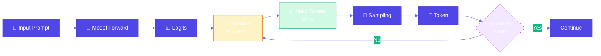
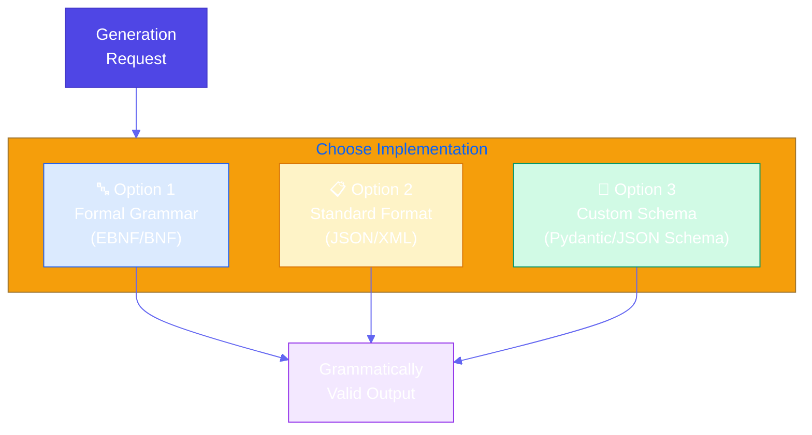

# Grammar Constrained Generation

**Source Books**: Generative AI Design Patterns

## Problem Statement

When generating structured outputs, language models often produce text that doesn't conform to required formats, schemas, or grammars. Unlike simple logits masking which prevents invalid sequences, grammar-constrained generation ensures outputs follow a formal grammar specification. This is essential for:

- Generating configuration files that must parse correctly
- Creating API schemas that must be valid
- Producing structured data that matches specific formats
- Ensuring outputs can be parsed and validated programmatically

Traditional approaches like post-processing or retry loops are inefficient and don't guarantee grammatical correctness.

## Solution Overview

**Grammar Constrained Generation** uses formal grammar specifications to guide token generation. The pattern ensures that every generated token conforms to the grammar rules, guaranteeing that the final output is grammatically valid and can be parsed.

This pattern offers three implementation approaches:

### Option 1: Grammar-Constrained Logits Processor
Uses a formal grammar (like EBNF) to create a logits processor that only allows tokens that maintain grammatical validity.

**Steps:**
1. **Create Formal Grammar**: Define the grammar using a formal notation (EBNF, BNF, etc.)
2. **Create Logits Processor**: Build a processor that validates tokens against the grammar
3. **Apply Logits Processing**: Use the processor during generation to constrain output

### Option 2: Standard Data Format (JSON/XML)
Leverages well-known formats with existing parsers and validators.

**Approach:**
- Use JSON Schema or XML Schema for validation
- Apply format-specific logits processors
- Benefit from existing tooling and libraries

### Option 3: User-Defined Schema
Uses custom schemas (like JSON Schema, Pydantic models, or custom validators).

**Approach:**
- Define schema using a schema language
- Convert schema to grammar constraints
- Apply constraints during generation

## Use Cases

- **API Configuration Generation**: Generate OpenAPI specs, GraphQL schemas, or API documentation
- **Configuration Files**: Generate YAML, TOML, or INI files that must parse correctly
- **Database Queries**: Generate SQL or query languages with guaranteed syntax
- **Structured Data**: Generate CSV, XML, or custom formats with validation
- **Code Generation**: Generate code snippets that must compile/parse
- **Data Schemas**: Generate JSON Schema, Avro schemas, or Protocol Buffer definitions

## Implementation Details

### Key Components

1. **Grammar Parser**: Parses formal grammar specifications
2. **State Machine**: Tracks current position in grammar during generation
3. **Logits Processor**: Modifies logits based on valid next tokens
4. **Validator**: Validates generated output against grammar/schema

### Architecture



### Three Implementation Options



### How It Works

1. **Grammar Definition**: Define what valid output looks like using formal grammar
2. **State Tracking**: Track current position in grammar parse tree during generation
3. **Token Filtering**: Only allow tokens that maintain grammatical validity
4. **Validation**: Continuously validate that generation follows grammar rules

## Code Example

This example demonstrates generating API endpoint configurations using all three approaches:

- **Option 1**: Formal grammar for API endpoint syntax
- **Option 2**: JSON Schema for API configuration
- **Option 3**: Custom schema for endpoint definitions

### Running the Example

```bash
# The example demonstrates all three options
python example.py
```

## Best Practices

- **Start Simple**: Begin with simple grammars and gradually add complexity
- **Use Existing Tools**: Leverage libraries like `transformers-cfg` or `outlines` for grammar processing
- **Validate Incrementally**: Check grammar validity at each step, not just at the end
- **Cache Valid Tokens**: Pre-compute valid token sets for common grammar states
- **Handle Ambiguity**: Design grammars to minimize ambiguity
- **Performance**: Consider grammar complexity vs. generation speed trade-offs
- **Error Recovery**: Provide fallback mechanisms when grammar constraints are too strict

## References

- [Transformers-CFG](https://github.com/YouriTielens/transformers-cfg) - Grammar-constrained generation for transformers
- [Outlines](https://github.com/outlines-dev/outlines) - Structured text generation with grammars
- [EBNF Grammar Notation](https://en.wikipedia.org/wiki/Extended_Backus%E2%80%93Naur_form)
- [JSON Schema](https://json-schema.org/) - Schema validation for JSON
- [Grammar-Based Generation in Production](https://fireworks.ai/blog/why-do-all-LLMs-need-structured-output-modes)

## Related Patterns

- **Logits Masking**: Similar pattern but for simpler constraints (no formal grammar)
- **Structured Output Generation**: Patterns for generating specific data formats
- **Schema Validation**: Patterns for validating generated outputs

