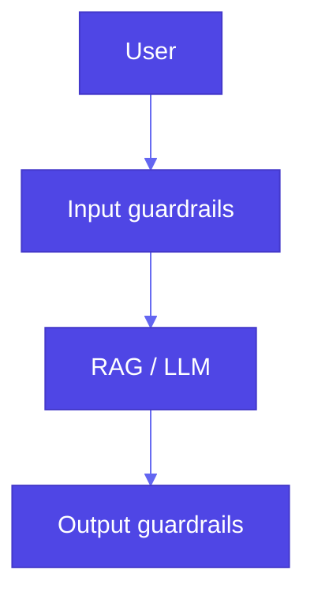

# Pattern 32: Guardrails

## Overview

**Guardrails** are **policy layers** around LLM **inputs** and **outputs**—and sometimes **retrieval**—to address **security**, **data privacy**, **content moderation**, **hallucination risk**, and **alignment** with brand or regulatory rules. They combine **prebuilt** controls from **model vendors** (safety filters, moderation endpoints) with **custom** scanners (PII redaction, banned topics, allowlists, **LLM-as-Judge**).

## Problem Statement

- **Prompt injection**, **data exfiltration**, and **toxic** or **off-policy** content can reach users or logs.
- **RAG** can surface **wrong** or **sensitive** chunks without an **enforcement** layer at the **boundary**.

## Solution Overview

### Layers

| Layer | Examples |
|--------|----------|
| **Prebuilt / vendor** | **Google Gemini** safety settings and blocked categories; **OpenAI** Moderation API; provider **content filters** on hosted endpoints |
| **Custom input** | Block or rewrite **PII** in prompts; **topic** allow/deny lists; **regex** / classifiers for injection patterns |
| **Custom output** | Same on **answers**; **brand** voice checks (e.g. **Acrolinx**-style); **citation** requirements (Pattern 11) |
| **Orchestration** | Run **input** guardrails **before** retrieval/generation; **output** guardrails **before** display or **tool** side effects |

### Book reference

`32_guardrails/1_with_guardrails.ipynb`: **RAG** + **custom** guardrails—`guardrail_replace_names`, `guardrail_banned_topics`, `apply_guardrails`, and a **GuardedQueryEngine** that wraps the **query engine** and scans **input** and **output**. `0_no_guardrails.ipynb` contrasts behavior. `basic_rag.py` builds a **LlamaIndex** BM25 query engine over **Gutenberg** texts.

### Prebuilt vs custom

- **Prebuilt** reduces time-to-value and tracks **vendor** policy updates; you still need **custom** rules for **domain** policies (e.g. “no legal advice,” internal **data classes**).
- **Custom** guardrails are **explicit contracts**: easy to **unit test**; can **compose** in a pipeline like the book’s `apply_guardrails(to_scan, scanners)`.

### High-level flow

## Use Cases

- **Enterprise** search and **support** bots; **regulated** industries; **customer-facing** chat with **PII** boundaries

## Implementation Details

- **Order matters**: cheap checks first; **avoid** logging **raw** PII when redacting.
- **Fail closed** for **high-risk** actions (payments, deletes); **fail open** only with explicit product risk acceptance.
- Combine with **Pattern 31** (self-check) and **Pattern 11** (trustworthy generation).

## Constraints & Tradeoffs

**Tradeoffs:** ✅ Defense in depth. ⚠️ **False positives** frustrate users; **latency** stacks with many scanners; **vendor** lock-in on prebuilt filters.

## References

- Book: `generative-ai-design-patterns/examples/32_guardrails/` (`0_no_guardrails.ipynb`, `1_with_guardrails.ipynb`, `basic_rag.py`, `USAGE.md`).
- [QED42: prompt-based guardrails](https://www.qed42.com/insights/building-simple-effective-prompt-based-guardrails) (USAGES).
- [Acrolinx: brand voice / LLM-as-Judge](https://www.acrolinx.com/blog/does-your-ai-speak-your-brand-voice/) (USAGES).
- [Google AI: Gemini safety settings](https://ai.google.dev/docs/safety_setting_gemini) (prebuilt thresholds).
- **Pattern 17 (LLM-as-Judge)**: can implement a **custom** **output** guardrail.

## Related Patterns

- **Self-check (31)**: **statistical** confidence; guardrails **enforce** **policy**
- **Trustworthy generation (11)**: citations and warnings; overlaps **output** safety
- **Human-in-the-loop (38)**: **Automated** guardrails first; **humans** for **gray** zones and **appeals**
- **Safety guardian (49)**: *Gulli* **layered** **safety** **architecture** **and** **emergency** **response** **(extends** **this** **pattern)**
