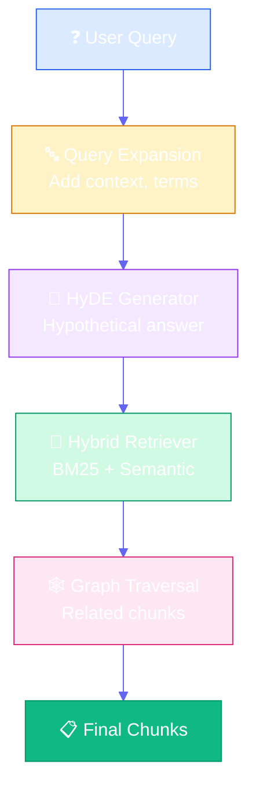
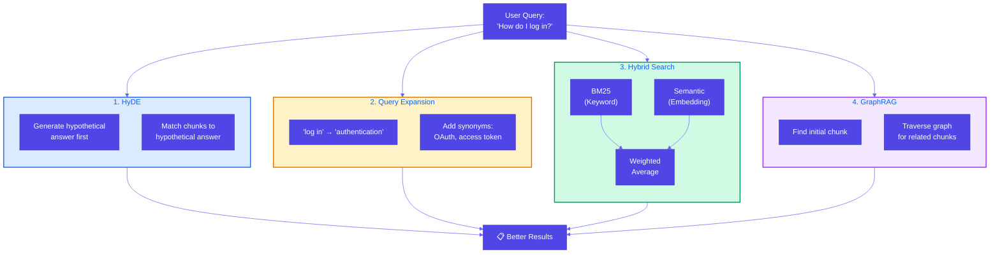
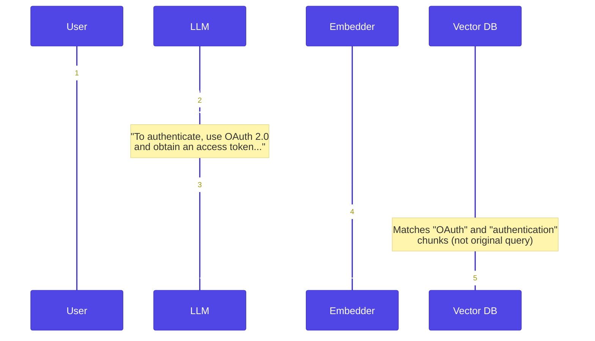

# Index-Aware Retrieval

**Source Books**: Generative AI Design Patterns

## Problem Statement

Basic RAG assumes you can search the knowledge base for chunks similar to questions, but this isn't always the case:

- **Question Not in Knowledge Base**: User asks "How do I log in?" but chunks say "authentication" or "OAuth 2.0"
- **Technical Knowledge Mismatch**: User uses natural language, docs use technical terminology
- **Fine Detail Hidden**: Answer is a small detail buried in a large chunk
- **Holistic Interpretation**: Answer requires connecting multiple concepts across chunks

For example:
- User asks: "How do I log in?"
- Knowledge base has: "Authentication via OAuth 2.0 requires obtaining an access token..."
- Basic RAG fails because "log in" ≠ "authentication" ≠ "OAuth 2.0"

## Solution Overview

**Index-Aware Retrieval** uses advanced retrieval techniques to bridge the gap between user queries and knowledge base content:

1. **Hypothetical Document Embedding (HyDE)**: Generate hypothetical answer first, then match chunks to that answer
2. **Query Expansion**: Add context and translate user terms to technical terms used in chunks
3. **Hybrid Search**: Combine keyword (BM25) and semantic (embedding) search with weighted average
4. **GraphRAG**: Store documents in graph database, retrieve related chunks after finding initial match

### Key Concepts

#### Hypothetical Document Embedding (HyDE)

**HyDE** generates a hypothetical answer to the query first, then uses that answer to find relevant chunks:

1. **Generate Hypothetical Answer**: LLM generates what a good answer would look like
2. **Embed Hypothetical Answer**: Convert to embedding vector
3. **Match Chunks**: Find chunks similar to hypothetical answer (not original query)

**Why it works**: The hypothetical answer uses terminology that matches the knowledge base, bridging the vocabulary gap.

#### Query Expansion

**Query Expansion** enriches the query with context and translates terms:

1. **Add Context**: Expand query with related terms and concepts
2. **Term Translation**: Map user terms to technical terms in knowledge base
3. **Synonym Expansion**: Include synonyms and related concepts
4. **Multi-Query Generation**: Generate multiple query variations

**Why it works**: Expands query to match the vocabulary and concepts used in the knowledge base.

#### Hybrid Search

**Hybrid Search** combines multiple retrieval methods:

1. **Keyword Search (BM25)**: Traditional keyword-based search
2. **Semantic Search (Embeddings)**: Meaning-based search using embeddings
3. **Weighted Combination**: Combine scores: `final_score = α × BM25_score + (1-α) × semantic_score`

**Why it works**: Keyword search finds exact matches, semantic search finds conceptual matches. Together they're more effective.

#### GraphRAG

**GraphRAG** uses graph structure to find related chunks:

1. **Graph Storage**: Store chunks as nodes in a graph database
2. **Relationships**: Create edges between related chunks (same topic, references, etc.)
3. **Initial Retrieval**: Find initial relevant chunk
4. **Graph Traversal**: Retrieve related chunks by following graph edges

**Why it works**: Answers often require connecting multiple related concepts, which graph structure captures.

## Implementation Details

### Components

1. **HyDE Generator**: Generates hypothetical answers from queries
2. **Query Expander**: Expands queries with context and term translation
3. **Hybrid Retriever**: Combines BM25 and semantic search
4. **Graph Builder**: Creates graph structure from documents
5. **Graph Retriever**: Traverses graph to find related chunks

### Architecture



### Four Retrieval Techniques



### HyDE Process Detail



### How It Works

1. **Query Expansion**: Expand user query with context and term translation
2. **HyDE**: Generate hypothetical answer, embed it, find similar chunks
3. **Hybrid Search**: Combine keyword and semantic search scores
4. **Graph Traversal**: Find related chunks from initial matches
5. **Ranking**: Combine all retrieval methods for final ranking

## Use Cases

- **Technical Documentation**: Users ask in natural language, docs use technical terms
- **Research Papers**: Answers require connecting multiple concepts
- **API Documentation**: Fine details hidden in large chunks
- **Product Documentation**: Holistic answers need multiple related sections
- **Knowledge Bases**: Complex questions requiring multi-hop reasoning

## Code Example

This example demonstrates index-aware retrieval for technical API documentation:

- **HyDE**: Generate hypothetical answers to bridge vocabulary gap
- **Query Expansion**: Translate user terms to technical terms
- **Hybrid Search**: Combine BM25 and semantic search
- **GraphRAG**: Retrieve related chunks via graph structure

### Running the Example

```bash
python example.py
```

## Best Practices

- **HyDE**: Use when vocabulary mismatch is common
- **Query Expansion**: Maintain term translation dictionary
- **Hybrid Search**: Tune weight (α) based on your data (typically 0.3-0.7)
- **GraphRAG**: Build meaningful relationships (topics, references, dependencies)
- **Combination**: Use multiple techniques together for best results
- **Performance**: Cache embeddings and graph structure for efficiency
- **Evaluation**: Measure retrieval quality with metrics (recall@k, precision@k)

## Constraints & Tradeoffs

**Constraints:**
- HyDE requires LLM call (latency and cost)
- Query expansion needs domain knowledge
- Hybrid search requires both keyword and semantic indexes
- GraphRAG needs graph database infrastructure

**Tradeoffs:**
- ✅ Handles vocabulary mismatches
- ✅ Finds fine details in chunks
- ✅ Connects related concepts
- ✅ More accurate retrieval
- ⚠️ More complex than basic RAG
- ⚠️ Higher computational cost
- ⚠️ Requires more infrastructure

## References

- [HyDE: Hypothetical Document Embeddings](https://arxiv.org/abs/2212.10496)
- [BM25 Algorithm](https://en.wikipedia.org/wiki/Okapi_BM25)
- [GraphRAG](https://www.microsoft.com/en-us/research/blog/introducing-graphrag-indexing-knowledge-graphs-for-llm-augmented-generation/)
- [Hybrid Search Best Practices](https://www.pinecone.io/learn/hybrid-search/)

## Related Patterns

- **Basic RAG**: Foundation pattern that index-aware retrieval extends
- **Semantic Indexing**: Advanced indexing patterns
- **Indexing at Scale**: Patterns for large-scale knowledge bases

