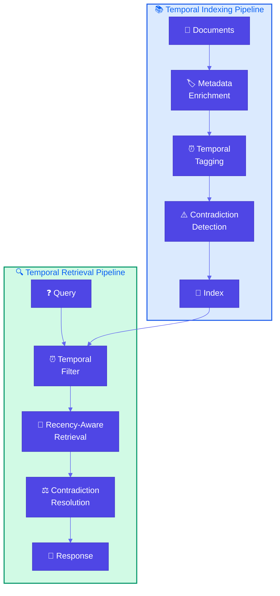
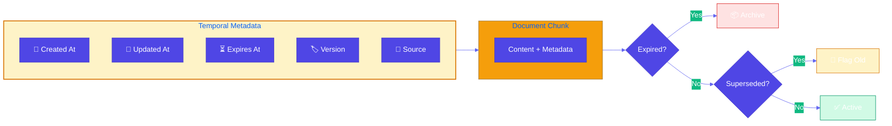
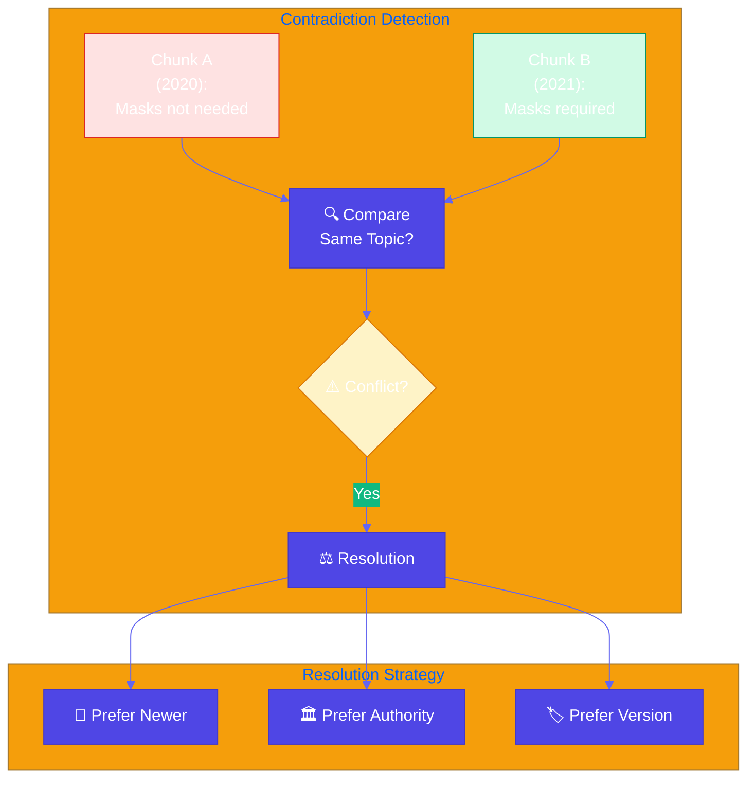

# Indexing at Scale

**Source Books**: Generative AI Design Patterns

## Problem Statement

RAG systems in production face critical challenges as knowledge bases grow:

- **Performance Degradation**: Search and retrieval slow down as index size increases
- **Data Freshness**: Recent findings obsolete old guidelines (e.g., CDC updates contradict previous recommendations)
- **Contradictory Content**: Multiple versions of information exist, causing confusion
- **Outdated Content**: Old information remains in index, leading to incorrect answers
- **Scale Issues**: Indexing millions of documents becomes computationally expensive

For example, a healthcare knowledge base might contain:
- CDC guidelines from 2020 saying "masks not needed"
- CDC guidelines from 2021 saying "masks required"
- CDC guidelines from 2023 saying "masks optional in certain settings"

Without proper indexing at scale, the system might return outdated or contradictory information.

## Solution Overview

**Indexing at Scale** uses metadata and temporal awareness to handle large, evolving knowledge bases:

1. **Document Metadata**: Use timestamps, version numbers, source information for context
2. **Temporal Tagging**: Tag chunks with creation/update dates, expiration dates
3. **Contradiction Detection**: Identify and prioritize newer information over older contradictory content
4. **Outdated Content Management**: Automatically deprecate or flag outdated information
5. **Efficient Indexing**: Use incremental updates, versioning, and metadata filtering
6. **Model Lifecycle Management**: Choose models/APIs with long support lifecycles

### Key Concepts

#### Temporal Metadata

**Temporal metadata** tracks when information was created, updated, or expires:
- **Creation Date**: When the document/chunk was first indexed
- **Update Date**: When the document/chunk was last modified
- **Expiration Date**: When the information becomes outdated
- **Version Number**: Track document versions for change management

#### Contradiction Detection

**Contradiction detection** identifies conflicting information:
- **Temporal Comparison**: Compare old vs new information on same topic
- **Semantic Similarity**: Find chunks that discuss same topic but contradict
- **Source Authority**: Prioritize authoritative sources (e.g., CDC over blog posts)
- **Version Tracking**: Track superseded versions

#### Outdated Content Management

**Outdated content management** handles stale information:
- **Expiration Policies**: Automatically deprecate content after expiration date
- **Version Supersession**: Mark old versions as superseded
- **Recency Filtering**: Filter results by recency in retrieval
- **Archive Strategy**: Move outdated content to archive index

## Implementation Details

### Components

1. **Metadata Enricher**: Adds temporal and source metadata to chunks
2. **Contradiction Detector**: Identifies conflicting information
3. **Temporal Retriever**: Retrieves with recency and freshness filters
4. **Version Manager**: Tracks document versions and supersessions
5. **Incremental Indexer**: Updates index efficiently without full rebuild

### Architecture



### Temporal Metadata Flow



### Contradiction Detection



### How It Works

1. **Indexing**: Add temporal metadata (dates, versions) to all chunks
2. **Contradiction Detection**: Identify conflicting information during indexing
3. **Retrieval**: Filter by recency, prioritize newer information
4. **Resolution**: Resolve contradictions by preferring newer, authoritative sources
5. **Maintenance**: Periodically clean outdated content, update metadata

## Use Cases

- **Healthcare Guidelines**: CDC, WHO guidelines that change over time
- **Technical Documentation**: API docs with versioning and deprecations
- **Policy Documents**: Company policies that get updated regularly
- **Research Knowledge Bases**: Scientific papers with publication dates
- **Regulatory Compliance**: Regulations that change with new laws
- **Product Documentation**: Features that get deprecated or updated

## Code Example

This example demonstrates indexing at scale for healthcare guidelines:

- **Temporal Metadata**: Track creation dates, update dates, expiration
- **Contradiction Detection**: Identify conflicting guidelines
- **Recency-Aware Retrieval**: Prioritize recent information
- **Version Management**: Track guideline versions

### Running the Example

```bash
python example.py
```

## Best Practices

- **Metadata Strategy**: Always include temporal metadata (created, updated, expires)
- **Version Control**: Track document versions explicitly
- **Expiration Policies**: Set expiration dates for time-sensitive content
- **Incremental Updates**: Update index incrementally, not full rebuilds
- **Contradiction Resolution**: Prefer newer, authoritative sources
- **Archive Strategy**: Archive outdated content, don't delete immediately
- **Model Lifecycle**: Choose models/APIs with long-term support
- **Performance Optimization**: Use metadata filtering to reduce search space
- **Monitoring**: Track index size, query performance, content freshness

## Constraints & Tradeoffs

**Constraints:**
- Requires metadata management infrastructure
- Contradiction detection can be computationally expensive
- Temporal tagging adds complexity to indexing
- Version management needs careful design

**Tradeoffs:**
- ✅ Handles large-scale knowledge bases efficiently
- ✅ Ensures data freshness and accuracy
- ✅ Prevents contradictory information
- ✅ Manages outdated content automatically
- ⚠️ More complex than basic RAG
- ⚠️ Requires metadata discipline
- ⚠️ Additional storage for metadata

## References

- [Temporal RAG Patterns](https://docs.llamaindex.ai/en/stable/module_guides/loading/node_parsers/modules/#temporal-parsing)
- [Version Control for Knowledge Bases](https://www.pinecone.io/learn/versioning-vector-databases/)
- [Incremental Indexing](https://docs.llamaindex.ai/en/stable/module_guides/indexing/incremental_indexing/)
- [Metadata Filtering](https://www.pinecone.io/learn/metadata-filtering/)

## Related Patterns

- **Basic RAG**: Foundation pattern that indexing at scale extends
- **Semantic Indexing**: Advanced retrieval patterns
- **Index-Aware Retrieval**: Patterns for improving retrieval quality

