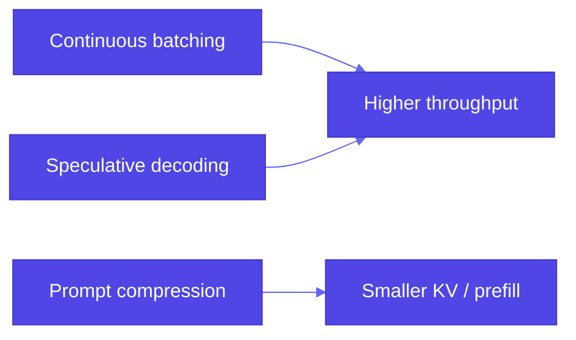

# Pattern 26: Inference Optimization

## Overview

**Inference optimization** matters most when you **self-host** LLMs—for **sensitive** or **regulated** data you often cannot rely on a shared API. Running models on your own GPUs or VMs shifts the bottleneck to **throughput**, **latency**, and **memory** (especially **KV cache**). Three practical levers are **continuous batching** (serving), **speculative decoding** (decode path), and **prompt compression** (context path).

## Problem Statement

- **Traditional ML batching** assumes **aligned** tensor shapes. **LLM serving** has **variable-length** prompts and generations; naive **padding** to the **max length** in a batch wastes **compute** and **memory**.
- **Long prompts** (RAG dumps, policies, chat history) inflate **KV cache** size and **prefill** cost.
- **Self-hosted** stacks must squeeze **tokens/sec** and **cost per query** without breaking **quality**.

## Solution Overview

### 1. Continuous batching (dynamic batching)

**Static batching** waits until *N* requests of similar shape arrive, or **pads** short sequences to the longest in the batch—both hurt utilization when lengths differ.

**Continuous batching** (often paired with **PagedAttention** in **vLLM**) schedules requests so sequences **join and leave** the batch at **iteration** (or token-step) **granularity**. The engine **allocates** KV blocks flexibly instead of one giant padded tensor per request. **Throughput** improves because the GPU stays busier as requests stream in and out.

**SGLang** and other runtimes also target **high-throughput** multi-request serving with efficient scheduling and memory management—compare benchmarks on your hardware and model family.

Reference book code: `vllm_batching_comparison.py` (individual vs batched `generate`).

### 2. Speculative decoding

A **small draft** model proposes **multiple** tokens; a **large target** model **verifies** them in parallel. Throughput rises when drafts are **accepted**; the **output distribution** remains aligned with the target when the algorithm is correct (see **Pattern 24: Small language model** and book `speculative_decoding.py`).

### 3. Prompt compression

**KV cache** scales with **sequence length** (and layers, heads, batch). **Redundant** instructions, duplicated **RAG** chunks, or verbose **system** prompts increase **memory** and **prefill** time.

**Compression** strategies include:

- **Deduplication** and **templating** (one copy of policy text, references by id).
- **Summarization** of retrieved documents before injection (tradeoff: information loss).
- **Learned** or **heuristic** compressors that produce shorter **surrogate** prompts with similar semantics.

Reference book code: `prompt_compression.py` (chunking large texts for analysis).

### Relationship diagram

## Use Cases

- **On-prem** or **VPC** deployments for regulated workloads
- **High QPS** APIs behind a gateway
- **Long-context** RAG where prompts must shrink to fit **VRAM**

## Implementation Details

- **Profiling**: measure **time-to-first-token**, **tokens/sec**, **GPU memory**—not only wall time on one request.
- **Batching**: prefer a **serving engine** (vLLM, TGI, TensorRT-LLM, etc.) tuned for your model.
- **Compression**: validate **task accuracy** after aggressive shortening.

## Constraints & Tradeoffs

**Tradeoffs:** ✅ Better utilization and speed. ⚠️ Serving stack complexity; speculative decoding **two models** in memory; compression can **drop** details.

## References

- Book examples: `generative-ai-design-patterns/examples/26_inference_optimization/` (`vllm_batching_comparison.py`, `speculative_decoding.py`, `prompt_compression.py`, `USAGE.md`).
- [vLLM](https://github.com/vllm-project/vllm) — PagedAttention, continuous batching
- [SGLang](https://github.com/sgl-project/sglang) — structured generation and serving
- [NVIDIA: LLM inference optimization](https://developer.nvidia.com/blog/mastering-llm-techniques-inference-optimization/)
- **Pattern 24 (Small language model)** — speculative decoding and quantization context
- **Pattern 25 (Prompt caching)** — orthogonal: reuse **outputs**; compression shortens **inputs**

## Related Patterns

- **Prompt caching (25)**: avoids recomputation; inference optimization still matters on **cache miss**
- **Small language model (24)**: quantization + speculative decoding **stack** with batching
- **Resource-aware optimization (40)**: *Gulli* **policy** **layer**—when to **apply** batching, **tier** **models**, **degrade**—on top of **infra** **patterns**
