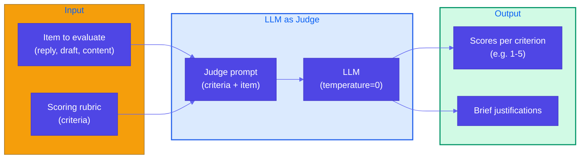
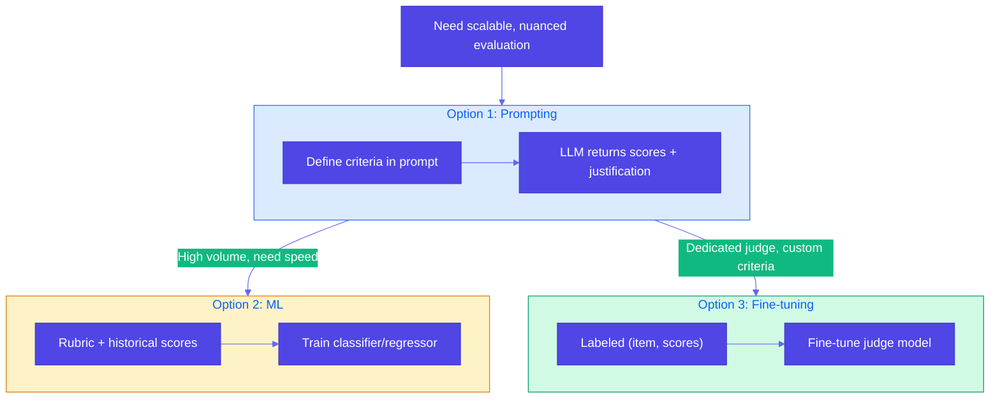

# Pattern 17: LLM as Judge

## Overview

**LLM as Judge** uses a language model to evaluate outputs (e.g., support replies, drafts, generated content) against explicit criteria, providing scores and brief justifications. It scales better than human-only evaluation and yields more nuanced assessments than simple automated metrics, forming a feedback loop that drives model and prompt improvements.

## Problem Statement

Effective evaluation is fundamental to improving generative systems: it provides the **feedback loop** that drives model refinements, prompt tuning, and quality assurance. Traditional approaches have limitations:

- **Outcome measurement**: Task-specific metrics (e.g., accuracy, BLEU) often miss nuance (tone, clarity, appropriateness) and do not explain *why* an output is good or bad.
- **Human evaluation**: High quality but does not scale; expensive and slow for large volumes or continuous evaluation.
- **Automated metrics**: Fast and scalable but shallow (e.g., length, keyword overlap); poor at judging coherence, tone, or adherence to brand/guidelines.

You need evaluation that is **scalable**, **nuanced**, and **interpretable** (scores + justification) so teams can iterate on prompts, fine-tune models, or filter low-quality outputs.

## Solution Overview

**LLM as Judge**: Use an LLM to score and justify outputs against a **scoring rubric**. The judge is given the item to evaluate (e.g., a support reply, a voter pamphlet argument, a draft email) and a set of **criteria**; it returns a score per criterion (e.g., 1–5) and a **brief justification**. This scales better than human evaluation and provides more interpretable feedback than single-number metrics.

### Three Implementation Options

1. **Prompting approach** — Define criteria and ask the judge LLM (via prompt) to score each criterion and provide a brief justification. Use **temperature=0** for consistency. No training; easy to iterate on rubric and criteria.
2. **ML approach** — Create a scoring rubric and collect **historical data** (items + human or LLM-judge scores). Train a **classification or regression model** (e.g., score 1–5 per criterion) to replicate the rubric at lower cost and latency. Good when you have large labeled sets and want a fast, cheap judge.
3. **Fine-tuning** — Fine-tune a model (or adapter) specifically as a judge on your rubric and labeled data. Produces a dedicated judge model that can be smaller/faster and highly aligned to your criteria; requires training pipeline and data.

For most teams, **Option 1 (prompting)** is the starting point: define criteria, prompt the judge, use the scores and justifications for feedback loops or filtering.

### High-Level Flow

### When to Use Which Option

## Use Cases

- **Support reply quality**: Score agent or human replies on helpfulness, tone, accuracy, clarity, completeness; drive training and routing (e.g., DoorDash Dasher support automation).
- **Voter pamphlet / editorial content**: Rate arguments or articles on clarity, fairness, accessibility (e.g., WA voter pamphlet example in reference).
- **Brand voice and guardrails**: Evaluate content for brand consistency, tone, and safety (e.g., Acrolinx brand voice).
- **Model and prompt evaluation**: Compare model outputs or prompt variants on custom criteria (e.g., AWS Bedrock LLM-as-Judge for model evaluation).
- **Draft and copy review**: Score marketing copy, emails, or docs on clarity, persuasiveness, and audience fit.
- **Content moderation**: Judge user-generated or model-generated content against policy (with human-in-the-loop where needed).

## Implementation Details

### Prompting Approach (Option 1)

1. **Define criteria**: Write a short rubric (e.g., 4–6 criteria). Examples: "Centers the voter," "Uses plain language," "Clear call to action," "Helpful and accurate," "Appropriate tone."
2. **Build judge prompt**: Include (a) the rubric, (b) the item to evaluate, (c) instructions to output a score (e.g., 1–5) per criterion and a brief justification.
3. **Invoke judge**: Call the LLM with **temperature=0** (or low) for stable, reproducible scores. Prefer a capable model (e.g., GPT-4, Claude, or a strong open-weight model) for nuanced judgment.
4. **Parse and use**: Parse scores and justifications from the response; use for logging, filtering, A/B tests, or feedback into training.

### Best Practices

- **Explicit rubric**: Criteria should be clear and, where possible, operational (e.g., "Uses plain language" vs "Good").
- **Temperature=0**: Reduces variance so the same item gets similar scores across calls; important for comparability and pipelines.
- **Calibrate with humans**: Periodically compare LLM-judge scores to human ratings on a sample to detect drift or bias.
- **Single dimension per criterion**: One score per criterion (e.g., 1–5) plus one short justification keeps output parseable and actionable.
- **Guardrails**: For high-stakes or sensitive content, use LLM-as-Judge as a signal alongside human review or policy checks.

## Constraints & Tradeoffs

**Constraints:**
- Judge quality depends on model capability and rubric clarity.
- Cost and latency scale with volume (mitigated by Option 2/3 or batching).
- Parsing free-form justifications may require light post-processing or structured-output prompts.

**Tradeoffs:**
- ✅ Scales better than human-only evaluation
- ✅ More nuanced than simple automated metrics; provides justification
- ✅ Easy to iterate on criteria (prompting approach)
- ⚠️ Judge can be biased or inconsistent; calibrate with humans
- ⚠️ Not a replacement for human judgment in high-stakes decisions without oversight

## References

- [DoorDash – LLM-based Dasher support automation](https://careersatdoordash.com/blog/large-language-modules-based-dasher-support-automation/) (LLM as Judge)
- [AWS Bedrock – LLM as a Judge for model evaluation](https://aws.amazon.com/blogs/machine-learning/llm-as-a-judge-on-amazon-bedrock-model-evaluation/)
- [Acrolinx – Brand voice with AI guardrails](https://www.acrolinx.com/blog/does-your-ai-speak-your-brand-voice/)
- Reference example: `generative-ai-design-patterns/examples/17_llm_as_judge` (voter pamphlet argument scoring with rubric + justification)

## Related Patterns

- **Evol-Instruct (Pattern 16)**: Evol-Instruct uses scoring (e.g., 1–5) to filter (instruction, answer) pairs; that scorer can be implemented as an LLM-as-Judge.
- **Content Optimization (Pattern 5)**: Preference-based tuning (DPO) uses comparisons; LLM-as-Judge can provide scalar scores or pairwise preferences for such data.
- **Trustworthy Generation (Pattern 11)**: Citations and guardrails; LLM-as-Judge can evaluate whether outputs are grounded and appropriate.
- **Human-in-the-loop (Pattern 38)**: Judge scores can **drive** **escalation** to **human** review (confidence + stakes).
- **Evaluation and monitoring (Pattern 42)**: **Export** **judge** **scores** **as** **time** **series** **with** **traces**, **SLOs**, **and** **A/B** **gates**
