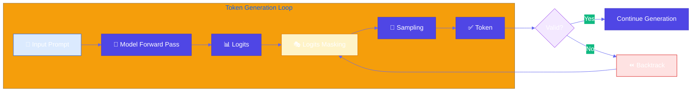
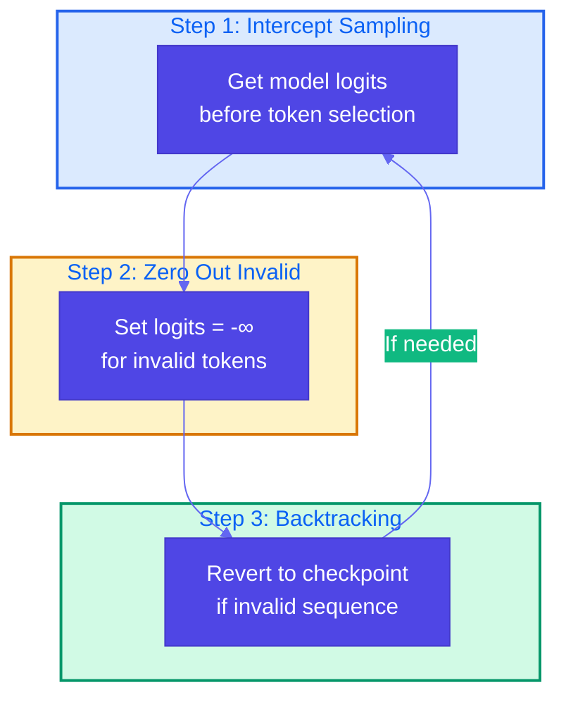

# Logits Masking

**Source Books**: Generative AI Design Patterns

## Problem Statement

When generating structured outputs (like JSON, code, or formatted text), language models can produce invalid sequences that don't conform to required style rules, schemas, or constraints. For example:
- Generating invalid JSON syntax
- Using banned words or phrases in content
- Violating coding style guidelines
- Producing outputs that don't match required formats

Traditional approaches like post-processing or retry loops are inefficient and don't prevent invalid generation at the source.

## Solution Overview

**Logits Masking** intercepts the model's token generation process to enforce constraints during sampling. The pattern involves three key steps:

1. **Intercept Sampling**: Modify logits (token probabilities) before the model samples the next token
2. **Zero Out Invalid Sequences**: Set logits to negative infinity for tokens that would lead to invalid sequences
3. **Backtracking and Regenerating**: If an invalid sequence is detected, backtrack to a valid state and regenerate

This ensures the model can only generate tokens that maintain valid sequences according to the specified rules.

## Use Cases

- **API Response Generation**: Ensure JSON responses conform to a specific schema
- **Code Generation**: Enforce coding standards and style guidelines
- **Content Moderation**: Prevent generation of banned words or phrases
- **Structured Data Extraction**: Generate outputs that match specific formats (CSV, XML, etc.)
- **Brand Compliance**: Ensure generated content uses preferred terminology and avoids restricted phrases

## Implementation Details

### Key Components

1. **Logits Processor**: Intercepts model logits before sampling
2. **Constraint Validator**: Checks if a token sequence would be valid
3. **State Manager**: Tracks generation state for backtracking
4. **Token Masker**: Applies masks to logits based on constraints

### Architecture



### Three-Step Process



### How It Works

1. **Intercept Sampling**: Before sampling, we modify the logits tensor to mask invalid tokens
2. **Zero Out Invalid Sequences**: Tokens that would create invalid sequences get their logits set to a very negative value (effectively zero probability)
3. **Backtracking**: If we detect an invalid sequence, we revert to the last valid state and regenerate from there

## Code Example

This example demonstrates generating API responses in JSON format with schema validation. The logits masking ensures:
- Valid JSON syntax is maintained
- Required fields are present
- Field types match the schema

### Running the Example

```bash
# Ensure you have a model available via HuggingFace
# For local models, you can use Ollama with transformers integration
# Or use a model from HuggingFace (requires HF_TOKEN)

# Set your HuggingFace token (optional, for private models)
export HF_TOKEN=your_token_here

# Run the example
python example.py
```

## Best Practices

- **Pre-compute Valid Tokens**: Build a lookup table of valid next tokens for common states
- **Efficient Validation**: Use finite state machines or regex for fast constraint checking
- **Graceful Degradation**: If backtracking fails, provide a fallback mechanism
- **Performance**: Cache constraint checks to avoid redundant computations
- **Logging**: Track masked tokens and backtrack events for debugging
- **Schema Validation**: Use JSON Schema or similar for complex structure validation

## References

- [HuggingFace Transformers Documentation](https://huggingface.co/docs/transformers/)
- [Structured Generation with Transformers](https://huggingface.co/docs/transformers/main/en/llm_tutorial#controlling-generation)
- [Finite State Machines for Text Generation](https://v4nn4.github.io/posts/ner-using-structured-generation/)
- [Logits Processors in Transformers](https://huggingface.co/docs/transformers/main/en/internal/generation_utils#transformers.LogitsProcessor)

## Related Patterns

- **Grammar Constrained Generation**: Similar pattern for enforcing grammar rules
- **Structured Output Generation**: Patterns for generating specific data formats
- **Content Filtering**: Patterns for content moderation and safety

