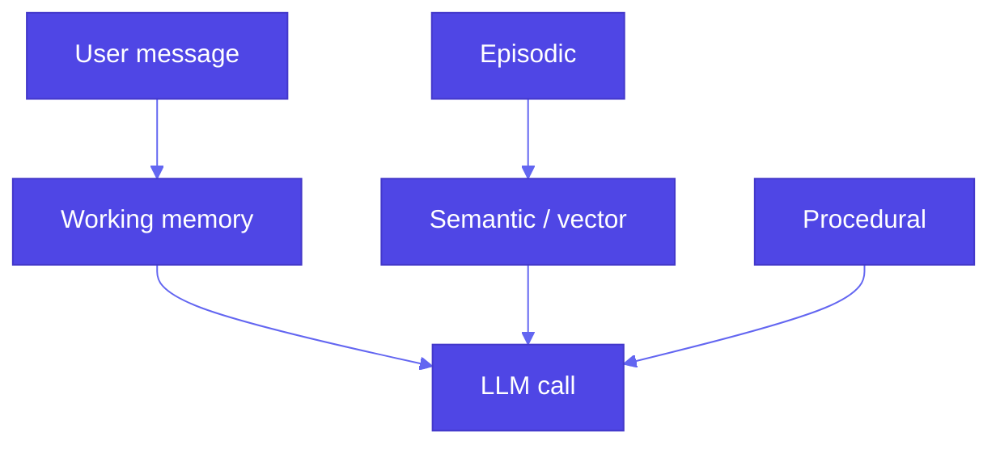

# Pattern 28: Long-Term Memory

**Agentic catalog**: **Pattern 44 (Memory management)** (*Gulli*, `memory-manager.md`) **summarizes** the same **theme** **with** **LangGraph** **checkpoint** **notes**—**Pattern** **28** **remains** the **detailed** **four**-**type** **+** **Mem0** **material** **here**.

## Overview

**Long-term memory** solves a core limitation of **stateless** LLM APIs: each call has **no built-in recall** of prior turns unless you **inject** context. Chat UIs **simulate** memory by **prepending** history; **workflow agents** pass **explicit state**. **Durable** assistants need **structured** memory beyond a growing transcript: **working**, **episodic**, **procedural**, and **semantic** layers—often backed by **vector stores** and **extractors** (e.g. **Mem0**).

## Problem Statement

- **Statelessness**: The model does not “remember” yesterday unless you **send** that information again.
- **Raw history** does not scale: **context windows** are finite; **noise** drowns facts.
- **Regulated** or **personalized** products need **durable**, **queryable** memory with **privacy** controls.

## Solution Overview

### Four complementary types

| Type | Role | Typical implementation |
|------|------|-------------------------|
| **Working memory** | **Current** task focus: recent turns, scratch facts for *this* session | Sliding window of messages; small token budget |
| **Episodic memory** | **What happened**: dated interactions, user events, “last time we…” | Append-only log, session ids, timestamps |
| **Procedural memory** | **How to do things**: playbooks, tool recipes, approved workflows | Versioned docs, structured steps, few-shot slots |
| **Semantic memory** | **Stable facts** about the user/world: preferences, entities, policies | Key-value + **vector** search over **extracted** statements |

Production systems often **extract** salient facts from dialogue into **semantic** storage (Mem0, custom pipelines) while keeping **episodic** traces for audit.

### Mem0 (reference book stack)

**[Mem0](https://github.com/mem0ai/mem0)** (`mem0ai`) combines **LLM**-assisted extraction, **embeddings**, and a **vector store** (e.g. Chroma) so `memory.add(messages, user_id=…)` and `memory.search(query, user_id=…)` replace hand-rolled RAG over raw chat logs. See book `examples/28_long_term_memory/basic_memory.py` (OpenAI + Chroma, conversational add/search).

### High-level flow

## Use Cases

- **Personalized** tutors, **support** bots with account history
- **Agents** that **reuse** playbooks and **learn** stable user preferences

## Implementation Details

- **Scope memory** per **tenant** / **user** id; enforce **retention** and **deletion** (GDPR).
- **Refresh** working memory from **semantic** hits on each turn; cap **injected** tokens.
- **Evaluate** retrieval: bad memory **hurts** more than no memory.

## Constraints & Tradeoffs

**Tradeoffs:** ✅ Continuity and personalization. ⚠️ **Stale** facts, **PII** in stores, **extra** latency on `search`.

## References

- Book: `generative-ai-design-patterns/examples/28_long_term_memory/` (`basic_memory.py`, `USAGE.md` — e.g. RevisionDojo + Mem0).
- [Mem0](https://github.com/mem0ai/mem0)
- **Pattern 6 (Basic RAG)**: document retrieval; long-term memory often **RAG-over-memories**
- **Pattern 28 (Long-term memory)** — **Pattern 25** caches **exact** completions; memory stores **facts** for **new** queries

## Related Patterns

- **Prompt caching (25)**: reuse **identical** requests; memory supplies **variable** context.
- **Semantic indexing (7)**: similar embedding machinery; **memory** emphasizes **user-centric** facts over static corpora.
- **Learning and adaptation (36)**: **Memory-based** learning and **online** updates complement **retrieval**-first memory (Pattern 28).
