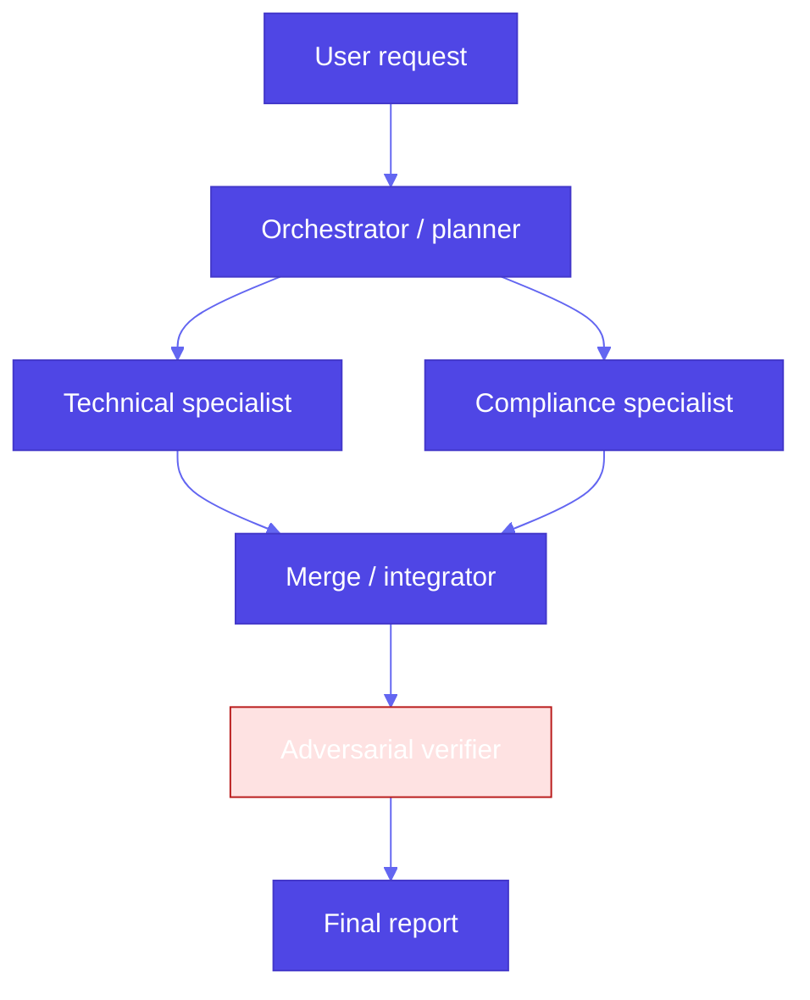

# Pattern 23: Multi-Agent Collaboration

## Overview

**Multi-agent collaboration** is the pattern where **several specialized agents** (each with its own role, tools, and prompts) work together on **multistep tasks** that exceed what a single model call or single ReAct loop should own. Real applications do not only **call APIs**; they **decompose work**, **run breadth-first or parallel branches**, **maintain state across extended interactions**, and sometimes **challenge** intermediate outputs—often **without constant human intervention**, with optional **human-in-the-loop** at checkpoints.

## Problem Statement

- **Single-agent limits**: One long context and one system prompt create **cognitive bottlenecks**—everything competes for attention. **Parameter efficiency** suffers when one model must be expert in every subdomain. **Reasoning** and **domain adaptation** are harder to tune in one monolithic agent.
- **Complex apps** need **different tools** (research, policy, execution, verification) and **stable handoffs** between steps.
- **Long-running workflows** must preserve **intent and artifacts** across turns, not collapse into a single blob.

You need **explicit roles**, **decomposition**, and **integration**—not one generic assistant doing everything.

## Solution Overview

### Specialized agents

Assign **narrow mandates**: e.g. researcher, drafter, compliance checker, executor, critic. Each agent can use a **different model size**, **temperature**, or **tool set** (Patterns 21–22).

### Architectures (common)

| Style | Idea | When it fits |
|--------|------|----------------|
| **Hierarchical** | Orchestrator / planner **decomposes** work, **delegates** to specialists, **integrates** results | Clear phases; enterprise workflows |
| **Prompt chaining (sequential)** | Agent A’s output is **input** to agent B | Linear pipelines; drafts → review — see dedicated **Pattern 33: Prompt chaining** (*Gulli*) for single-pipeline orchestration |
| **Peer-to-peer** | Agents negotiate or share a **blackboard** / message bus; authority spread more evenly | Exploration, debate, weak hierarchy |
| **Parallel / breadth-first** | Independent subtasks run **concurrently** (e.g. LangGraph `Send`), then merge | Independent facts or domains |

### Frameworks and coordination ideas

- **CrewAI**, **LangGraph**, **AutoGen / AG2**, and similar libraries implement **crews**, **graphs**, or **group chat**—same ideas: roles, edges, and optional human gates.
- **Market-based coordination** (speculative / research-heavy): treat tasks as goods; agents **bid** or maximize a **utility** function under budgets—useful when you must **allocate limited API spend** or **pick among competing sub-plans** (production systems often simplify to **priority queues** and **cost caps**).
- **Human-in-the-loop**: pause before irreversible actions (payout, deploy, external email); **approve**, **edit**, or **reject** specialist output.

### Interoperability: Agent2Agent (A2A)

The **[Agent2Agent (A2A) protocol](https://google.github.io/A2A/)** is an open approach to **agent-to-agent** collaboration across frameworks and vendors: **agent cards** (capabilities), **tasks** with lifecycle, **messages** with typed parts, often over **JSON-RPC** and **HTTP(S)**—complementary to **MCP** (Pattern 21: tools and resources), which focuses on **model-to-tool** more than **agent-to-agent** workflows. Use A2A when multiple **autonomous services** must discover and delegate work to each other in a standardized way.

### High-level flow (hierarchical + critic)

*Example uses sequential specialists then merge; parallelizing `T` and `C` is a common optimization when subtasks are independent.*

## Use Cases

- **Breadth-first / parallel**: Gather independent research branches, then synthesize.
- **Complex reasoning**: Planner assigns math vs. policy vs. narrative subtasks (see book reference: AutoGen-style **writers** + **task assigner**).
- **Multistep problem solving**: Incident response, vendor onboarding, contract review.
- **Adversarial verification**: Dedicated **critic** or **red-team** agent challenges the draft before release (pairs well with **LLM-as-Judge**, Pattern 17).

## Implementation Details

- **Boundaries**: Clear inputs/outputs per agent; avoid unbounded “reply to all” unless you need debate.
- **State**: Shared store or message history with **schema** for handoffs (LangGraph `TypedDict` state, etc.).
- **Cost and latency**: Cap rounds; parallelize only when **independent**; cache specialist outputs.
- **Safety**: Same as multi-tool systems—**least privilege** per agent, audit trails, HITL on sensitive actions.

## Constraints & Tradeoffs

**Constraints:** Orchestration complexity; duplicated work; consensus can be slow.

**Tradeoffs:** ✅ Modularity, specialization, parallelization. ⚠️ More moving parts, debugging, and coordination overhead than a single agent.

## References

- Book reference: `generative-ai-design-patterns/examples/23_multi_agent` (AutoGen **ConversableAgent** + task assigner + domain writers; USAGE cites e.g. Devin-style sub-agents).
- [Agent2Agent (A2A) specification](https://google.github.io/A2A/specification/)
- [CrewAI](https://docs.crewai.com/) — role-based crews and processes
- **Pattern 17 (LLM-as-Judge)**, **Pattern 21 (Tool Calling)**, **Pattern 22 (Code Execution)**

## Related Patterns

- **Tool Calling (21)**: One agent with tools; multi-agent **composes** multiple tool-capable roles.
- **Code Execution (22)**: Specialists can emit DSL; sandbox remains centralized.
- **Reflection (18)**: Single-model retry; multi-agent **reflection** is often a **critic** pass or peer review.
- **Prompt chaining (33)**: A **linear** chain can be one **specialist** pipeline; multi-agent adds **roles**, **parallel** branches, and **peer** coordination.
- **Routing (34)**: Often **selects** which **agent** or **crew** handles the turn (rules, embeddings, LLM, or classifier).
- **Parallelization (35)**: **Workers** run **concurrently** when tasks are **independent**; **merge** or **supervisor** synthesizes (LCEL ``RunnableParallel``, pools, LangGraph).
- **Evaluation and monitoring (42)**: **Per-agent** **spans**, **handoff** **latency**, **end-to-end** **traces**
- **Inter-agent communication (48)**: *Gulli* **message** **fabric** **/** **A2A-style** **routing** **with** **this** **pattern**
