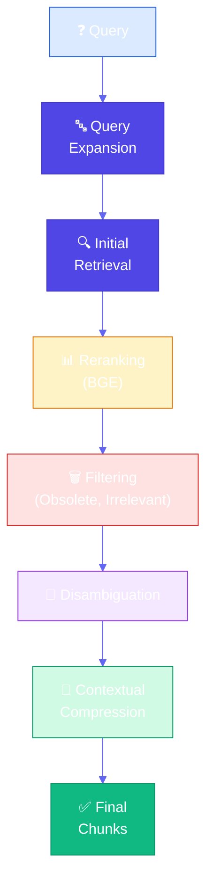
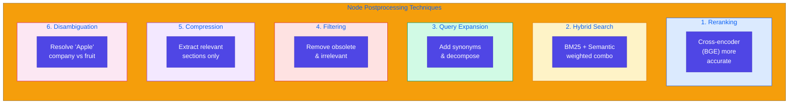
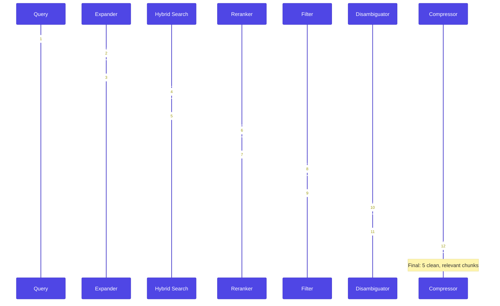

# Node Postprocessing

**Source Books**: Generative AI Design Patterns

## Problem Statement

RAG systems retrieve chunks similar to queries, but retrieved chunks may have issues:

- **Not Relevant**: Chunks match query keywords but aren't actually relevant
- **Ambiguous Entities**: Chunks mention entities that could refer to multiple things
- **Conflicting Content**: Different chunks provide contradictory information
- **Obsolete Information**: Chunks contain outdated information
- **Too Verbose**: Chunks contain too much irrelevant content
- **Low Quality**: Initial retrieval ranking isn't accurate enough

For example, a legal document system might retrieve:
- Chunks about "Apple" (company) when query is about "apple" (fruit)
- Outdated regulations that have been superseded
- Conflicting interpretations of the same law
- Verbose chunks with only a small relevant section

## Solution Overview

**Node Postprocessing** improves retrieved chunks through multiple techniques:

1. **Reranking**: Use more accurate models (like BGE) to rerank chunks
2. **Hybrid Search**: Combine BM25 (keyword) and semantic (embedding) retrieval
3. **Query Expansion and Decomposition**: Expand queries and break into sub-queries
4. **Filtering**: Remove obsolete, conflicting, or irrelevant chunks
5. **Contextual Compression**: Extract only relevant parts from verbose chunks
6. **Disambiguation**: Resolve ambiguous entities and clarify context

### Key Concepts

#### Reranking

**Reranking** uses cross-encoder models (like BGE) that are more accurate than embedding models:

- **Embedding Models**: Encode query and chunks separately, compare embeddings (fast but less accurate)
- **Reranking Models**: Encode query-chunk pairs together (slower but more accurate)
- **BGE Models**: State-of-the-art reranking models (BGE-reranker-base, BGE-reranker-large)

**Why it works**: Reranking models see query and chunk together, making more accurate relevance judgments.

#### Hybrid Search

**Hybrid Search** combines multiple retrieval methods:

- **BM25 (Keyword)**: Traditional keyword-based search
- **Semantic (Embedding)**: Meaning-based search using embeddings
- **Weighted Combination**: `final_score = α × BM25_score + (1-α) × semantic_score`

**Why it works**: Keyword search finds exact matches, semantic search finds conceptual matches. Together they're more effective.

#### Query Expansion and Decomposition

**Query Expansion and Decomposition** improves query understanding:

- **Query Expansion**: Add synonyms, related terms, context
- **Query Decomposition**: Break complex queries into simpler sub-queries
- **Multi-Query Retrieval**: Retrieve for each sub-query, combine results

**Why it works**: Expands query vocabulary and handles complex multi-part questions.

#### Filtering

**Filtering** removes problematic chunks:

- **Obsolete Information**: Filter chunks with outdated dates or superseded versions
- **Conflicting Content**: Detect and remove contradictory chunks
- **Relevance Threshold**: Filter chunks below relevance threshold
- **Entity Disambiguation**: Filter chunks with wrong entity meanings

**Why it works**: Removes noise and ensures only relevant, current information is used.

#### Contextual Compression

**Contextual Compression** extracts relevant parts from verbose chunks:

- **Extract Relevant Sections**: Identify and extract only query-relevant parts
- **Summarize**: Condense verbose chunks while preserving key information
- **Focus Extraction**: Use LLM to extract focused answers from long chunks

**Why it works**: Reduces noise in context, improves answer quality, saves tokens.

#### Disambiguation

**Disambiguation** resolves ambiguous entities and clarifies context:

- **Entity Resolution**: Determine which "Apple" (company vs fruit) is meant
- **Context Clarification**: Add context to resolve ambiguities
- **Multi-Entity Handling**: Handle queries about multiple entities

**Why it works**: Ensures correct interpretation of ambiguous terms.

## Implementation Details

### Components

1. **Reranker**: Uses BGE or similar models to rerank chunks
2. **Hybrid Retriever**: Combines BM25 and semantic search
3. **Query Processor**: Expands and decomposes queries
4. **Filter**: Removes obsolete, conflicting, or irrelevant chunks
5. **Compressor**: Extracts relevant parts from verbose chunks
6. **Disambiguator**: Resolves ambiguous entities

### Architecture



### Six Postprocessing Techniques



### Complete Postprocessing Pipeline



### How It Works

1. **Initial Retrieval**: Get candidate chunks using basic retrieval
2. **Reranking**: Rerank chunks using more accurate models
3. **Query Processing**: Expand/decompose query for better matching
4. **Hybrid Search**: Combine keyword and semantic search
5. **Filtering**: Remove obsolete, conflicting, or irrelevant chunks
6. **Disambiguation**: Resolve ambiguous entities
7. **Compression**: Extract relevant parts from verbose chunks
8. **Final Ranking**: Combine all signals for final ranking

## Use Cases

- **Legal Documents**: Handle ambiguous entities, conflicting interpretations, obsolete laws
- **Medical Records**: Filter outdated treatments, disambiguate medical terms
- **Technical Documentation**: Compress verbose chunks, filter deprecated APIs
- **Research Papers**: Handle conflicting findings, disambiguate technical terms
- **News Articles**: Filter outdated news, disambiguate entity names

## Code Example

This example demonstrates node postprocessing for legal document Q&A:

- **Reranking**: Use BGE-style reranking for accuracy
- **Hybrid Search**: Combine BM25 and semantic search
- **Query Expansion**: Expand queries with legal terminology
- **Filtering**: Remove obsolete regulations and conflicting interpretations
- **Contextual Compression**: Extract relevant sections from verbose legal text
- **Disambiguation**: Resolve ambiguous legal entities

### Running the Example

```bash
python example.py
```

## Best Practices

- **Reranking**: Use BGE-reranker models for best accuracy
- **Hybrid Search**: Tune weight (α) based on your data (typically 0.3-0.7)
- **Query Expansion**: Build domain-specific term dictionaries
- **Filtering**: Set appropriate thresholds for relevance and recency
- **Compression**: Balance compression ratio with information preservation
- **Disambiguation**: Use entity linking and context clues
- **Combination**: Use multiple techniques together for best results
- **Performance**: Cache reranking results for common queries

## Constraints & Tradeoffs

**Constraints:**
- Reranking requires additional model (latency and cost)
- Filtering needs domain knowledge and thresholds
- Compression may lose important context
- Disambiguation requires entity knowledge bases

**Tradeoffs:**
- ✅ More accurate retrieval
- ✅ Handles ambiguous entities
- ✅ Filters problematic content
- ✅ Compresses verbose chunks
- ⚠️ More complex than basic retrieval
- ⚠️ Higher computational cost
- ⚠️ Requires additional models/infrastructure

## References

- [BGE Reranker Models](https://huggingface.co/BAAI/bge-reranker-base)
- [Hybrid Search Best Practices](https://www.pinecone.io/learn/hybrid-search/)
- [Contextual Compression](https://docs.llamaindex.ai/en/stable/module_guides/deploying/node_postprocessors/modules/contextual-compression/)
- [Query Decomposition](https://docs.llamaindex.ai/en/stable/module_guides/querying/query_transformations/query_decomposition/)

## Related Patterns

- **Basic RAG**: Foundation pattern that node postprocessing extends
- **Index-Aware Retrieval**: Advanced retrieval patterns
- **Indexing at Scale**: Patterns for handling large-scale knowledge bases

