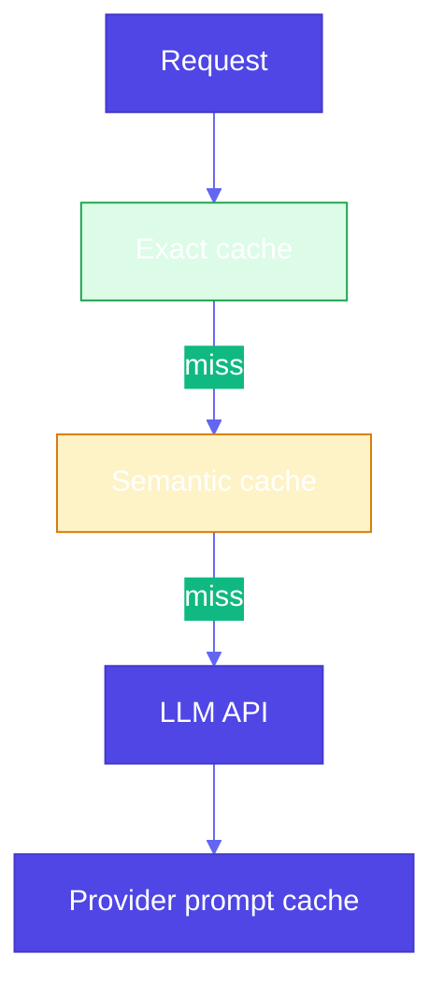

# Pattern 25: Prompt Caching

## Overview

**Prompt caching** avoids **recomputing** LLM outputs when **requests repeat** or **overlap** in meaning. Without caching, every identical or near-identical prompt pays full **latency** and **cost**. Caches exist at **several layers**: **client-side** memoization, **framework** caches (e.g. LangChain), **embedding-based semantic** lookup, and **provider server-side** prefix caching on large static prompts.

## Problem Statement

- **Repetitive traffic** (FAQ bots, codegen with stable system prompts, RAG with fixed context) triggers the **same** or **similar** model work many times.
- **Exact-match** hashing misses **paraphrases** (“What is RAG?” vs “Explain retrieval-augmented generation”).
- **Long prompts** dominate **prefill** time; **server-side** caching of stable prefixes reduces billed tokens and latency when the provider supports it.

## Solution Overview

### 1. Client-side exact caching (memoization)

Hash the **full prompt** (or serialized messages + model name + decoding params) and store the response in **memory**, **SQLite**, or **disk**. First call invokes the model; later calls return the **cached string**. Works with **any** backend (local Ollama, cloud APIs).

Tradeoffs: **stale** answers if the world changes; **no hit** on tiny prompt edits; **PII** in cache files—encrypt or TTL.

### 2. Framework-level caching (e.g. LangChain)

LangChain supports **LLM caches** such as **`InMemoryCache`** and **`SQLiteCache`** (`langchain_core.globals.set_llm_cache`). Behavior is **exact-key** unless you add a custom layer. Use for **dev** repeatability and **prod** when keys are stable.

### 3. Semantic caching

Index **prompt embeddings** (or a lighter proxy). On a new query, retrieve **nearest neighbors** above a **similarity threshold** and return the cached completion if acceptable—**no exact string match**. Tradeoffs: **embedding cost**, **false positives** (wrong answer for a similar question), **index maintenance**.

The book reference `semantic_cache.py` uses an LLM to generate **alternative phrasings**; production systems more often use **embedding models** + vector DB.

### 4. Server-side prompt caching (providers)

- **Anthropic**: **Prompt caching** for long, stable content—mark cached blocks with **`cache_control`**; repeated prefixes can be **cheaper** and **faster** (see provider docs).
- **OpenAI**: **Automatic** prompt caching for eligible prompts above a **minimum length** (policy changes over time—check current docs).

These apply **inside** the provider’s stack; you still benefit from **client** caches for **identical** full requests and **semantic** layers for **near-duplicates**.

### High-level placement

## Use Cases

- Stable **system prompts** + variable user utterances (cache the **prefix** server-side where supported).
- **Support** and **internal** bots with repeated questions (exact + semantic).
- **CI** and **eval** harnesses: deterministic repeats without burning quota (LangChain SQLite cache).

## Implementation Details

- **Cache key**: Include **model id**, **temperature**, **max_tokens**, and **full message list**—or you risk returning wrong outputs.
- **TTL** and **max entries**: avoid unbounded growth and stale answers.
- **Semantic**: tune **threshold**; log **similarity** on hits for debugging (not in tight loops in production hot paths).

## Constraints & Tradeoffs

**Tradeoffs:** ✅ Latency and cost. ⚠️ Staleness, privacy in stored text, semantic **false hits**.

## References

- Book examples: `generative-ai-design-patterns/examples/25_prompt_caching/` (`basic_cache.py`, `semantic_cache.py`, Anthropic/OpenAI samples, `USAGE.md`).
- [Anthropic: prompt caching](https://www.anthropic.com/news/prompt-caching)
- [Humanloop: OpenAI prompt caching](https://humanloop.com/blog/prompt-caching)
- [LangChain: LLM caching](https://python.langchain.com/docs/how_to/llm_caching/)
- **Pattern 20 (Prompt optimization)**: different goal—**choose** prompts; caching **reuses** outputs.

## Related Patterns

- **Small language model (24)**: cheaper **generation**; caching avoids **any** generation.
- **Semantic indexing (7)**: overlapping ideas for **embedding** retrieval; prompt cache retrieves **prior answers**, not documents.
- **Resource-aware optimization (40)**: **Cache** **hits** **reduce** **$**; **budget** **policies** **decide** **when** **to** **call** **vs** **reuse**
