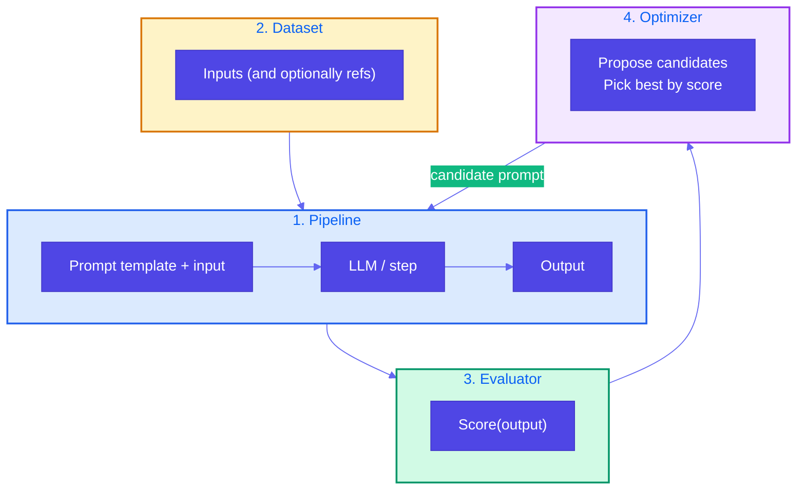

# Pattern 20: Prompt Optimization

## Overview

**Prompt optimization** is the systematic search for prompts that perform well on a given **model** and **evaluation metric**. Hand-tweaking prompts or adding examples can help, but when you change the foundational model, all that trial-and-error often has to be repeated. The solution is **indirection**: treat prompt optimization as a repeatable pipeline with four components — **pipeline**, **dataset**, **evaluator**, and **optimizer** — so you can re-run optimization for any model or metric without starting from scratch.

## Problem Statement

To get better results from an LLM, **prompt engineering** or **adding few-shot examples** often helps. But:

- **Model changes**: If you switch foundational models (or versions), prompts that worked well may degrade; all manual trials need to be repeated.
- **No single “best” prompt**: Different models and tasks need different phrasings and structures.
- **Cost of trial-and-error**: Manually testing many variants is slow and not reproducible.

You need a **repeatable, model-agnostic** way to find good prompts: define what “good” means (evaluator), run candidates on a fixed dataset, and let an **optimizer** search for the best prompt (or few-shot set) for the current model and metric.

## Solution Overview

**All problems in computer science can be solved by another level of indirection.** Prompt optimization is no exception: introduce a small **optimization loop** that is driven by four components:

1. **Pipeline of steps** — The flow that uses the prompt: e.g. “given prompt template + input → call LLM → output.” The prompt (or few-shot examples) is a **parameter** of this pipeline, not hardcoded.
2. **Dataset** — A set of inputs (and optionally reference outputs or labels) on which you evaluate. Can be dozens to thousands of examples; quality and coverage matter.
3. **Evaluator** — A function that scores pipeline output (e.g. correctness, format, length, LLM-as-Judge score). The metric you optimize is defined here.
4. **Optimizer** — Searches for a prompt (or prompt + examples) that maximizes the evaluator’s score on the dataset. Options: grid/random search over template variants, LLM-generated prompt candidates, or libraries like DSPy that compile/optimize prompts (e.g. BootstrapFewShot).

Run: for each candidate prompt (from the optimizer), run the **pipeline** on the **dataset**, **evaluate** each output, aggregate score; the **optimizer** uses these scores to propose the next candidate or return the best so far. When you change the model, you keep the same pipeline, dataset, and evaluator and re-run the optimizer; the optimizer finds a prompt suited to the new model.

### Four Components

### Optimization Loop

## Use Cases

- **Support ticket summarization**: Optimize the instruction so one-line summaries are concise and informative across many tickets; evaluator = length + key-info check or LLM-as-Judge.
- **Marketing copy / blurb generation**: Pipeline = extract → improve → format; dataset = book descriptions; evaluator = appeal scores (e.g. topic, content, objectives); optimizer = BootstrapFewShot or search over instructions (reference example).
- **Classification or extraction**: Optimize the prompt so the model’s labels match gold labels on a dev set; evaluator = accuracy or F1.
- **Any task where prompt wording matters**: Re-run the same optimization when you change the model so the prompt stays tuned to the new model.

## Implementation Details

### Pipeline

- The pipeline takes **prompt** (or template + few-shot examples) and **input**; it returns **output**. The prompt is a **variable** the optimizer will change. Keep the pipeline deterministic in structure (same steps); only the prompt text varies.

### Dataset

- Curate a **dataset** of inputs (and optionally reference outputs). It should reflect the real distribution and be large enough that average score is stable. Splits: train (for optimizers that use demonstrations) and dev (for reporting and early stopping).

### Evaluator

- **Evaluator(output, input?, reference?)** returns a numeric score. Can be rule-based (length, format, keyword presence), LLM-as-Judge (Pattern 17), or task metric (exact match, F1). The optimizer maximizes this score (or its average over the dataset).

### Optimizer

- **Simple**: Enumerate a list of candidate prompts; run pipeline on dataset for each; average score; return the prompt with highest score.
- **Search**: Random search or grid search over template variables (e.g. “Summarize in one sentence” vs “Write a one-sentence summary”).
- **LLM-generated candidates**: Use an LLM to generate N prompt variants; score each; iterate or pick best.
- **Libraries**: e.g. DSPy’s `BootstrapFewShot`, `BootstrapFewShotWithRandomSearch`, which compile a program (pipeline) against a metric and trainset to produce optimized few-shot prompts.

### When You Change the Model

- Keep **pipeline**, **dataset**, and **evaluator** the same. Re-run the **optimizer** (with the new model inside the pipeline). The optimizer will find a prompt (or few-shot set) that works for the new model. No need to manually re-do all previous trials.

## Best Practices

- **Stable dataset**: Fix the dataset (and splits) so results are comparable across runs and model changes.
- **Clear metric**: The evaluator should reflect the real goal (user satisfaction, accuracy, format compliance); avoid optimizing a proxy that doesn’t align.
- **Budget**: Limit optimizer iterations or candidate count to control cost and time.
- **Versioning**: Store the best prompt and the model/dataset/evaluator version so you can reproduce and audit.

## Constraints & Tradeoffs

**Constraints:**
- Requires a dataset and an evaluator; optimizer runs can be expensive (many pipeline runs).
- Quality of the optimized prompt is bounded by the pipeline design, dataset coverage, and evaluator quality.

**Tradeoffs:**
- ✅ Repeatable, model-agnostic prompt selection; no manual re-trials when the model changes
- ⚠️ Setup cost (four components); optimization cost (compute and possibly API calls)

## References

- Reference example: `generative-ai-design-patterns/examples/20_prompt_optimization` (book blurb pipeline: extract → improve → evaluator scores topic/content/objectives; DSPy BootstrapFewShot to optimize prompts on a dataset of blurbs).
- [DSPy](https://github.com/stanfordnlp/dspy) — Declarative prompt optimization and compilation.

## Related Patterns

- **LLM as Judge (Pattern 17)**: The evaluator in prompt optimization is often implemented as an LLM-as-Judge (e.g. score output on criteria).
- **Dependency Injection (Pattern 19)**: The pipeline can inject the LLM call so optimization runs can use mocks in tests and real LLM in production.
- **Reflection (Pattern 18)**: Reflection improves a single response; prompt optimization improves the **prompt** so future responses are better on average.
