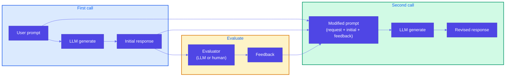

# Pattern 18: Reflection

## Overview

**Reflection** is a pattern for improving LLM outputs in **stateless** API settings: instead of a single call, you invoke the LLM **twice (or more)**. The first response is not returned directly to the client; it is sent to an **evaluator** (LLM or human). The evaluator's feedback is then used to build a **modified prompt** (e.g., original request + initial response + feedback). A second call produces a **revised** response. This gives the model a chance to "correct" its earlier answer even when the client cannot send a follow-up message.

**Agentic Design Patterns** (*Antonio Gulli*) frames the same loop as **execution → critical analysis / critique → refinement → iteration** until quality or a **round cap** is met; companion agent spec: `subagents-design-patterns/agents/reflector.md` ([upstream](https://github.com/anti-achismo-social-club/subagents-design-patterns/blob/main/agents/reflector.md)). **Lakshmanan** (*Generative AI Design Patterns*) documents the **two-call** API pattern (this repo’s Pattern **18** number); **Gulli** stresses **multi-dimensional** rubrics, **convergence** criteria, and **generator–critic** loops beyond a single revise.

## Problem Statement

When an LLM gives a suboptimal answer in a **conversational** UI, the user can ask a follow-up ("make it shorter," "add an order number," "tone it down"). When you invoke the LLM through an **API**, calls are typically **stateless**: each request is independent, and the model has no built-in memory of the previous turn. So how do you get the LLM to correct an earlier response without the user explicitly sending a second message?

- You cannot rely on the client to always send a critique or follow-up.
- You want higher-quality first responses for API consumers (drafts, product listings, support replies).
- Retrying the same prompt often yields similar suboptimal output; the model needs **feedback** on what to change.

## Solution Overview

**Reflection**: Do not return the first response to the client immediately. Instead:

1. **First call** — Send the user prompt to the LLM; get the **initial response** (draft, listing, reply, etc.).
2. **Evaluate** — Send the initial response to an **evaluator**. The evaluator can be:
   - An **LLM** (e.g., LLM-as-Judge with a rubric: tone, clarity, completeness, correctness).
   - A **human** (e.g., approval workflow or sampled review).
   - A **rule-based or model-based** checker (e.g., required fields, policy).
3. **Modified prompt** — Build a new prompt that includes:
   - The **original user request**,
   - The **initial response** (so the model "sees" what it produced),
   - The **evaluator's feedback** (what to improve).
4. **Second call** — Send the modified prompt to the LLM; get a **revised response**. Return this (or iterate again if needed).

Because the modified prompt explicitly includes the initial output and the feedback, the model can correct its earlier answer in a single, stateless second call.

### High-Level Flow

### Why This Works in a Stateless API

The **modified prompt** carries the "memory": it contains the original request, the model's own first attempt, and the critique. The second call is still stateless from the API's perspective, but the model receives enough context to revise. No session or multi-turn state is required on the server.

### Optional: Multiple Rounds

You can repeat the cycle: revised response → evaluator → feedback → modified prompt → next revision. Cap the number of rounds (e.g., 2–3) to control cost and latency.

**Gulli / reflector** phrasing: **output generation** → **evaluation** across accuracy, completeness, clarity, relevance → **improvement identification** → **iterative refinement** until thresholds or max iterations.

## Use Cases

- **Email or copy drafts**: First draft → evaluator checks tone, clarity, required elements (e.g., order ref, apology) → revised draft (e.g., apology email for delayed shipment).
- **Product listings**: Generate listing → validation LLM (or human) checks completeness, correctness, and features that hurt performance → revised listing (e.g., Amazon example).
- **Support replies**: First reply → judge scores helpfulness/tone/accuracy → revised reply before sending to customer.
- **API response text**: Generate explanation or error message → check for clarity and safety → revised text.
- **Structured output**: Generate JSON or config → validator/evaluator checks schema and business rules → second call with feedback to fix issues.
- **Writing & long-form**: Outline or draft → critic (style, structure, factual claims) → refine; repeat for **planning-heavy** documents.
- **Code generation**: Implement → static analysis / tests / LLM code review → patch or full rewrite pass with **diff-oriented** feedback in the modified prompt.
- **Complex problem solving**: Proposed solution → verify assumptions, edge cases, consistency → revised solution (pairs well with **CoT** inside each pass if needed).
- **Planning & strategy**: Plan v1 → evaluator checks feasibility, risks, dependencies → plan v2+ (distinct from **Tree of Thoughts**, which explores **multiple** branches; reflection **improves one** trajectory).

## Implementation Details

### Key Components

1. **Generator** — The LLM (or pipeline) that produces the initial and revised outputs. Same model and system prompt for both calls; only the user-facing prompt changes (first = user request, second = modified prompt).
2. **Evaluator** — Can be:
   - **LLM-as-Judge**: Prompt with rubric; returns scores and/or free-form feedback (see Pattern 17).
   - **Human**: Send initial response to a queue; human returns feedback; then build modified prompt.
   - **Rules**: Check for required fields, forbidden words, length; produce a short feedback string.
3. **Modified prompt builder** — Concatenate or template: original request + "Your previous response:" + initial response + "Feedback to apply:" + feedback + "Produce an improved version."
4. **Orchestration** — Call generator → call evaluator → build modified prompt → call generator again; return revised (or best of N rounds).

### Best Practices

- **Clear feedback format**: Have the evaluator output structured or plain feedback that is easy to inject into the modified prompt (e.g., bullet list of improvements).
- **Limit rounds**: Typically 1–2 revision rounds; more rounds increase cost and latency and may not improve quality much.
- **Fallback**: If the evaluator finds no issues (or score above threshold), you can skip the second call and return the initial response.
- **Logging**: Log initial response, feedback, and revised response for debugging and quality monitoring.

### LangChain (LCEL)

Compose reflection as a **linear** runnable pipeline so each step stays **swappable** (mocks vs real LLMs):

- **`RunnableLambda`** per phase: generate initial → evaluate → build modified prompt → generate revised.
- Chain with **`|`** (sequence). Pass a **dict** state through steps (`user_prompt`, `current`, `feedback`, `modified`, `revised`) so the same shape works in **LangSmith** traces.
- **LangGraph**: use a **loop** with a **conditional** edge: if evaluator score ≥ threshold → **END**, else → **revise** node (clearer for **max rounds** and human-in-the-loop).
- Keep the **evaluator** as **Pattern 17** (LLM-as-Judge) or **rules**; the **generator** can be the same model with a **different** user message only.

See `example.py`: `build_reflection_lcel_chain()` (optional `langchain-core`).

## Constraints & Tradeoffs

**Constraints:**
- Two (or more) LLM calls per request → higher latency and cost.
- Evaluator quality (LLM or human) affects how much the revision improves.
- Modified prompt can become long; stay within context limits.

**Tradeoffs:**
- ✅ Enables "self-correction" in stateless APIs without user follow-up
- ✅ Better first-response quality for consumers
- ⚠️ Higher cost and latency than single call; use when quality matters more than speed

## References

- [Amazon – Going beyond AI assistants](https://aws.amazon.com/blogs/machine-learning/going-beyond-ai-assistants-examples-from-amazon-com-reinventing-industries-with-generative-ai/) — Reflection for product listing validation and completeness.
- **LLM as Judge (Pattern 17)** — Use as the evaluator in the Reflection loop.
- Reference example: `generative-ai-design-patterns/examples/18_reflection` (logo design: generate → evaluate/critique → extra instructions → regenerate).
- **Agentic Design Patterns** — *Antonio Gulli*; **reflector** agent: [reflector.md](https://github.com/anti-achismo-social-club/subagents-design-patterns/blob/main/agents/reflector.md).

## Related Patterns

- **LLM as Judge (Pattern 17)**: The evaluator in Reflection is often implemented as an LLM-as-Judge (rubric, scores, justification); the feedback is then turned into the modified prompt.
- **Chain of Thought / Tree of Thoughts**: Reasoning patterns; Reflection is about revising a *generated output* using external feedback, not about multi-step reasoning per se (though the revised call can use CoT if desired). **ToT** explores alternatives; **Reflection** tightens **one** draft.
- **Content Optimization**: Preference-based tuning; Reflection is a runtime pattern (per-request revision) rather than offline tuning.
- **Prompt chaining (33)**: Reflection is often **one** short **chain** (gen → eval → revise) or a **LangGraph** loop; chaining generalizes to longer pipelines.
- **Parallelization (35)**: Run **multiple independent critics** or checks in parallel, then **merge** feedback into one modified prompt (optional).
