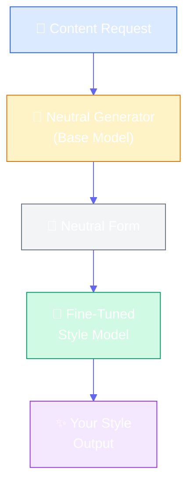
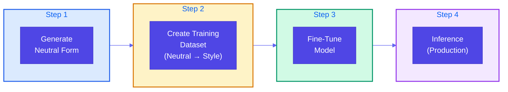
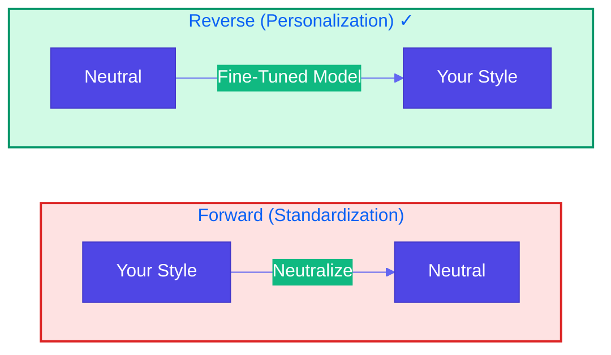

# Reverse Neutralization

**Source Books**: Generative AI Design Patterns

## Problem Statement

When you need to generate text in a specific, personalized style (e.g., "write it as you wrote it"), zero-shot prompting often fails because:

- The model doesn't know your unique writing style, tone, or voice
- Generic style descriptions ("professional", "casual") don't capture personal nuances
- Direct style transfer prompts produce inconsistent results
- You need consistent, personalized output that matches your specific writing patterns

For example, converting technical documentation into your personal writing style for a blog post requires understanding your specific:
- Sentence structure preferences
- Vocabulary choices
- Tone and voice
- Formatting style
- Examples and analogies you typically use

Traditional approaches like few-shot learning are limited by context window size and don't capture the full complexity of personal style.

## Solution Overview

**Reverse Neutralization** uses a two-stage fine-tuning approach to learn your specific writing style:

1. **Generate Neutral Form**: First, generate content in a neutral, standardized format (easier for the model)
2. **Fine-Tune Style Converter**: Train a model to convert from neutral form to your desired personal style
3. **Inference**: Use the fine-tuned model to transform neutral content into your style

This approach works because:
- Neutral form generation is easier and more reliable (model doesn't need to know your style)
- Fine-tuning can learn your specific style from examples
- The two-stage process separates content generation from style application

### Why "Reverse" Neutralization?

The name comes from the process:
- **Forward**: Your style → Neutral (standardization)
- **Reverse**: Neutral → Your style (personalization)

We use the reverse direction because generating neutral content first is easier, then we learn to convert it to your style.

## Implementation Steps

### Step 1: Generate Neutral Form
Use the base model to generate content in a neutral, standardized format. This is easier because:
- No personal style knowledge required
- Standard formats are well-learned by models
- More consistent and reliable output

### Step 2: Create Training Dataset
Collect pairs of:
- **Input**: Neutral form content
- **Output**: Same content in your desired style

You can:
- Manually rewrite neutral content in your style
- Use existing examples of your writing
- Generate neutral content and have it rewritten by you or a style expert

### Step 3: Fine-Tune the Model
Train a model on the neutral → style pairs to learn the transformation:
- Format training data (prompt-completion pairs)
- Fine-tune base model
- Validate on held-out examples

### Step 4: Inference
Use the fine-tuned model to:
1. Generate neutral form content (using base model)
2. Convert to your style (using fine-tuned model)

## Use Cases

- **Personal Blog Writing**: Convert technical content to your personal blog style
- **Brand Voice**: Maintain consistent brand voice across different content types
- **Documentation Style**: Convert generic docs to match your organization's style guide
- **Communication Templates**: Generate emails/messages in your personal communication style
- **Content Adaptation**: Adapt content from one format to another while maintaining your voice
- **Style Consistency**: Ensure all generated content matches your established writing patterns

## Implementation Details

### Key Components

1. **Neutral Generator**: Base model for generating neutral content
2. **Training Data Collector**: System for creating neutral → style pairs
3. **Fine-Tuning Pipeline**: Fine-tuning infrastructure
4. **Style Validator**: Ensures output matches desired style

### Architecture



### Four-Step Process



### Why "Reverse" Neutralization



### How It Works

1. **Neutral Generation**: Generate content in neutral format (e.g., technical documentation)
2. **Style Learning**: Fine-tune model on neutral → style pairs
3. **Style Application**: Use fine-tuned model to convert neutral to your style
4. **Validation**: Verify style consistency and content accuracy

## Code Example

This example demonstrates converting technical documentation to user-friendly guides in a specific personal style:

- **Step 1**: Generate neutral technical documentation
- **Step 2**: Create training dataset (neutral → personal style)
- **Step 3**: Fine-tune model on the dataset
- **Step 4**: Use fine-tuned model for inference

### Running the Example

```bash
python example.py
```

## Best Practices

- **Quality Neutral Content**: Ensure neutral form is clear, complete, and well-structured
- **Representative Training Data**: Collect diverse examples that capture your style variations
- **Style Consistency**: Review training examples to ensure consistent style
- **Iterative Refinement**: Start with small dataset, evaluate, and expand
- **Validation Set**: Keep held-out examples to validate fine-tuned model
- **Content Preservation**: Verify that style transfer doesn't alter core information
- **Dataset Size**: Aim for 100+ high-quality pairs for effective fine-tuning

## References

- [Fine-Tuning Language Models](https://huggingface.co/docs/transformers/training)
- [Personalized Text Generation](https://arxiv.org/abs/2001.09977)
- [Style Transfer in NLP](https://aclanthology.org/2021.acl-long.364/)
- [Reverse Engineering Writing Style](https://www.aclweb.org/anthology/2020.acl-main.705/)

## Related Patterns

- **Style Transfer**: Similar pattern but uses few-shot learning instead of fine-tuning
- **Content Generation**: Patterns for generating structured content
- **Template Generation**: Patterns for creating reusable templates

