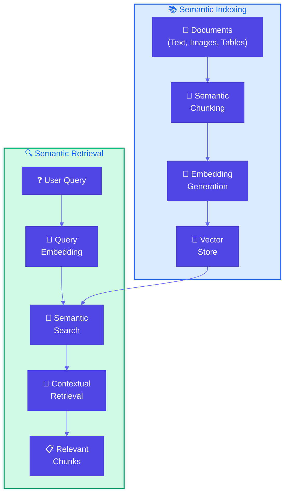
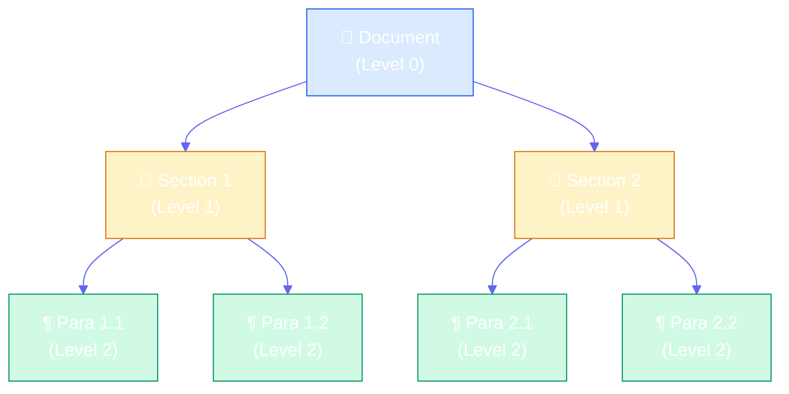

# Semantic Indexing

**Source Books**: Generative AI Design Patterns

## Problem Statement

Traditional keyword-based indexing has limitations when documents become more complex:

- **Semantic Understanding**: Keywords miss meaning - "car" and "automobile" are the same but different keywords
- **Complex Content**: Struggles with images, tables, code blocks, and structured data
- **Context Loss**: Fixed-size chunking breaks up related content, losing context
- **Multimedia**: Can't index images, videos, or other non-text media effectively

For example, searching for "authentication methods" might miss chunks that say "OAuth 2.0" or "API keys" if they don't contain the exact keyword "authentication methods".

## Solution Overview

**Semantic Indexing** uses embeddings (vector representations) to capture the meaning of content, enabling:

1. **Semantic Search**: Find content by meaning, not just keywords
2. **Semantic Chunking**: Divide text into meaningful segments based on semantic content
3. **Multimedia Support**: Encode images, videos, and other media into embeddings
4. **Table Handling**: Extract and organize structured information from tables
5. **Contextual Retrieval**: Preserve context when chunking documents
6. **Hierarchical Chunking**: Multi-level chunking for better context preservation

### Key Concepts

#### Embeddings

**Embeddings** are fixed-size vector representations that capture semantic meaning. Similar concepts have similar vectors, enabling semantic search.

- **Text Embeddings**: Convert text into vectors using models like sentence-transformers
- **Image Embeddings**: Use vision models or OCR + text embeddings
- **Hybrid Embeddings**: Combine multiple types (text + numeric + structured)

#### Semantic Chunking

Instead of fixed-size chunks, **semantic chunking** divides text by meaning:
- Respects document structure (headers, paragraphs, sections)
- Preserves related content together
- Adapts chunk size based on semantic boundaries

#### Images/Videos Handling

**Multimedia content** requires special processing:
- **OCR (Optical Character Recognition)**: Extract text from images, then embed the text
- **Vision Models**: Generate embeddings directly from visual content (alternative to OCR)
- **Video Processing**: Extract frames, transcribe audio, generate embeddings
- **Hybrid Approach**: Combine OCR text and visual embeddings for richer representation

#### Table Handling

**Structured data** in tables needs special treatment:
- **Extract Structure**: Preserve table schema (columns, rows, relationships)
- **Text Representation**: Convert table data to searchable text format
- **Embedding Generation**: Create embeddings that capture both content and structure
- **Metadata Preservation**: Keep original table structure for context

#### Contextual Retrieval

**Contextual retrieval** addresses context loss from small chunks:
- **Hierarchical Chunking**: Create chunks at multiple levels (document → section → paragraph)
- **Parent-Child Relationships**: Link chunks to preserve hierarchy
- **Context Expansion**: Include parent/child chunks when retrieving
- **Multi-Level Context**: Retrieve at appropriate granularity (document overview or paragraph detail)

#### Hierarchical Chunking

**Hierarchical chunking** creates a multi-level structure:
- **Level 0 (Document)**: Overview of entire document
- **Level 1 (Section)**: Major sections/chapters
- **Level 2 (Paragraph)**: Individual paragraphs or code blocks
- **Relationships**: Parent-child links maintain document structure
- **Context Preservation**: Retrieve with appropriate level of detail

## Implementation Details

### Components

1. **Embedding Model**: Converts content to vectors (sentence-transformers, vision models)
2. **Semantic Chunker**: Divides content by meaning, not just size
3. **Vector Store**: Stores embeddings for efficient similarity search
4. **Contextual Retriever**: Retrieves chunks with context preservation
5. **Multimedia Processor**: Handles images, tables, and structured data

### Architecture



### Six Key Concepts

```mermaid
%%{init: {'theme': 'base', 'themeVariables': { 'primaryColor': '#4f46e5', 'primaryTextColor': '#fff', 'primaryBorderColor': '#4338ca', 'lineColor': '#6366f1', 'secondaryColor': '#10b981', 'tertiaryColor': '#f59e0b'}}}%%
flowchart TB
    subgraph CONCEPTS["Semantic Indexing Concepts"]
        direction TB
        
        subgraph C1["1. Embeddings"]
            E1["Text → Vector<br/>Captures meaning"]
        end
        
        subgraph C2["2. Semantic Chunking"]
            E2["Divide by meaning<br/>not fixed size"]
        end
        
        subgraph C3["3. Image/Video"]
            E3["OCR or Vision<br/>Models"]
        end
        
        subgraph C4["4. Tables"]
            E4["Extract structure<br/>Preserve schema"]
        end
        
        subgraph C5["5. Contextual Retrieval"]
            E5["Preserve context<br/>Parent-child links"]
        end
        
        subgraph C6["6. Hierarchical Chunking"]
            E6["Doc → Section<br/>→ Paragraph"]
        end
    end
    
    style C1 fill:#dbeafe,stroke:#2563eb
    style C2 fill:#fef3c7,stroke:#d97706
    style C3 fill:#d1fae5,stroke:#059669
    style C4 fill:#f3e8ff,stroke:#9333ea
    style C5 fill:#fce7f3,stroke:#db2777
    style C6 fill:#ccfbf1,stroke:#0d9488
```



### Hierarchical Chunking Structure



### How It Works

1. **Chunking**: Divide documents semantically (by meaning/structure)
2. **Embedding**: Convert chunks to vector representations
3. **Storage**: Store embeddings in vector database
4. **Retrieval**: Convert query to embedding, find similar chunks
5. **Context**: Include parent/child chunks for context preservation

## Use Cases

- **Technical Documentation**: Search code examples, API docs, tutorials
- **Research Papers**: Find papers by concept, not just keywords
- **Product Catalogs**: Search by features, not just product names
- **Multimedia Content**: Index images, videos, and their descriptions
- **Structured Data**: Query databases, tables, and structured documents
- **Knowledge Bases**: Complex documents with mixed content types

## Code Example

This example demonstrates semantic indexing for technical documentation:

- **Semantic Chunking**: Divide by code blocks, sections, and meaning
- **Embedding Generation**: Create vector representations
- **Table Handling**: Extract structured information
- **Contextual Retrieval**: Preserve context with hierarchical chunks

### Running the Example

```bash
python example.py
```

## Best Practices

- **Choose Right Embedding Model**: Match model to your domain (general vs specialized)
- **Semantic Chunking Strategy**: Respect document structure (headers, sections, code blocks)
- **Chunk Size Balance**: Large enough for context, small enough for precision
- **Hierarchical Structure**: Create parent-child relationships for context
- **Multimedia Handling**: Use appropriate models (OCR for text in images, vision models for visual content)
- **Table Extraction**: Structure table data for better retrieval
- **Hybrid Search**: Combine semantic and keyword search for best results
- **Embedding Storage**: Use efficient vector databases (ChromaDB, Pinecone, Weaviate)

## Constraints & Tradeoffs

**Constraints:**
- Requires embedding models (computational cost)
- Vector storage needs more space than keyword indexes
- Embedding quality depends on model choice
- Semantic chunking more complex than fixed-size

**Tradeoffs:**
- ✅ Better semantic understanding
- ✅ Handles complex content (images, tables)
- ✅ Preserves context better
- ⚠️ More complex implementation
- ⚠️ Higher computational cost
- ⚠️ Requires embedding model selection

## References

- [Sentence Transformers](https://www.sbert.net/) - Embedding models
- [ChromaDB](https://www.trychroma.com/) - Vector database
- [Semantic Chunking Best Practices](https://www.pinecone.io/learn/chunking-strategies/)
- [Hierarchical Chunking](https://docs.llamaindex.ai/en/stable/module_guides/loading/node_parsers/modules/#hierarchicalchunking)
- [Multimodal Embeddings](https://huggingface.co/blog/multimodal-embeddings)

## Related Patterns

- **Basic RAG**: Foundation pattern that semantic indexing extends
- **Index-Aware Retrieval**: Advanced retrieval patterns
- **Node Postprocessing**: Patterns for refining retrieved chunks

