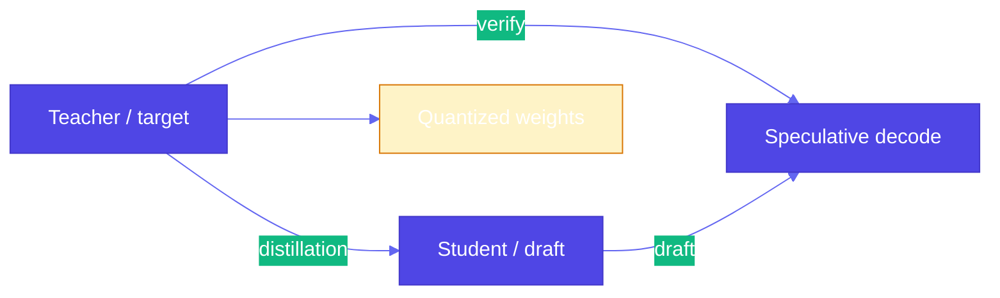

# Pattern 24: Small Language Model (SLM)

## Overview

**Small language models** and **efficient inference** address a practical barrier: **frontier LLMs** on dedicated hardware are **expensive** (GPU count, VRAM, cloud VM rates), **scarce**, and often **overkill** for narrow tasks. A **Gemma 3 27B**-class model or a **distilled** student can match a **teacher** on many workflows while **quantized** weights fit on a single consumer GPU. This pattern combines **training-time** (distillation), **load-time** (quantization), and **decode-time** (speculative decoding) techniques.

## Problem Statement

- **Frontier models** require **state-of-the-art GPUs** or large multi-GPU setups; **memory** and **hourly cost** dominate (e.g. multi–H100 nodes for the largest open weights).
- **Full precision** weights (FP32) multiply **storage and bandwidth**; for large parameter counts the footprint is **hundreds of GB** before KV cache and activations.
- You need **quality** close to a large teacher with **latency and cost** closer to a small model.

## Solution Overview

### 1. Knowledge distillation (training)

Train a **student** to mimic a **teacher**:

1. Generate **teacher** outputs (labels or sequences) on a task-specific dataset.
2. Train the **student** to match **soft targets** (probability distributions over tokens), not only hard labels.

**Kullback–Leibler divergence** \(D_{\mathrm{KL}}(P \| Q)\) is often used to align the student’s distribution over **vocabulary** with the teacher’s—often **combined** with cross-entropy on the true data. Minimizing KL encourages the student to **match the teacher’s uncertainty**, not only the argmax token.

Reference book code: `generative-ai-design-patterns/examples/24_small_language_model/knowledge_distillation.py` (teacher/student Gemma-style, optional 4-bit save).

### 2. Quantization (weights / activations)

Reduce **bits per weight** (e.g. **INT8**, **4-bit NF4** with **double quantization**):

- **Post-training** quantization loads a pretrained model with **BitsAndBytesConfig** (Hugging Face `transformers` + `bitsandbytes`) and **does not** require full retraining for many deployment paths.
- **Tradeoff**: lower precision can **degrade** accuracy; evaluate on **your** task and use **calibration** or **QAT** when needed.

Reference book code: `model_quantization.py` (same `gemma-3-1b-it` loaded with and without `BitsAndBytesConfig`).

### 3. Speculative decoding (inference)

Use **two models** at decode time:

- A **small draft** model proposes **several** tokens quickly.
- A **large target** model **verifies** in parallel (often a **batch** forward on the prefix). Accepted draft tokens are accepted in one step; on mismatch, the target corrects and continues.

This **improves throughput** (tokens per second) while **keeping** output distribution aligned with the **target** model when implemented correctly (e.g. vLLM, some frameworks).

Reference book code: `speculative_decoding.py` (vLLM `speculative_config` with a smaller Gemma as draft).

### High-level comparison

## Use Cases

- **On-prem or edge** deployment with **VRAM** caps.
- **High-throughput** serving (speculative decoding + batching).
- **Task-specific** quality: **distill** a small model for **one** domain (routing, extraction, formatting).

## Implementation Details

- **Distillation**: Balance **KL** on teacher logits with **CE** on ground truth; **temperature** on teacher softmax affects softness of targets.
- **Quantization**: Prefer **NF4** + **double quant** for 4-bit; **bf16/fp16** compute dtype for matmuls where supported.
- **Speculative decoding**: Tune **draft size** and **draft model**; measure **wall-clock** and **acceptance rate**, not only token count.

## Constraints & Tradeoffs

**Tradeoffs:** ✅ Lower cost and smaller footprint. ⚠️ Distillation needs **data and compute**; quantization can **hurt** rare patterns; speculative decoding adds **system** complexity (two models in memory).

## References

- Book examples: `generative-ai-design-patterns/examples/24_small_language_model/` (`knowledge_distillation.py`, `model_quantization.py`, `speculative_decoding.py`, `USAGE.md`).
- [AWS: SLM use cases](https://aws.amazon.com/blogs/machine-learning/going-beyond-ai-assistants-examples-from-amazon-com-reinventing-industries-with-generative-ai/) (book `USAGE.md` cites pharmalexical normalization).
- **Pattern 15 (Adapter tuning)**: complementary **parameter-efficient** training; **Evol-Instruct (16)** for data generation.

## Related Patterns

- **Adapter tuning (15)**: LoRA/QLoRA on a **frozen** base—often combined with **quantization** for training and serving.
- **Prompt optimization (20)**: Improve prompts; SLMs **benefit** more from tight prompts than frontier models.
