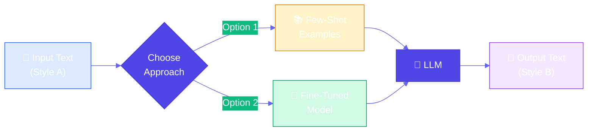
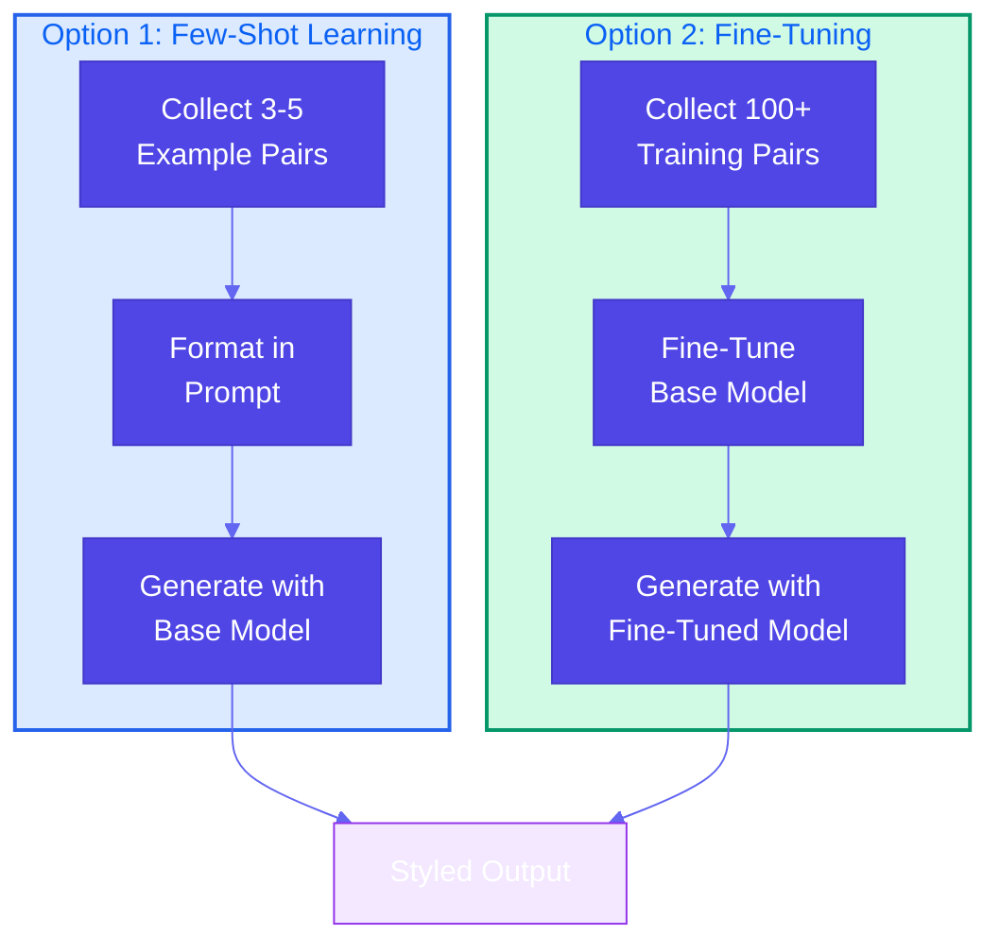

# Style Transfer

**Source Books**: Generative AI Design Patterns

## Problem Statement

Content often needs to be transformed from one style to another while preserving the core information. Common scenarios include:

- Converting informal notes into professional emails
- Transforming academic papers into blog posts
- Adapting social media content across different platforms
- Converting technical documentation into user-friendly guides
- Transforming meeting notes into formal reports

Traditional approaches like manual rewriting are time-consuming and inconsistent. Simple prompt engineering often fails to capture nuanced style differences.

## Solution Overview

**Style Transfer** uses AI to transform content from one style to another while maintaining the original meaning. The pattern offers two main approaches:

### Option 1: Few-Shot Learning (In-Context Learning)
Uses example pairs in the prompt to teach the model the desired style transformation.

**How it works:**
1. Provide 3-5 example pairs showing input style → output style
2. Include the target text in the prompt
3. Model learns the pattern from examples and applies it

**Advantages:**
- No training required
- Quick to implement
- Easy to adjust style by changing examples
- Works with any LLM

**Limitations:**
- Limited by context window
- May not capture complex style nuances
- Examples must be representative

### Option 2: Model Fine-Tuning
Fine-tunes a base model on a dataset of style-transformed examples.

**How it works:**
1. Collect training pairs (input style, output style)
2. Fine-tune the model on these pairs
3. Use the fine-tuned model for style transfer

**Advantages:**
- Better style consistency
- Handles complex style transformations
- More efficient at inference time
- Can learn subtle style nuances

**Limitations:**
- Requires training data
- More complex setup
- Less flexible (need retraining to change style)

## Use Cases

- **Professional Communication**: Convert notes to emails, reports, or presentations
- **Content Adaptation**: Transform academic content to blog posts or social media
- **Brand Voice**: Maintain consistent tone across different content types
- **Platform Adaptation**: Adapt content for different social media platforms
- **Documentation**: Convert technical docs to user-friendly guides
- **Localization**: Adapt content style for different cultural contexts

## Implementation Details

### Key Components

1. **Style Examples**: Representative pairs showing style transformation
2. **Prompt Template**: Structured prompt with examples and target text
3. **Model Interface**: API or local model for generation
4. **Validation**: Ensure meaning is preserved during style transfer

### Architecture



### Two Approaches Compared



### How It Works

**Option 1 (Few-Shot):**
1. Collect example pairs demonstrating the style transformation
2. Format examples in a prompt template
3. Include target text in the prompt
4. Generate output using the model

**Option 2 (Fine-Tuning):**
1. Collect training dataset of style pairs
2. Fine-tune base model on the dataset
3. Use fine-tuned model for inference
4. Optionally add few-shot examples for additional guidance

## Code Example

This example demonstrates converting informal notes into professional emails using both approaches:

- **Option 1**: Few-shot learning with in-context examples
- **Option 2**: Fine-tuning approach (conceptual demonstration)

### Running the Example

```bash
python example.py
```

## Best Practices

- **Quality Examples**: Use high-quality, representative examples that clearly show the style difference
- **Consistent Style**: Ensure all examples follow the same style guidelines
- **Meaning Preservation**: Verify that style transfer doesn't alter core meaning
- **Iterative Refinement**: Start with a few examples and add more if needed
- **Validation**: Check outputs for style consistency and accuracy
- **Context Awareness**: Consider the context and audience when defining style
- **Fine-Tuning Data**: For fine-tuning, collect diverse, high-quality pairs (100+ examples)

## References

- [In-Context Learning Research](https://arxiv.org/abs/2201.11903)
- [Fine-Tuning Language Models](https://huggingface.co/docs/transformers/training)
- [Style Transfer in NLP](https://aclanthology.org/2021.acl-long.364/)
- [Few-Shot Learning Best Practices](https://www.promptingguide.ai/techniques/fewshot)

## Related Patterns

- **Prompt Engineering**: Patterns for crafting effective prompts
- **Content Generation**: Patterns for generating structured content
- **Template Generation**: Patterns for creating reusable templates

