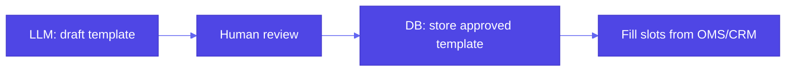

# Pattern 29: Template Generation

## Overview

**Template generation** is a **safeguard** pattern: instead of asking an LLM to **write the final customer-facing text** (high variance, hard to audit), you ask it to **author a reusable template** with explicit **slots** (`[CUSTOMER_NAME]`, `[ORDER_ID]`, …). Humans **review** the template once (or per locale/product line); at **send time**, software **fills** slots from trusted CRM / OMS data. **Few-shot** examples in the prompt anchor **structure** and **tone** so outputs stay **grounded** and **reviewable**.

## Problem Statement

- **Non-determinism**: Same prompt can yield different **claims** or **tone** on each run—bad for regulated or brand-controlled comms.
- **Full prose generation** mixes **facts** (order id, dates) with **creative** language—errors are costly and hard to **lint**.
- **Stakeholders** need **approval** of wording **before** scale, not post-hoc review of thousands of unique emails.

## Solution Overview

1. **Generate a template** (low temperature): fixed skeleton + **placeholders** for variable facts.
2. **Human or policy review** of the **template** (not every filled instance): legal/comms signs off on phrasing once per segment.
3. **Deterministic fill** at runtime from **systems of record** (no LLM for slot values, unless separately validated).
4. **Few-shot** prompts: show 1–2 approved templates so the model **imitates** structure and slot naming.

Book reference: `examples/29_template_generation/template_generation.ipynb` — tour-company **thank-you** letter with `[CUSTOMER_NAME]`, `[TOUR_GUIDE]`; **Gemini** via pydantic-ai `Agent`; fill with `.replace(...)`.

### Why this fits “Setting Safeguard”

You **constrain** the surface area of model creativity: the risky step is **bounded** to **layout + tone**; **facts** are **injected** safely.

### High-level flow

## Use Cases

- **Transactional** email/SMS: thank-you, onboarding, shipping delay notices
- **Support macros** with consistent **brand** voice and **audit** trail

## Implementation Details

- **Name slots** consistently (`[SNAKE_CASE]` or `{{mustache}}`—one convention).
- **Validate** that required slots exist before persisting templates.
- **Version** templates per **locale** and **product**; **A/B** test templates, not one-off generations.

## Constraints & Tradeoffs

**Tradeoffs:** ✅ Reviewable, repeatable, safer facts via fill. ⚠️ Up-front prompt engineering; templates can feel **stiff** if over-constrained.

## References

- Book: `generative-ai-design-patterns/examples/29_template_generation/` (`template_generation.ipynb`).
- **Pattern 2 (Grammar)**: structural constraints; templates are **human-visible** grammars for comms.
- **Pattern 20 (Prompt optimization)**: optimize **template-generation** prompts separately from **fill** logic.

## Related Patterns

- **Grammar (2)**: machine-checkable structure; templates are **soft** structure + **policy** review
- **Trustworthy generation (11)**: citations and guardrails; templates **reduce** hallucinated **facts**
- **Human-in-the-loop (38)**: **Human** **approval** of **templates** and **slots** before high-volume **send**
