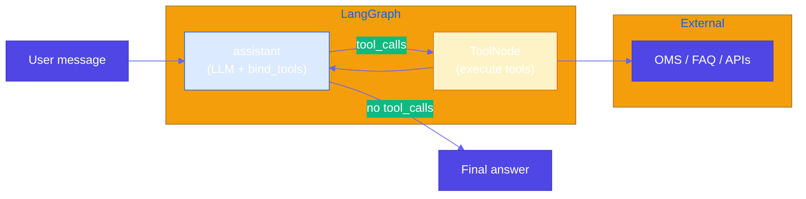

# Pattern 21: Tool Calling

## Overview

**Tool calling** lets an LLM invoke **external software** — APIs, databases, booking systems, calculators — not just generate text. It extends **grammar-constrained generation** (Pattern 2): instead of constraining *tokens*, you constrain *which tools* the model may call and with what arguments. Together with **RAG** (Patterns 6–12), which injects *retrieved knowledge*, tool calling gives **actions** and **live data** that the model cannot produce from training alone.

## Problem Statement

- **Content generation alone** is limited by what the model learned during training; it can hallucinate facts or be stale.
- **RAG** helps by injecting documents into context, but the model still cannot *execute* software: book a flight, place an order, call an enterprise API, or run a deterministic calculation.
- **Software can do things LLMs cannot**: reserve inventory, charge a card, submit a ticket, fetch live weather or order status.

You need a pattern where the model **reasons** about the user goal, **decides** which tools to call, **interleaves** reasoning and action (**ReAct**), and returns a final answer grounded in tool outputs.

## Solution Overview

**Tool calling**: The model emits structured **tool calls** (name + arguments). A runtime (**LangGraph** `ToolNode`, or similar) executes tools and appends results back into the message history; the model continues until it produces a final answer without further tool calls.

**LangGraph** models this as a **graph**: an **assistant** node (LLM with `bind_tools`) and a **tools** node (executes tool functions). **Conditional edges** route to `tools` when the last message contains `tool_calls`, else **END**. This loop implements **ReAct**-style reasoning + action.

**MCP (Model Context Protocol)** exposes tools as a standard client–server protocol. Enterprise systems can expose **MCP servers** (e.g. CRM, order management); LangChain **MCP adapters** can wrap those tools so the same LangGraph agent consumes them. The reference book example uses a small MCP weather server; production patterns use the same idea for internal APIs.

### Relationship to Grammar Pattern

- **Grammar** (Pattern 2): constrain *generation* to valid syntax (JSON, EBNF).
- **Tool calling**: constrain *which* external operations are allowed and *how* arguments are shaped (often JSON schema). The model’s output is parsed into a **tool call**; the executor is the only path to side effects.

### High-Level Architecture

### ReAct (Reasoning + Action)

The model alternates between **thought** (reasoning in the message) and **action** (tool calls). Tool results are **observations** fed back into the context. LangGraph’s loop makes this explicit and auditable.

## Use Cases

- **Customer support**: Look up order status, search internal FAQ, create tickets — **enterprise APIs** behind tools.
- **Travel / booking**: Availability and booking (when tools wrap real APIs; **never** trust the LLM alone to “book” without a verified tool).
- **RAG + tools**: Retrieve docs, then call a calculator or SQL tool for exact numbers.
- **MCP**: Unified way to expose many internal tools to agents and IDEs.

## Implementation Details

### Four moving parts

1. **Tools**: Python functions decorated with `@tool` (LangChain) with clear docstrings (the model uses them to choose tools).
2. **LLM with `bind_tools(tools)`**: Local model via **Ollama** (`ChatOllama`) with tool-capable models (e.g. `llama3.2`, `qwen2.5`).
3. **LangGraph**: `StateGraph(MessagesState)` + `assistant` + `ToolNode` + conditional edges (see `example.py`).
4. **Optional MCP**: Run MCP servers separately; connect with LangChain MCP adapters so tools appear like other LangChain tools.

### Best Practices

- **Idempotent tools**: Prefer safe retries; document side effects (e.g. booking).
- **Validate arguments**: Tool code should validate inputs and fail clearly.
- **Least privilege**: Tools only expose what the agent needs; audit logs for production.
- **Do not** rely on the LLM for authorization — enforce **authz** in the tool/API layer.

## Constraints & Tradeoffs

**Constraints:**
- Requires a model that supports tool calling (many Ollama models do).
- Tool latency and failures add to total latency; handle timeouts and errors in tools.

**Tradeoffs:**
- ✅ Up-to-date data, real actions, composable with RAG
- ⚠️ More moving parts than plain RAG; security and governance are critical

## References

- [LangGraph](https://langchain-ai.github.io/langgraph/) — Stateful graphs, prebuilt agents
- [ReAct (Reasoning + Acting)](https://arxiv.org/abs/2210.03629)
- [Model Context Protocol (MCP)](https://modelcontextprotocol.io/)
- Reference example: `generative-ai-design-patterns/examples/21_tool_calling` (LangGraph weather + geocoding + NWS; MCP weather client/server)

## Related Patterns

- **Grammar (Pattern 2)**: Constrains token output; tool calling constrains *executable* operations.
- **Basic RAG / retrieval patterns**: Knowledge injection; combine with tools for retrieval + action.
- **Dependency Injection (Pattern 19)**: Inject tool implementations or mock tools in tests.
- **LLM as Judge (Pattern 17)**: Evaluate tool-using agent outputs or tool plans.
- **Routing (Pattern 34)**: Restrict or swap **tool sets** per intent before the model plans tool calls.
- **Exception handling and recovery (37)**: **Tool** and **HTTP** failures → **retry**, **breaker**, **fallback** responses.
- **Reasoning techniques (41)**: **ReAct** / **PAL**-style **loops**—*Gulli* index to **Patterns** **21–22** and **12–14**.
- **MCP integration (47)**: **Standard** **tool** **server** **protocol** **alongside** **bound** **tools**
