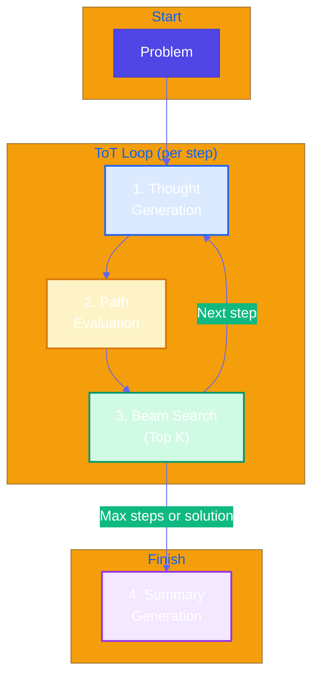
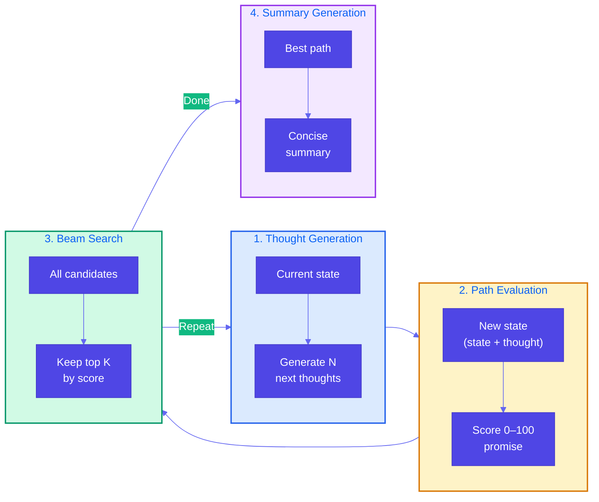
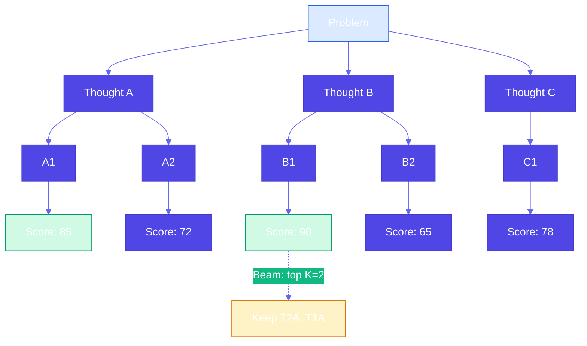

# Pattern 14: Tree of Thoughts (ToT)

## Overview

**Tree of Thoughts (ToT)** treats problem-solving as a **tree search process** rather than a single linear reasoning path. It explores multiple partial solutions, evaluates them to guide the search, and keeps the most promising branches (beam search) until a solution is summarized.

## Problem Statement

Many tasks that demand **strategic thinking** cannot be solved by a single multistep reasoning path:

- **Single-path limitation**: Chain of Thought (CoT) follows one sequence of steps. If that path is wrong or suboptimal, the answer suffers.
- **Branching decisions**: Strategic problems have multiple plausible next steps (e.g., which hypothesis to investigate first, which design option to pursue).
- **Need for exploration**: The best solution often requires exploring several directions and comparing partial solutions before committing.
- **Evaluation of progress**: Not all paths are equally promising; the system must evaluate partial solutions to focus search.

### When CoT Is Not Enough

```
Problem: "What is the root cause of our API latency spike?"

CoT: One linear path — e.g. "Check DB → Check cache → Check dependency" 
     and stop at first plausible answer. Might miss the real cause (e.g. thread pool exhaustion).

ToT: Explore multiple hypotheses in parallel (DB, cache, dependency, resource limits), 
     evaluate how promising each direction is, keep top K, expand further, then summarize.
```

## Solution Overview

**Tree of Thoughts** models problem-solving as tree search with four components:

1. **Thought generation**: From the current state, generate **multiple** possible next steps (thoughts), not just one.
2. **Path evaluation**: Score each partial solution (e.g., 0–100) for how promising it is (correctness, progress, potential).
3. **Beam search (top K)**: Keep only the **top K** most promising states for the next round; prune the rest.
4. **Summary generation**: Once search stops (max steps or high-scoring solution), produce a concise **summary** of the best path and the answer.

### ToT vs CoT

- **CoT**: One path, step-by-step. Good for linear deduction.
- **ToT**: Tree of paths; generate several thoughts, evaluate, keep best K, repeat. Good for strategic exploration and branching decisions.

### High-Level Flow



### Four Components in Detail



### Tree Search Visualization



## Use Cases

- **Incident root-cause analysis**: Explore multiple hypotheses (DB, cache, dependency, resources), evaluate each path, beam search, summarize most likely cause.
- **Strategic roadmap / prioritization**: Explore different feature orderings or themes, evaluate impact/feasibility/risk per path, keep best K, summarize recommended plan.
- **Design exploration**: Multiple architecture or design options as thoughts; evaluate partial designs; beam search; summarize chosen design.
- **Game playing or puzzles**: Legal moves as thoughts; evaluate board state; beam search; best move or solution.
- **Supply chain or configuration optimization**: Explore configurations and scenarios (as in the book example); evaluate each path; summarize best configuration.

## Implementation Details

### Key Components

1. **Thought generator**: Given (problem, current state, step number), call LLM to produce N distinct next thoughts (often as a list or JSON).
2. **Evaluator**: Given (problem, state = path so far), call LLM (or rule-based) to return a score (e.g., 0–100) for how promising the path is.
3. **Beam**: Priority structure (e.g., heap or sorted list) holding at most K states; each state = (score, state string, path list, step).
4. **Summarizer**: Given (problem, best final state), call LLM to produce a short summary and final answer.

### Search Loop (Pseudocode)

```
beam = [(initial_score, initial_state, [], 0)]
for step in 1 .. max_steps:
    candidates = []
    for (score, state, path, _) in beam:
        thoughts = generate_thoughts(state, step)
        for thought in thoughts:
            new_state = state + thought
            new_score = evaluate(new_state, problem)
            candidates.append((new_score, new_state, path + [thought], step))
    beam = top_k(candidates, K)
    if best(beam).score > threshold: break
best_state, best_path = best(beam)
summary = generate_summary(problem, best_state)
```

### When ToT Is Not Appropriate

- **Linear deduction**: If the problem has one clear sequence (e.g., simple math), CoT is simpler and cheaper.
- **Knowledge gap**: If the bottleneck is missing data, use RAG or tools; ToT does not add facts.
- **Cost/latency**: ToT uses more LLM calls (thought generation + evaluation per node); use when strategic exploration pays off.

## Best Practices

- **Thought diversity**: Ask the model for *distinct* next steps to avoid redundant branches.
- **Evaluation criteria**: Make evaluator criteria explicit (e.g., correctness, progress, potential) and use low temperature for consistency.
- **Beam width**: Larger K = more exploration and cost; typical K = 2–5.
- **Early stopping**: Stop when a path exceeds a score threshold (e.g., 0.9) to save cost.
- **Summary**: Always produce a concise summary from the best path for downstream use and UX.

## Constraints & Tradeoffs

**Constraints:**
- More LLM calls than CoT (generate + evaluate per node).
- Requires defining "thought" format and evaluation scale.
- Quality depends on thought diversity and evaluator accuracy.

**Tradeoffs:**
- ✅ Explores multiple strategies; avoids commitment to one bad path.
- ✅ Evaluation guides search toward promising directions.
- ✅ Beam search limits cost while preserving diversity.
- ⚠️ Higher cost and latency than single-path CoT.
- ⚠️ Need to tune K, max steps, and thresholds.

## References

- [Tree of Thoughts (Yao et al.)](https://arxiv.org/abs/2305.10601)
- [Chain of Thought (Wei et al.)](https://arxiv.org/abs/2201.11903) — comparison baseline
- [Beam Search](https://en.wikipedia.org/wiki/Beam_search)
- Reference implementation: `generative-ai-design-patterns/examples/14_tree_of_thoughts`

## Related Patterns

- **Chain of Thought**: Single-path step-by-step reasoning; use when one path suffices.
- **Tree of Thoughts**: Multi-path exploration; use when strategic branching is needed.
- **Deep Search**: Iterative retrieve + think; can combine with ToT for exploration over retrieved context.
