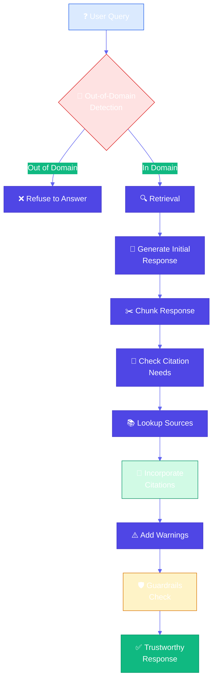
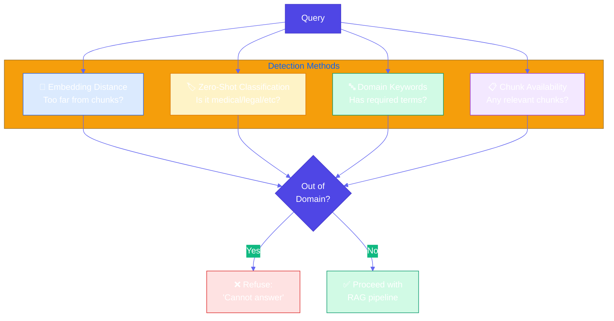
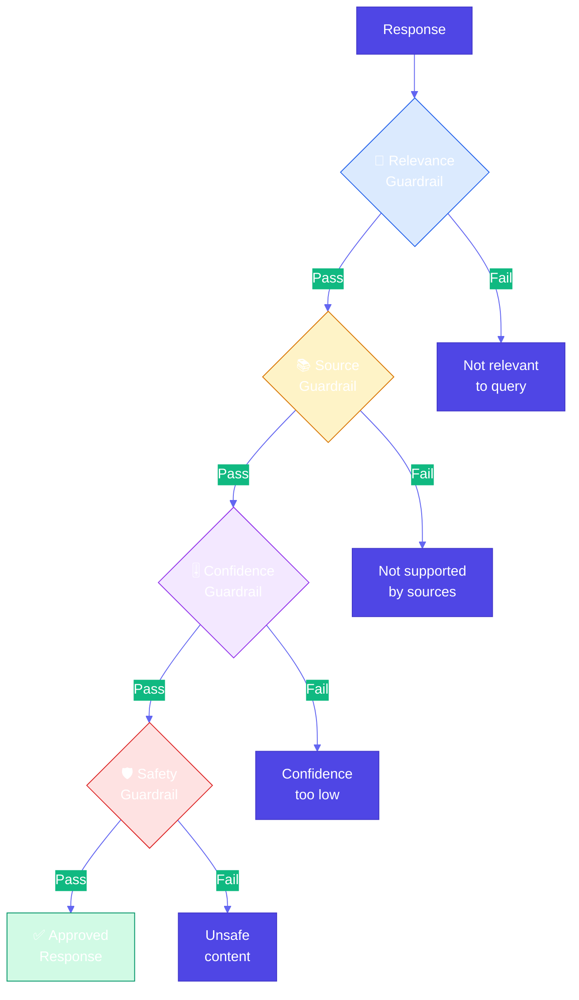

# Trustworthy Generation

**Source Books**: Generative AI Design Patterns

## Problem Statement

RAG systems can erode user trust due to several issues:

- **Retrieval Failures**: System retrieves irrelevant or no chunks, but still generates answers
- **Contextual Reliability Issues**: Retrieved context doesn't actually support the answer
- **Reasoning Errors**: LLM makes logical errors when reasoning about retrieved content
- **Hallucination Risks**: LLM generates information not present in knowledge base
- **Out-of-Domain Queries**: System answers questions outside its knowledge domain
- **Lack of Transparency**: Users can't verify where information came from

For example, a medical Q&A system might:
- Answer questions about topics not in its knowledge base (hallucination)
- Generate answers without proper citations (unverifiable)
- Provide confident answers when retrieval failed (unreliable)
- Mix retrieved facts with model's training knowledge (unclear sources)

## Solution Overview

**Trustworthy Generation** builds user trust through multiple mechanisms:

1. **Out-of-Domain Detection**: Detect when knowledge base doesn't contain relevant information
2. **Embedding Distance Checking**: Measure similarity between query and retrieved chunks
3. **Zero-Shot Classification**: Categorize queries to determine if they're answerable
4. **Domain-Specific Keywords**: Require domain terminology to ensure query is in-domain
5. **Citations**: Provide source citations for all factual claims
6. **Source-Level Tracking**: Track which sources support each part of the answer
7. **Classification-Based Citation**: Use classification to determine what needs citations
8. **Token-Level Attribution**: Attribute each token/claim to its source
9. **Guardrails**: Prevent generation of unsafe or unreliable content
10. **Observability**: Monitor system behavior and reliability
11. **Human Feedback**: Incorporate user feedback to improve trustworthiness
12. **Corrective RAG**: Self-correct when errors are detected
13. **Self-RAG**: Self-reflective RAG that checks its own work

### Key Concepts

#### Out-of-Domain Detection

**Out-of-domain detection** identifies when queries are outside the knowledge base:

- **Embedding Distance**: Measure distance between query embedding and nearest chunk embedding
- **Threshold-Based**: If distance exceeds threshold, mark as out-of-domain
- **Zero-Shot Classification**: Use classifier to categorize query as in-domain/out-of-domain
- **Keyword Checking**: Require domain-specific keywords in query

**Why it matters**: Prevents hallucination by refusing to answer when knowledge base lacks information.

#### Citations

**Citations** provide source attribution for factual claims:

- **Source-Level Citations**: Cite entire sources that support the answer
- **Classification-Based Citations**: Use classifier to determine which claims need citations
- **Token-Level Attribution**: Attribute each token/claim to specific source chunks
- **Inline Citations**: Include citations within the response text

**Why it matters**: Enables users to verify information and builds trust through transparency.

#### Self-RAG Workflow

**Self-RAG** is a self-reflective approach that checks its own work:

1. **Generate Initial Response**: Create draft answer from retrieved chunks
2. **Chunk the Response**: Divide response into smaller sections
3. **Check Citation Needs**: Determine which sections need citations
4. **Lookup Sources**: Find supporting sources for each section
5. **Incorporate Citations**: Add citations to the response
6. **Add Warnings/Corrections**: Flag uncertain or unsupported claims

**Why it matters**: Self-verification catches errors and ensures all claims are supported.

#### Guardrails

**Guardrails** prevent generation of problematic content:

- **Relevance Guardrails**: Ensure answers are relevant to query
- **Source Guardrails**: Ensure answers are supported by sources
- **Safety Guardrails**: Prevent harmful or inappropriate content
- **Confidence Guardrails**: Refuse to answer when confidence is low

**Why it matters**: Prevents unreliable or harmful outputs.

## Implementation Details

### Components

1. **Out-of-Domain Detector**: Detects queries outside knowledge base
2. **Citation Generator**: Adds citations to responses
3. **Source Tracker**: Tracks which sources support each claim
4. **Self-RAG Processor**: Implements self-reflective workflow
5. **Guardrail System**: Enforces safety and reliability constraints
6. **Observability Monitor**: Tracks system behavior and reliability

### Architecture



### Self-RAG 6-Step Workflow

```mermaid
%%{init: {'theme': 'base', 'themeVariables': { 'primaryColor': '#4f46e5', 'primaryTextColor': '#fff', 'primaryBorderColor': '#4338ca', 'lineColor': '#6366f1', 'secondaryColor': '#10b981', 'tertiaryColor': '#f59e0b'}}}%%
flowchart LR
    subgraph S1["Step 1"]
        A["Generate<br/>Initial Response"]
    end
    
    subgraph S2["Step 2"]
        B["Chunk<br/>Response"]
    end
    
    subgraph S3["Step 3"]
        C["Check Citation<br/>Needs"]
    end
    
    subgraph S4["Step 4"]
        D["Lookup<br/>Sources"]
    end
    
    subgraph S5["Step 5"]
        E["Incorporate<br/>Citations"]
    end
    
    subgraph S6["Step 6"]
        F["Add Warnings<br/>& Corrections"]
    end
    
    S1 --> S2 --> S3 --> S4 --> S5 --> S6
    
    style S1 fill:#dbeafe,stroke:#2563eb,stroke-width:2px
    style S2 fill:#fef3c7,stroke:#d97706,stroke-width:2px
    style S3 fill:#d1fae5,stroke:#059669,stroke-width:2px
    style S4 fill:#f3e8ff,stroke:#9333ea,stroke-width:2px
    style S5 fill:#fce7f3,stroke:#db2777,stroke-width:2px
    style S6 fill:#ccfbf1,stroke:#0d9488,stroke-width:2px
```



### Out-of-Domain Detection Methods



### Guardrails System



### How It Works

1. **Out-of-Domain Detection**: Check if query is answerable from knowledge base
2. **Initial Generation**: Generate draft response from retrieved chunks
3. **Response Chunking**: Divide response into verifiable sections
4. **Citation Checking**: Determine which sections need citations
5. **Source Lookup**: Find supporting sources for each section
6. **Citation Incorporation**: Add citations to response
7. **Warning Generation**: Add warnings for uncertain or unsupported claims
8. **Guardrail Enforcement**: Apply safety and reliability checks

## Use Cases

- **Medical Q&A**: Ensure all medical advice is cited and within knowledge domain
- **Legal Research**: Provide citations for all legal claims
- **Academic Research**: Attribute all facts to sources
- **Technical Documentation**: Verify all technical claims are documented
- **News/Content**: Ensure all information is verifiable

## Code Example

This example demonstrates trustworthy generation for medical Q&A:

- **Out-of-Domain Detection**: Detect queries outside medical knowledge base
- **Self-RAG Workflow**: 6-step process for trustworthy responses
- **Citations**: Add source citations to all factual claims
- **Warnings**: Flag uncertain or unsupported information
- **Guardrails**: Prevent unreliable or unsafe responses

### Running the Example

```bash
python example.py
```

## Best Practices

- **Out-of-Domain Detection**: Set appropriate distance thresholds
- **Citations**: Cite all factual claims, not just some
- **Source Tracking**: Track sources at granular level (sentence/token)
- **Self-RAG**: Always verify claims before finalizing response
- **Guardrails**: Set clear thresholds for refusal
- **Observability**: Monitor citation rates, out-of-domain rates, user feedback
- **Human Feedback**: Incorporate user corrections to improve system
- **Transparency**: Make it clear when information is uncertain

## Constraints & Tradeoffs

**Constraints:**
- Out-of-domain detection needs domain knowledge
- Citations add complexity and latency
- Self-RAG requires multiple LLM calls
- Guardrails may be too restrictive

**Tradeoffs:**
- ✅ Builds user trust through transparency
- ✅ Prevents hallucination
- ✅ Enables verification
- ✅ Catches errors through self-reflection
- ⚠️ More complex than basic RAG
- ⚠️ Higher latency (multiple steps)
- ⚠️ May refuse valid queries (false positives)

## References

- [Self-RAG Paper](https://arxiv.org/abs/2310.11511)
- [Corrective RAG](https://docs.llamaindex.ai/en/stable/module_guides/deploying/query_engines/corrective_rag/)
- [Guardrails AI](https://www.guardrailsai.com/)
- [Citation Best Practices](https://docs.llamaindex.ai/en/stable/module_guides/deploying/query_engines/citation_query_engine/)

## Related Patterns

- **Basic RAG**: Foundation pattern that trustworthy generation extends
- **Node Postprocessing**: Patterns for improving retrieved chunks
- **Index-Aware Retrieval**: Advanced retrieval patterns

